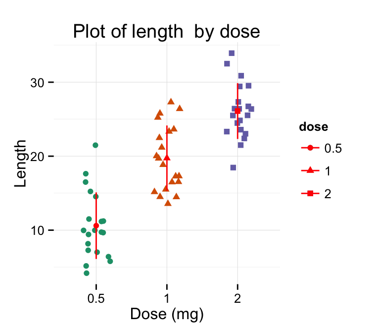

+++
author = "Yuichi Yazaki"
title = "Strip Chart"
slug = "strip-chart"
date = "2025-10-11"
categories = [
    "chart"
]
tags = [
    "",
]
image = "images/cover.png"
+++

A strip chart records or displays data continuously over time, often as a line updated in real time. The term also refers to charts that show individual data points as a continuous strip across time or categories. The common idea is to make ongoing change visible.

<!--more-->

## Historical Background

Strip charts originated in physical strip chart recorders used for industrial measurement, medical monitoring, and experiments. A moving paper strip recorded changing values as a continuous trace. The idea later carried over into digital monitoring displays and statistical plots.

## Use Cases

- Industrial sensor monitoring
- Medical and laboratory measurement
- Real-time system dashboards
- Time-series inspection

## Design Notes

- Keep time scale and sampling rate clear.
- Use alerts or bands for important thresholds.
- Avoid overplotting too many signals.
- Preserve enough history for context.

## Summary

Strip charts are practical tools for monitoring change as it happens. Their value comes from continuity and immediacy.
