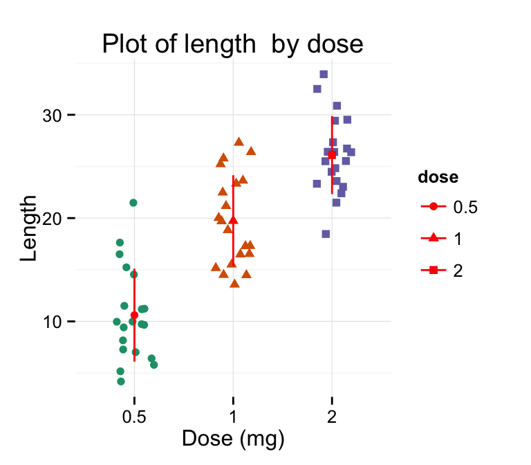

+++
author = "Yuichi Yazaki"
title = "ストリップ・チャート（Strip Chart）"
slug = "strip-chart"
date = "2025-10-11"
categories = [
    "chart"
]
tags = [
    "",
]
image = "images/cover.png"
+++

ストリップ・チャート（Strip Chart）は、時間の経過やカテゴリごとのデータ点を、**線または点の連続**として表示するチャートです。用途によって意味が少し異なりますが、共通するのは「**個々のデータ変化を連続的に可視化する**」点です。もともとは物理的なチャートレコーダ（strip chart recorder）として登場し、現在では統計可視化やリアルタイム監視画面などでも広く使われています。

<!--more-->

## チャートの見方

| 要素 | 説明 |
|------|------|
| 横軸（X軸） | 時間またはカテゴリを表す。多くの場合、左から右に経過する時系列を示す。 |
| 縦軸（Y軸） | 計測値や観測値を示す。温度、圧力、電圧、あるいは数値変数など。 |
| データ点／線 | 各瞬間または各観測データを表す。連続的な線でつなぐ場合も、点で離散的に示す場合もある。 |
| 更新・スクロール | リアルタイムの場合、新しいデータが右端に追加され、古いデータが左へ流れる（または消える）。 |
| ジッター処理 | 統計的ストリップ・チャートでは、データ点の重なりを防ぐために位置をわずかにずらすことがある。 |

## 背景と用途

### 1. 計測・記録機器としてのストリップ・チャート  
20世紀中頃まで、ストリップ・チャート・レコーダーは温度や電圧などの信号を**紙テープに連続記録**する装置として用いられていました。記録ペンが時間軸に沿って動くことで、変化を一目で把握できました。  
今日ではこの形式がデジタル化され、リアルタイム監視用の**波形ビューア**や**ダッシュボードチャート**として継承されています。

### 2. 統計的ストリップ・チャート（Strip Plot）  
統計学・データ可視化の分野では、ストリップ・チャートはカテゴリ別にデータ点を並べるシンプルな分布可視化手法です。  
箱ひげ図（Box Plot）やバイオリンプロット（Violin Plot）と併用されることが多く、**各観測値をそのまま点として可視化する**ことで、外れ値や分布のばらつきを確認できます。

### 3. リアルタイム監視やIoTダッシュボード  
センサー値やトランザクション量など、常時更新されるデータを時系列で追跡するために、ストリップ・チャートは現在も重要な役割を果たしています。スクロール式UIにより、常に最新の状態を右端で確認できます。

## 関連・類似チャートとの比較

| チャート名 | 概要 | ストリップ・チャートとの違い |
|-------------|------|------------------------------|
| ラインチャート (Line Chart) | 連続的なデータを線で結んで表示 | ストリップ・チャートはリアルタイム更新・長時間データ記録を重視 |
| スキャッタープロット (Scatter Plot) | 2変数間の関係を点で表示 | ストリップ・チャートは1軸を時間に固定する点が異なる |
| バイオリンプロット (Violin Plot) | 分布の形状を密度として可視化 | ストリップ・チャートは個別点をそのまま可視化するため、構造が単純 |
| スパークライン (Sparkline) | コンパクトな時系列線グラフ | ストリップ・チャートは記録・監視用途で長時間スパンを扱う |

## まとめ

ストリップ・チャートは、データを「**時間に沿って一目で把握する**」ための基本的な可視化形式です。  
歴史的にはアナログ記録機から始まり、現代ではソフトウェア上の**リアルタイム波形ビュー**や**統計的分布図**として進化しています。  
単純な形式ながら、**個々のデータ点の変化を可視化する力**に優れており、時系列データの理解に欠かせない存在です。

## 参考・出典

- [Wikipedia – Chart recorder](https://en.wikipedia.org/wiki/Chart_recorder)
- [LightningChart – Strip Chart Tutorial](https://lightningchart.com/net-charts/docs/tutorials/strip-chart/)
- [DataMentor – R stripchart() Function](https://www.datamentor.io/r-programming/strip-chart/)
- [UX StackExchange – How should a strip chart of data be displayed?](https://ux.stackexchange.com/questions/24768/how-should-a-strip-chart-of-data-be-displayed)
- [Chartexpo – What Is a Strip Chart?](https://chartexpo.com/blog/strip-charts)
