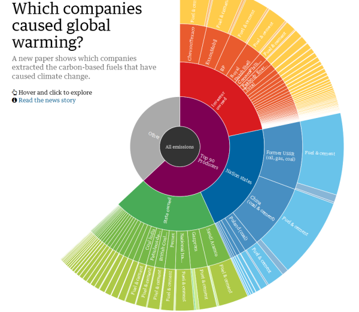
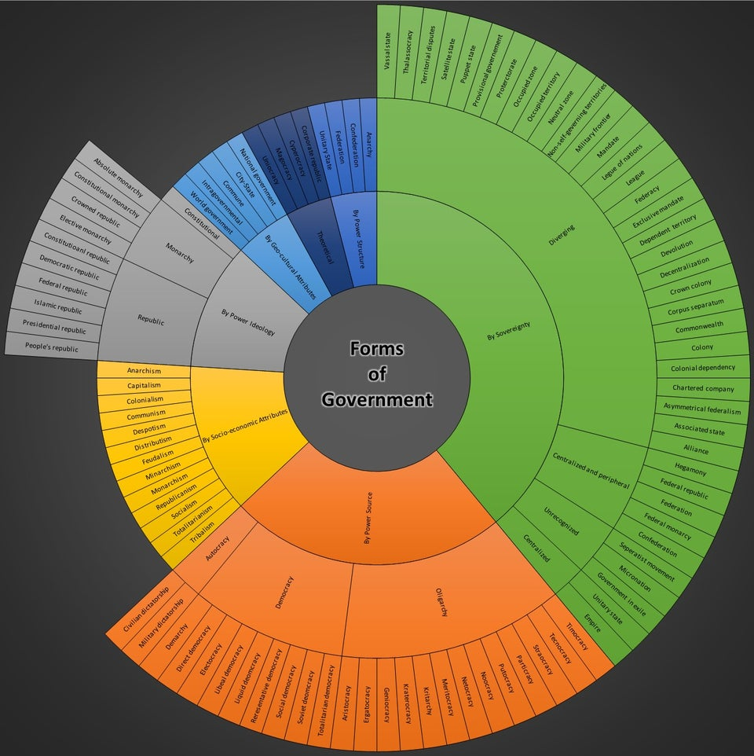
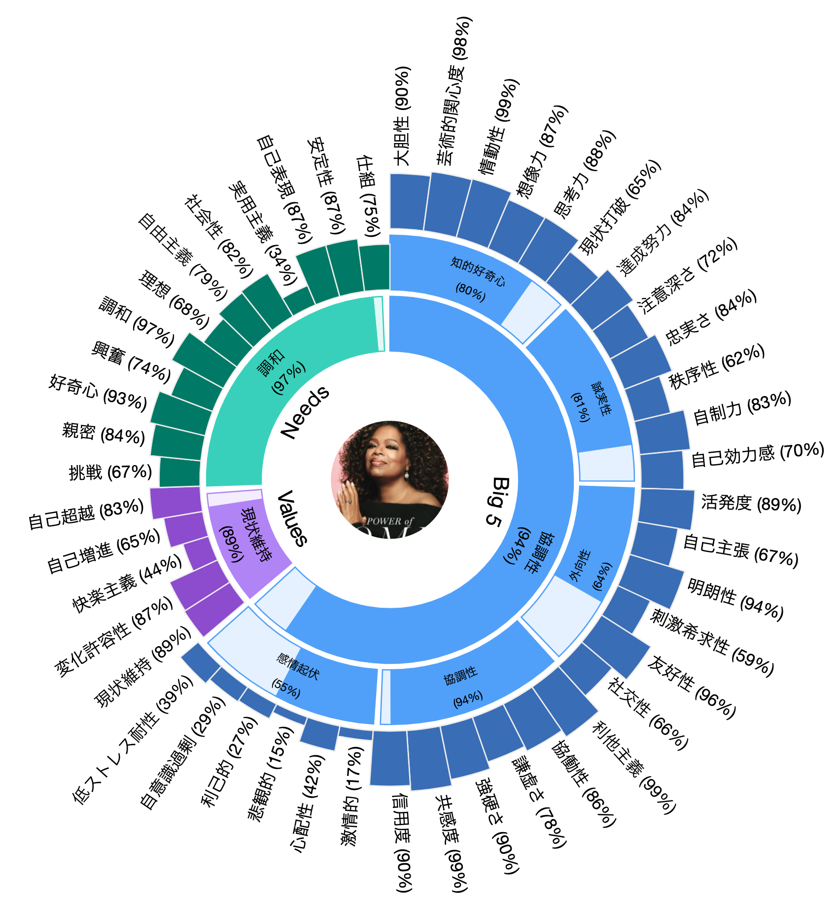
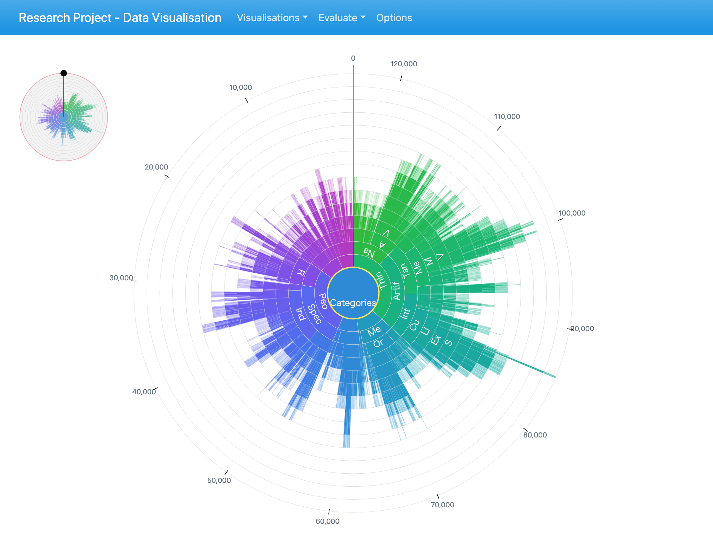
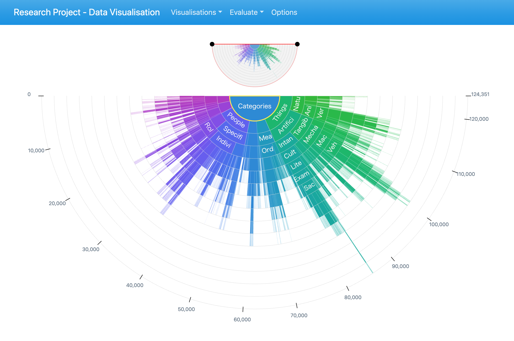
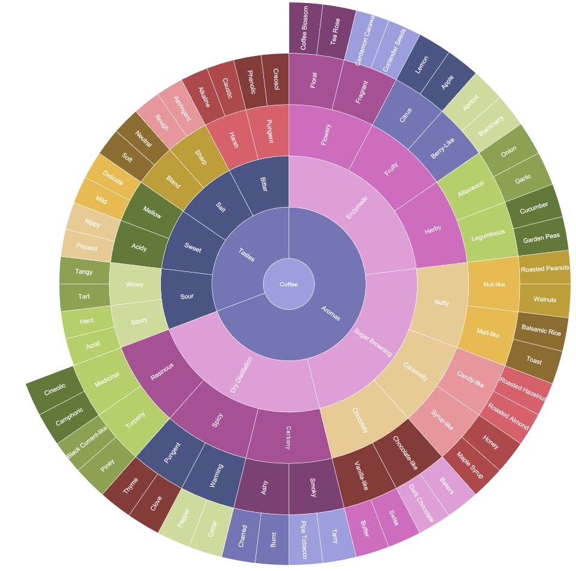
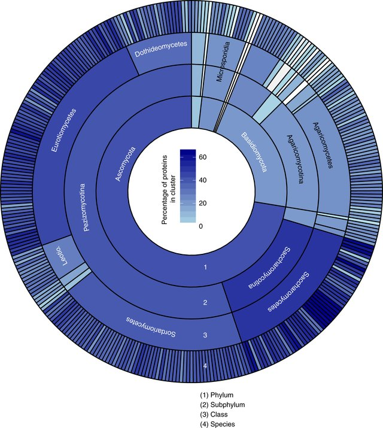

+++
author = "Yuichi Yazaki"
title = "サンバースト（Sunburst）の事例"
slug = "sunburst-example"
date = "2020-08-11"
description = ""
categories = [
    "chart"
]
tags = [
    "ツリー",
]
image = "images/personality-insights_OprahWinfrey.png"
+++

「サンバースト」が利用されている事例を紹介します。

<!--more-->

## 作例

### わずか90社で人為的な地球温暖化の3分の2を排出

[Just 90 companies caused two-thirds of man-made global warming emissions | Environment | The Guardian](https://www.theguardian.com/environment/2013/nov/20/90-companies-man-made-global-warming-emissions-climate-change)

### 政府の形態

[https://www.reddit.com/r/dataisbeautiful/comments/f4eky8/oc_forms_of_government_sunburst_chart/](https://www.reddit.com/r/dataisbeautiful/comments/f4eky8/oc_forms_of_government_sunburst_chart/)

### IBM WatsonによるPersonality Insights

作例はOprah Winfreyのツイートを元にした分析結果。

[Personality Insights](https://personality-insights-demo.ng.bluemix.net/)

### メルボルン モナッシュ大学での研究に使われたチャート

下図のサンバーストが半分になっているものを、彼らはサンダウン（Sun Down）と呼んでいる。

[Interactive Visualisation of Hierarchical Quantitative Data: an Evaluation](https://deepai.org/publication/interactive-visualisation-of-hierarchical-quantitative-data-an-evaluation)

### コーヒーの味

サンプルのデータセットとして、階層構造（親子関係）のみを示している。

[Software development | Sunburst chart | Data Integration | Aculocity](https://www.aculocity.com/labs/sunburst-chart)

### タンパク質をコードする遺伝子がクラスター化している割合を種ごとに示した

[https://www.researchgate.net/publication/335847129_Evolutionary_and_functional_patterns_of_shared_gene_neighbourhood_in_fungi/figures?lo=1](https://www.researchgate.net/publication/335847129_Evolutionary_and_functional_patterns_of_shared_gene_neighbourhood_in_fungi/figures?lo=1)

## 他の呼び名

Radial Icicle、Radial Treemap、Ring Bracketなどと呼ばれることもあります。
