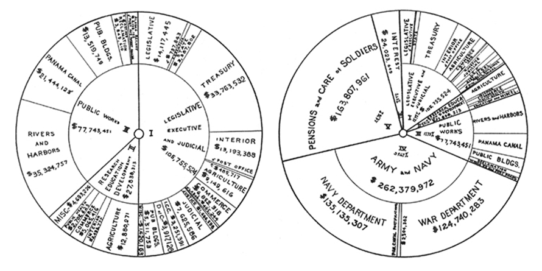

+++
author = "Yuichi Yazaki"
title = "Sunburst Chart"
slug = "sunburst"
date = "2025-10-02"
description = ""
categories = [
    "chart"
]
tags = [
    "ツリー",
]
image = "images/cover-Sunburst.jpg"
+++

A **sunburst chart** visualizes hierarchical data in a circular layout. The root sits at the center, and each outer ring represents a deeper level in the hierarchy. It can be understood as a radial treemap or a multi-level pie chart.

<!--more-->

## Background

Sunburst charts developed from the broader history of compact hierarchy visualization. Their lineage includes early concentric classification diagrams, financial diagrams, and information-visualization research.

Important historical threads include:

- **Late nineteenth century**: Lawrence W. Fike's zoological concentric chart, which arranged biological taxonomy in rings.
- **1921**: a "sunburst diagram" in *Mechanical Engineering* showing U.S. federal spending.
- **Around 2000**: John Stasko and Georgia Tech research introduced radial space-filling views for exploring file systems and other hierarchies.

The form became widely used with web visualization, especially through D3.js and Mike Bostock's `partition` layout.

## Data Structure

Sunburst charts require tree-structured data.

| Element | Meaning |
|---|---|
| Root node | Top-level category |
| Child node | Subcategory |
| Arc | Visual representation of a node |
| Angle or area | Quantitative value |

## Purpose

The goal is to show how parts belong to a whole across multiple levels. Sunburst charts are useful for product categories, file systems, organizational structures, website navigation, and hierarchical budgets.

## Strengths

- Shows hierarchy depth through radius.
- Provides a compact overview.
- Makes parent-child relationships visually intuitive.
- Works well with interaction, such as click-to-zoom.

## Limitations

- Deep hierarchies make the outer rings crowded.
- Exact comparison is difficult because values are encoded by angles and arcs.
- Node ordering can affect interpretation.
- User studies do not always favor sunburst charts for precise tasks.

## How to Read It

The center is the highest-level category. Moving outward means moving down the hierarchy. Arc length usually represents value, and color separates categories or branches.

## Design Notes

- Use related colors for parent and child nodes.
- Use tooltips or hover labels for outer rings.
- Keep the hierarchy shallow when possible.
- Use interaction when detailed comparison matters.

## Alternatives

| Chart | Feature |
|---|---|
| Treemap | Rectangular space-filling hierarchy |
| Circle packing | Nested circles for hierarchy |
| Flare chart | Radial node-link tree |

## Summary

The sunburst chart is a visually strong method for exploring hierarchical data. It is best used when the shape of the hierarchy matters more than exact value comparison.

## References

- [Observable: Sunburst chart](https://observablehq.com/@d3/sunburst)
- [D3.js API Reference: Partition Layout](https://github.com/d3/d3-hierarchy#partition)
- [Wikipedia: Sunburst chart](https://en.wikipedia.org/wiki/Sunburst_chart)
- [Georgia Tech SunBurst Page](https://sites.cc.gatech.edu/gvu/ii/sunburst/)
