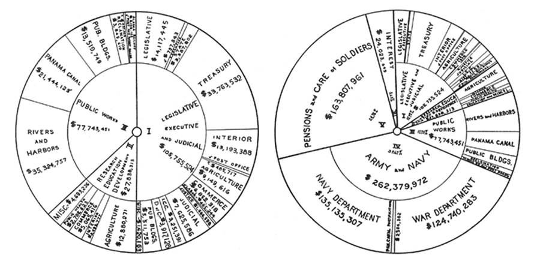

+++
author = "Yuichi Yazaki"
title = "サンバースト・チャートとは何か - 起源と特徴"
slug = "sunburst"
date = "2025-10-02"
description = ""
categories = [
    "chart"
]
tags = [
]
image = "images/cover-Sunburst.jpg"
+++

サンバースト・チャート（Sunburst Chart）は、階層構造（hierarchical data） を可視化するための手法で、同心円状のリングを用いて内側から外側にかけてデータの階層を展開します。

最も内側の円が「ルート（root）」を表し、外側へ進むほど下位階層（子・孫）が配置されます。各階層のセグメント（円弧）は、親カテゴリに対する割合を角度の大きさで示します。

<!--more-->

サンバースト・チャートは以下のようにも呼ばれています。

- 放射状トリーマップ（Radial Treemap）
- 多層円グラフ（Multi-level Pie Chart）
- リングチャート（Ring Chart）

## 誰が作ったのか ― 起源の探究

サンバースト・チャートは「誰が最初に作ったか」を一人に特定することはできません。歴史を追うと、いくつかの重要な系譜が見えてきます。

- **1. 19世紀末（1890年）**
    - Lawrence W. Fike による動物分類の同心円チャート（zoological concentric chart）が知られています。
    - 科 → 属 → 種といった階層を円環で表す教育・分類目的の可視化であり、現代的サンバーストの先駆的事例とされています。
- **2. 1921年（米国機械工学誌 “Mechanical Engineering”）**
    - 1910〜1919年における米国連邦政府の年間支出構成を示す可視化が「sunburst diagram」として紹介されたという記録があります。
    - ここでは経済データ（支出カテゴリ）を階層的に分解して示す試みが行われました。
- **3. 2000年頃（John Stasko, Georgia Tech）**
    - 情報可視化研究の中で、Treemap に代わる「放射状の space-filling 可視化」として体系的に導入されました。
    - 特に ファイルシステムの構造、Webサイト遷移、ソフトウェアパッケージの構成など、コンピュータ科学の文脈で大規模な階層を探索的に理解する目的で用いられています。
    - Georgia Tech の “SunBurst Page” では、Treemap の代替として階層構造を提示・探索する手法として紹介されています。

このように、サンバーストは 教育的分類図 → 財政可視化 → 情報可視化研究 という異なる文脈を経ながら、現在の形に進化してきました。

## どんな目的で使われてきたか

- **分類や系統の可視化** ：生物学的分類、図書館の階層分類など。
- **財政・経済データの構成表示** ：政府支出や売上の構成を階層別に表現。
- **IT領域での探索** ：ファイルシステムやWebサイトの階層構造を直感的にナビゲートするための可視化。
- **インタラクティブ分析**：BIツールやD3.js／Plotlyなどを用いて、ユーザーが階層を掘り下げて詳細を確認できる仕組み。

## サンバースト・チャートの利点

- **1.階層の直感的表現** ...中心から外側へ広がる放射状の構造で、親子関係が視覚的に理解しやすい。
- **2.部分と全体の関係を示す** ...各階層が親カテゴリに対してどれほどの割合を持つかを可視化できる。
- **3.空間効率** ...Treemap と比べて放射状に展開できるため、深い階層でも相対的にスペースを確保しやすい。

## サンバースト・チャートの欠点や注意点

- 階層が深いと外側が細かくなり読みにくい。
- 角度の比較は人間にとって難しいため、精密な比較には不向き。
- 階層間の面積不整合が生じる場合があり、同じ値でも見た目が異なることがある。
- 隣接関係に意味がない場合があるため、並びの解釈には注意が必要。
- ユーザー調査では必ずしも好まれないという研究もあり、利用には適切な場面選びが重要。

## まとめ

サンバースト・チャートは、「誰か一人の発明」ではなく、複数の歴史的流れの中で育まれてきた可視化手法です。

- **1890年** ：Fike による動物分類の同心円図
- **1921年** ：米国機械工学誌での財政データの可視化
- **2000年頃** ：John Stasko らによる情報可視化研究での確立

今日では、階層データを「全体から部分へ」と直感的に探索できる方法として、教育・行政・研究・ビジネスの幅広い分野で活用されています。

## 参考・出典

- [Think.Design – Sunburst: A Circular Visualization Technique](https://think.design/services/data-visualization-data-design/sunburst/)  
- [Georgia Tech – SunBurst Page (Stasko Lab)](https://sites.cc.gatech.edu/gvu/ii/sunburst/)  
- [NightingaleDVS – Endless River: An Overview of Dataviz for Categorical Data](https://nightingaledvs.com/endless-river-an-overview-of-dataviz-for-categorical-data/#a334)  
- [Richard Brath – Why history matters in data visualization](https://richardbrath.wordpress.com/2018/08/31/why-history-matters-in-data-visualization/)  
- [Wikipedia – John Stasko](https://en.wikipedia.org/wiki/John_Stasko)  
- [Visualization and Evolution of Software Architectures (OASIcs 2011)](https://drops.dagstuhl.de/storage/01oasics/oasics-vol027-vluds2012-irtg1131/OASIcs.VLUDS.2011.25/OASIcs.VLUDS.2011.25.pdf)  
- [Sunburst Chart: The Format That Fails at Layer Three – ChartExpo Blog](https://chartexpo.com/blog/sunburst-chart)
