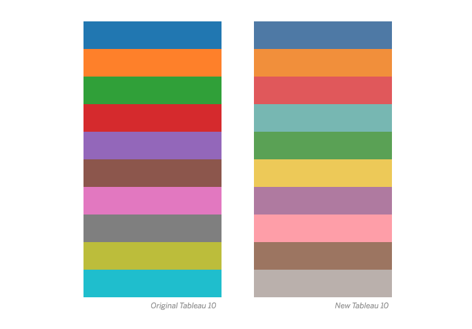
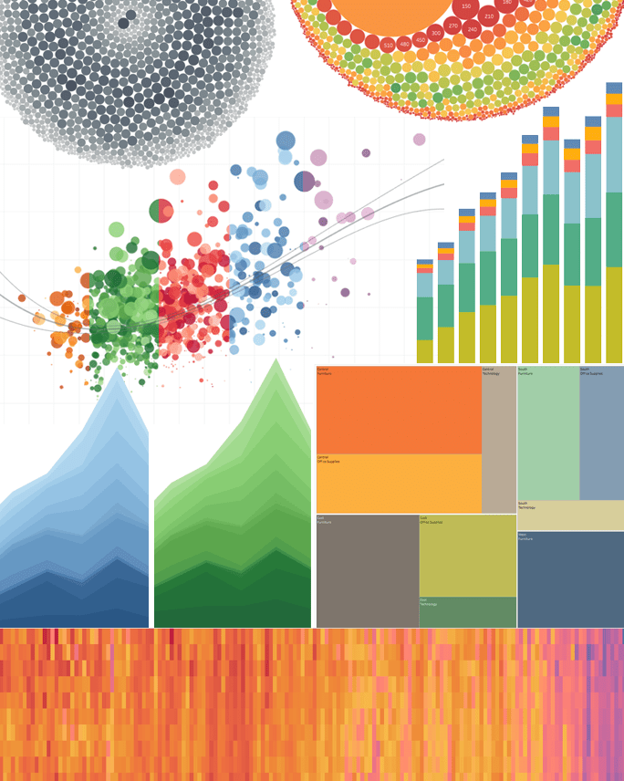
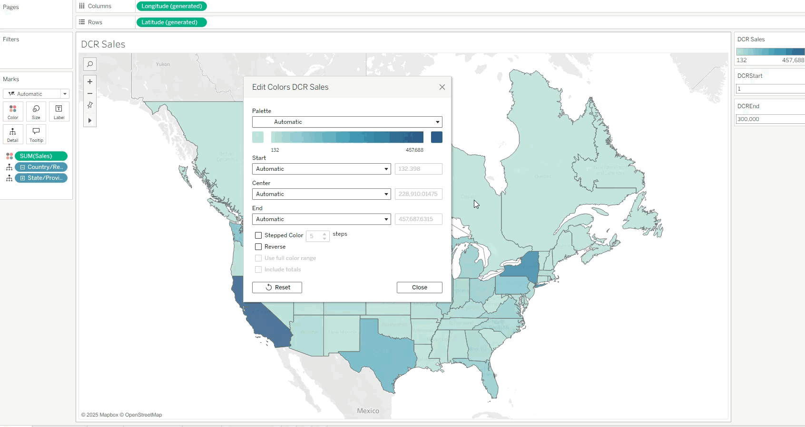

+++
author = "Yuichi Yazaki"
title = "Tableauのカラースキーム進化史"
slug = "tableau-color-scheme"
date = "2026-02-16"
categories = [
    "technology"
]
tags = [
    ""
]
image = "images/colortool3.png"
+++

データビジュアライゼーションのツールとして世界的に人気のTableau。そこに欠かせない要素が「カラースキーム」です。色は単なる装飾ではなく、データの意味を明確に伝え、ユーザーの理解を深める重要なツールです。この記事では、Tableauのカラースキームの経緯を、初期（2000年代前半）、2016年のTableau 10リリース、2025年の最新進化に焦点を当ててまとめます。

<!--more-->

これらの変化は、視覚科学の進歩とユーザー体験の向上を反映しています。色科学の専門家Maureen Stone氏の影響が強く、アクセシビリティ（色覚異常対応）や知覚的精度が一貫したテーマです。

## 初期のカラースキーム（~2005年頃：Tableauの創成期）
Tableauの初期バージョン（例：Tableau 1.5頃）では、カラースキームはシンプルで鮮やかなものが主流でした。主なものは「Classic Palettes」（Classic 10やClassic 20）と呼ばれるもので、赤、青、緑などの基本色をベースにした「Crayola-like」（クレヨンのような明るい色調）のパレットです。これらはカテゴリカルデータ（カテゴリ分け）の区別に適しており、視覚的にインパクトを与えました。

- **特徴**: 明るく鮮やかな色で、データの区別を直感的に行える。ただし、色覚異常（例：赤緑色盲）への対応が不十分で、グレースケール変換時に判別しにくい問題がありました。また、データのセマンティクス（意味）と色の一致（例：バナナを黄色で表現）を重視する基本原則がすでに取り入れられ始めていました。
- **作成者/貢献者**: Tableauの創業者チーム（Chris Stolte, Pat Hanrahan, Jock Mackinlayら）が主導。Edward Tufteのデータビジュアライゼーション理論（シンプルで中立的な色使い）の影響を受けています。2004年からアドバイスを提供したMaureen Stone氏の色知覚研究が、早期の基盤を形成しました。Stone氏はXerox PARCでの経験を活かし、「get it right in black and white」（白黒でも正しく伝わる）という原則を提唱。

この時期のスキームは、Tableauの「Grammar of Graphics」アプローチを支えましたが、洗練度が低く、ユーザーからのフィードバックで改善の余地が指摘されました。

## 2016年の大改革（Tableau 10リリース：アクセシビリティの飛躍）

2016年にリリースされたTableau 10では、従来のClassic Palettesを全面的に刷新し、より洗練された色調とアクセシビリティを重視したパレット群が導入されました。

これにより、Tableauはプロフェッショナルなビジュアルツールとして進化を遂げ、視覚的な効果性とスタイルのバランスを強化しました。

すべてのパレットがTableauの視覚効果基準を満たすよう設計され、従来の明るい色調を抑え、柔らかく洗練されたものに変更。デフォルトの定量的パレットは緑から青（Sequential）や赤緑からオレンジ青（Diverging）へシフトし、色覚異常対応を強化しました。

### 主なカラースキームと特徴

- **Categorical Palettes (Tableau 10/20)**: Tableau 10は10色の基本hue（例: 赤、青、ピンク、オレンジ、シアン、緑、黄色、茶色、紫、グレー）を柔らかく調整したもの。従来の鮮やかな色を抑え、クロマ（彩度）と明度を変化させて視覚的な調和を高め、洗練された印象を与えます。Tableau 20はこれを明るい/暗いペアで拡張し、カテゴリカルデータでの多様な区別を可能に。グレーには軽い色合いを加え、色ピッカーの小さなサンプルではクロマを増やして識別しやすく調整。従来のClassic 10/20に比べて、hueの選択がより多様で、視覚的な洗練度が向上しています。
- **Sequential Palettes** (例: Blue, Orange): 単一hueの明暗グラデーション（例: Blueは明るい青から暗い青へ、Orangeは明るいオレンジからタン（黄褐色）を経て暗い茶色へ）。定量的データ向けで、従来の緑デフォルトから青/オレンジへ変更により視覚協調が向上。hueの範囲を狭くし、明度とクロマの連続パスで視覚的に効果的。従来パレットよりhueのねじれを加え、連続したパスで機能性を高めています。
- **Diverging Palettes** (例: Orange-Blue): 二色グラデーション（オレンジ-中間ニュートラル-青）。正負値の偏差表示に最適で、従来の赤緑からオレンジ青へシフトし、色覚異常（主に赤緑色盲）対応を強化。hueとクロマにひねりを加えた二つのパスで中間点を中立的色に設定。従来より視覚的な区別が明確で、色盲フレンドリーな選択です。
- **Color Blind**: 青/オレンジ/グレー中心で明度差を強調。赤緑問題を回避し、デフォルトでユーザー親和性を向上。Tableau 10で新たに最適化され、従来の一般パレットより明度調整が強化されています。
- **Seasonal Palettes** (例: Summer, Winter): 季節テーマの色調（Summer: 暖色系、Winter: 寒色系）でスタイル多様化。少ないhueで独特の美学を提供し、Tableau 10で新規追加。フォーマット色（ダーク色、中間色、ライト背景）もTableau 20のペアに合わせ、Amanda Laurickによる軽やかなシェーディングでエレガントに仕上げられています。

### 作成者/貢献者

Cristy Miller（ビジュアルデザイン・ディレクター）とMaureen Stone氏（Tableau Researchチーム）の共同設計で、視覚デザインと色科学を融合。Carin Fishel, Shahaf Nuriel, Amanda Laurick（ライトカラーの再設計）、Jewel Loreeら開発チームが初期デザインを作成し、Stone氏が最終調整。CIELAB色空間（人間の知覚に基づく3次元空間）を活用したカスタムツールで、hue-chroma平面と明度スケールで編集。HSVやRGB hex形式もサポートし、知覚的精度を向上させました。

このリリースは、色を「データの意味を伝えるツール」として位置づけ、ユーザー体験を大幅に向上させました。旧パレットの問題（視覚疲労や判別性）を解決し、散布図、積み上げ棒グラフ、テキストの読みやすさなどのテストで検証。Tableauの市場シェア拡大に寄与し、視覚的明瞭さ、知覚的正確さ、ユーザー中心の原則を体現しています。

## 2025年の進化（Tableau 2025.2：動的な柔軟性へ）
2025年のTableau 2025.2では、カラースキームがさらにインタラクティブに進化しました。従来の固定パレットから脱却し、「Dynamic Color Ranges」という機能が追加され、色範囲をパラメーターで動的に調整可能になりました。これにより、データの文脈に合わせて色をカスタマイズしやすくなりました。

- **特徴**: 色範囲（開始/終了/中心）をフィルター適用時も保持。UIが刷新され、自動範囲の限界を克服。例：白から赤へのグラデーションでゼロ値を白く表現する柔軟性。アクセシビリティは維持しつつ、AI/ML統合との連動で自然言語による色調整も可能に。
- **作成者/貢献者**: Tableau開発チーム全体の取り組み。Maureen Stone氏の長期的な指導が基盤で、ユーザーからのフィードバック（Preferences.tpsファイルでのXMLカスタム）を反映。

この進化は、Tableauの「第三波」（ツールの収束）を象徴し、静的な色使いから動的なものへシフト。将来のビジュアライゼーションでは、リアルタイムデータ対応がさらに強調されるでしょう。

## まとめ

Tableauのカラースキームは、初期の鮮やかさから2016年の洗練・アクセシビリティ重視、2025年の動的柔軟性へと進化してきました。これらの変化は、Maureen Stone氏のような専門家の知見と、データビジュアライゼーションの原則に基づいています。

## 参考文献

- [Color Palettes and Effects - Tableau](https://help.tableau.com/current/pro/desktop/en-us/viewparts_marks_markproperties_color.htm)
- [How we designed the new color palettes in Tableau 10](https://www.tableau.com/blog/colors-upgrade-tableau-10-56782)
- [Create Custom Color Palettes - Tableau](https://help.tableau.com/current/pro/desktop/en-us/formatting_create_custom_colors.htm)
- [Dynamic Color Ranges in Tableau: Clearer Visual Analysis](https://www.tableau.com/blog/release-dynamic-color-ranges)
- [Choosing Colors for Data Visualization](http://perceptualedge.com/articles/b-eye/choosing_colors.pdf)
- [The Visual Display of Quantitative Information](https://www.edwardtufte.com/book/the-visual-display-of-quantitative-information)