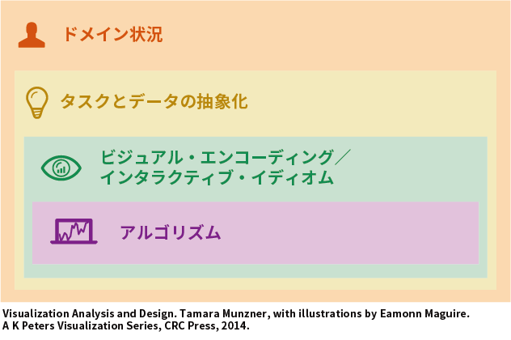

+++
author = "Yuichi Yazaki"
title = "ビジュアルデザインの複雑な問題を4つのカスケードレベルに分割する"
slug = "tamar-4levels"
date = "2020-01-12"
categories = [
    "technology"
]
tags = [
    "",
]
image = "images/fig4.2_ja-1.png"
+++

データビジュアライゼーションの作品を作ろうと思ったときに簡単に行かないのは「設計空間が膨大で、ほとんどの設計は効果がない」ことから、「ビジュアルデザインの複雑な問題を4つのカスケードレベルに分割することで、異なる懸念事項を個別に解決できる分析フレームワークを提供する」という意図で、Tamara Munznerさんが提示しているフレームワークをご紹介します。

上から、「ドメイン状況」「タスクとデータの抽象化」「ビジュアル・エンコーディング／インタラクティブ・イディオム」「アルゴリズム」の4レベルとなっており、上位のレベルほど、下位のレベルを包含していることがポイントです。つまり上位のレベルでの決定事項が、下位のレベルの決定に影響を与えるという構成になっています。

### 4レベルのそれぞれを紹介

#### ドメイン状況

ドメイン状況を検証するにあたって必要なのは、ターゲットユーザーのグループ、対象ドメイン、質問、およびデータなどです。

ドメインという用語は、ターゲットユーザーにとっての特定の関心分野を意味しています。

各ドメインには通常、データと問題を記述するための独自の語彙があり、通常、データを使用して問題を解決するための既存のワークフローがあります。

起こりうる間違いとしては、ターゲットユーザーのニーズを誤解していた、ということがあげられます。

#### タスクとデータの抽象化

特定のドメインにおける質問とデータを、ドメイン固有のフォームから汎用表現に抽象化する必要があります。

ドメインに依存しない語彙に抽象化することで、全くかけ離れたドメインにおいて、その可視化が必要な理由（タスク）とそのデータが示すものが、同様である可能性があるからです。

起こりうる間違いとしては、ターゲットユーザーへ間違ったものを見せようとしていた、ということがあげられます。

#### ビジュアル・エンコーディング／インタラクティブ・イディオム

イディオムデザインには2つの大きな意味があります。

1つ目は、ビジュアル・エンコーディング・イディオム。  
データから1つの画像（に見えるもの）を作成するということです。  
ユーザーが見るものを正確にコントロールします。

2つ目は、対話のイディオムです。  
その表現を動的に操作する方法ということです。  
ユーザーが見ているものをどのように変更するかをコントロールします。

起こりうる間違いとしては、見せているものが機能していない、ということがあげられます。

#### アルゴリズム

アルゴリズムの作成に関連するすべての設計や選択です。  
コンピュータが自動的に目的の目標を実行できるようにする詳細な手順としての、アルゴリズムの新たな設計や既存のものからの選択を指します。

起こりうる間違いとしては、実行速度が遅すぎる、ということがあげられます。

### アタックする順序

Tamaraさんは、これらのレベルを進めていく順序を、トップダウンとボトムアップの両方を想定してます。

#### 問題駆動型(problem-driven)

問題駆動型(problem-driven)の作業では、トップの「ドメイン状況」レベルから始め、「タスクとデータの抽象化」、「ビジュアル・エンコーディング／インタラクティブ・イディオム」、「アルゴリズム」の決定を下に進めます。

現実世界のユーザーの問題を取り組み、より効果的に作業できるソリューションを設計しようとします。この種の研究はデザイン研究と呼ばれることが多い。しばしば、新しいものを設計するのではなく、既存の視覚的エンコーディングと相互作用のイディオムを使用して問題を解決することができ、課題の多くは抽象レベルにあります。しかし、既存のものが抽出された設計上の問題を適切に解決できないと判断した場合、問題は新しいイディオムの設計を促すことがあります。

この設計プロセスは、決して厳密には線形ではなく、すべてのレベルで繰り返す中で洗練されていくとしています。

#### 技術主導型(technique-driven)

技術主導型(technique-driven)の作業では、既存の抽象概念をよりよくサポートする新しい視覚的なエンコーディングやインタラクションの「イディオム」や、既存のイディオムをよりよくサポートする新しい「アルゴリズム」を開発することを目標として、下位の2つのレベル、「ビジュアル・エンコーディング／インタラクティブ・イディオム」、「アルゴリズム」設計のいずれかで作業します。
