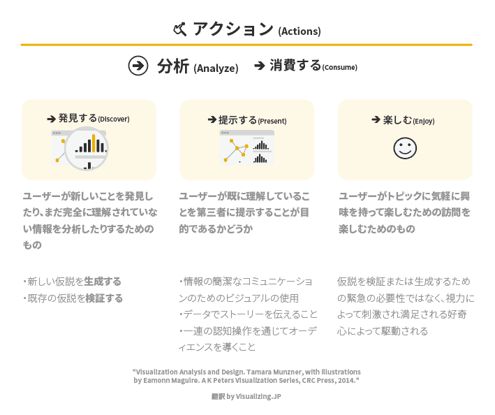
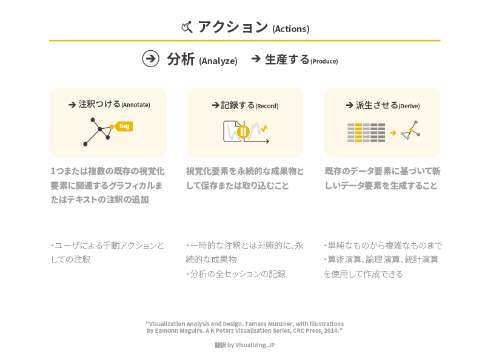
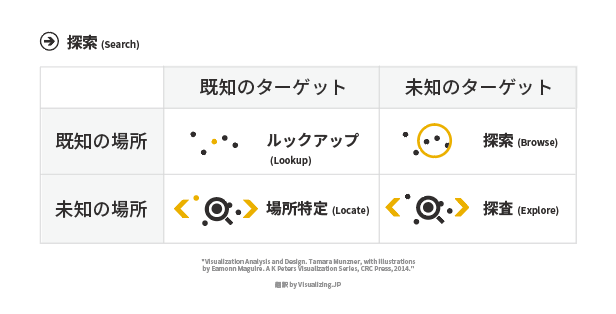
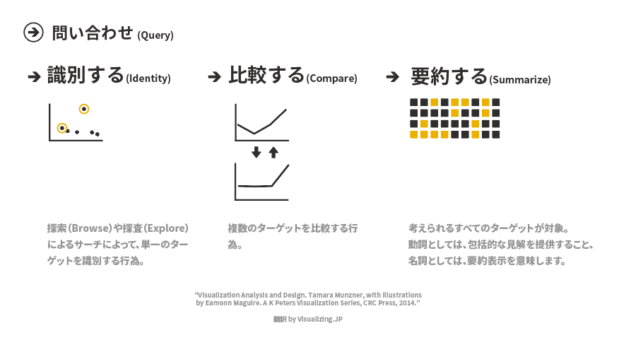

+++
author = "Yuichi Yazaki"
title = "タマラさんによるタスクの定義（アクション）"
slug = "tamar-action"
date = "2020-03-14"
categories = [
    "technology"
]
image = "images/fig3-1-action-analytics-consume-1.png"
+++

タマラ・ムンズナーさんがまとめた、なぜ可視化を行うのか？そのアクションとターゲットという図があります。

アクションの中でも、レベル感が三段階あります。そのうち一番高レベルのものとして「生産する」「消費する」の二つにわけられます。

#### 「消費する」分析

#### 「生産する」分析

#### 探す

一口に「探す」といっても、ターゲット（モノやコト）と場所について、未知と既知で４象限作り、それぞれの組み合わせについて、別な名称を提案しています。

#### 問い合わせる

単一のターゲットを対象とした識別、複数のターゲットを対象とした比較、全てのターゲットを対象とした要約に分けることを提案しています。

