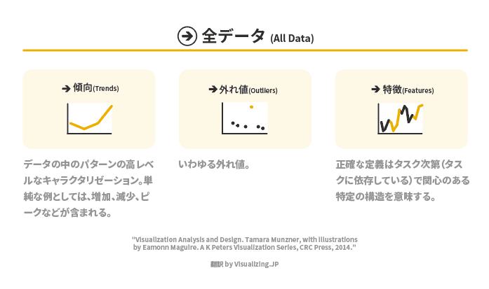
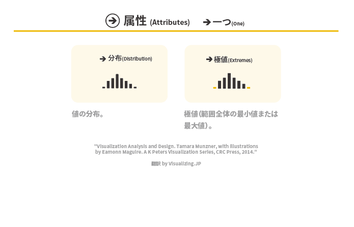
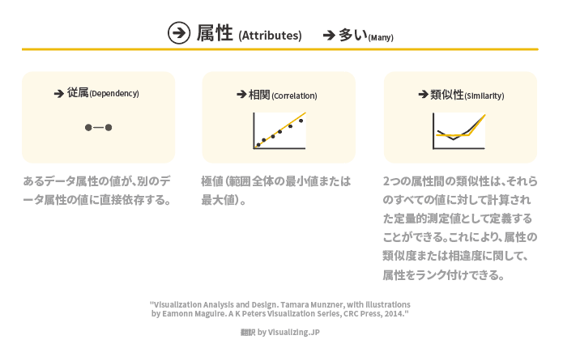

+++
author = "Yuichi Yazaki"
title = "タマラさんによるタスクの定義（ターゲット）"
slug = "tamar-targets"
date = "2020-03-26"
categories = [
    "technology"
]
tags = [
    "",
]
image = "images/tamar-targets-alldata.png"
+++

タマラ・ムンズナーさんがまとめた、なぜ可視化を行うのか？そのアクションとターゲットという図があります。ターゲットについて個別に図として独立させ、翻訳したものをご紹介します。

#### 「全データ」

#### 「一つの属性」

#### 「複数の属性」

