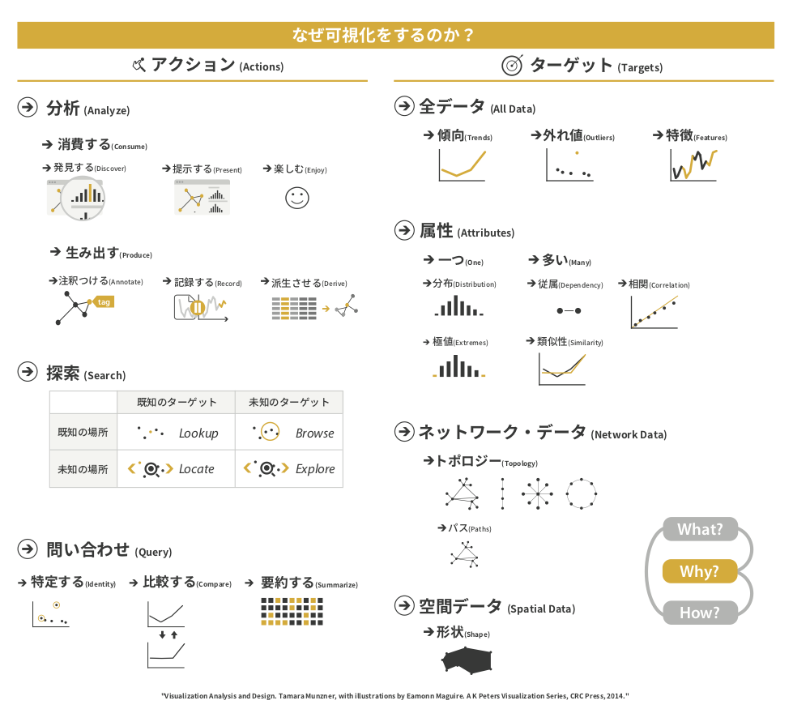

+++
author = "Yuichi Yazaki"
title = "なぜ可視化を行うのか？そのアクションとターゲット"
slug = "task-abstraction-tamar"
date = "2020-03-13"
categories = [
    "technology"
]
tags = [
    "",
]
image = "images/fig3.1_ja.png"
+++

タマラ・ムンズナーさんがまとめた、なぜ可視化を行うのか？そのアクションとターゲットという図があります。

まず先に右半分に掲載の「ターゲット」はデータの切り口や種類のことです。すこし異なる粒度のものが混ざっているので混乱するかもしれません。

左半分の「アクション」ですが、上から下へ具体性を帯びていきますが、分析と探索、問い合わせはそれぞれ独立しています。

ある特定の課題を解決するためにデータ可視化を行う際、そのドメイン（分野）の言葉だけでタスクを言い表していると、事例を探す範囲が狭くなってしまいます。

ドメイン（分野）を超えて、汎用的な言い回しで「タスクとして何が実現できればいいのだっけ」（どんなターゲットに対してどんなアクションを起こしたいのか）と言い換えることで、参考になる事例がほかのドメイン（分野）から探し出せるとタマラさんは述べています。

さらには、結局何を実現できればいいのかが言語化できるため、実装する際にシステム設計の詳細度をあげることが可能となりそうです。
