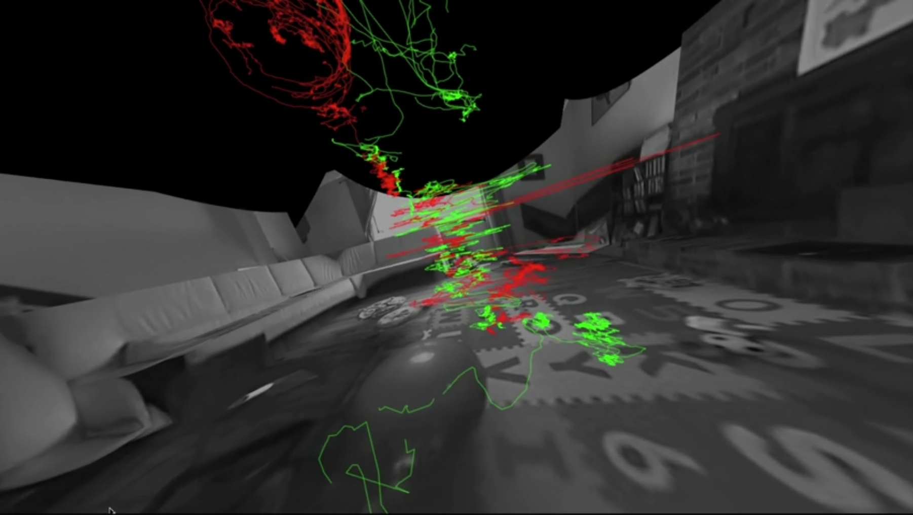
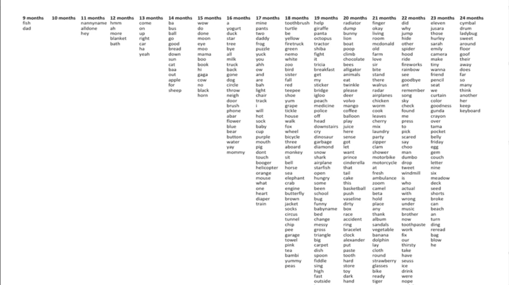
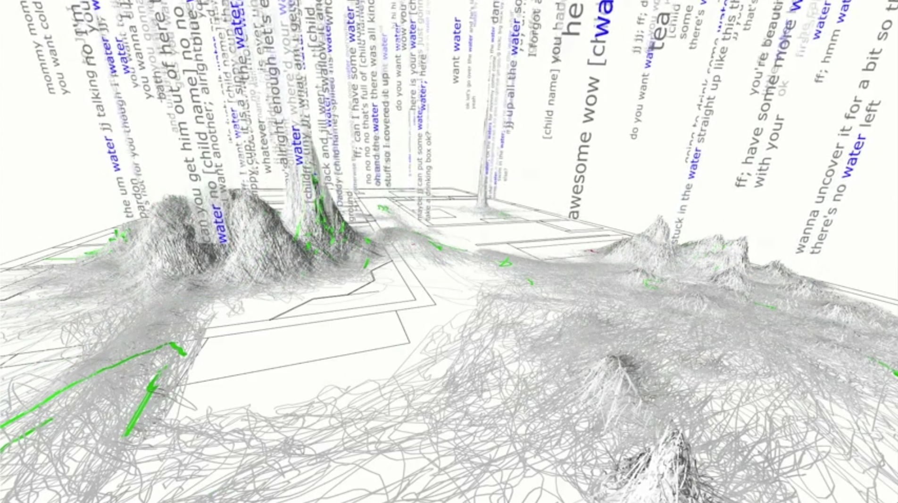

+++
author = "Yuichi Yazaki"
title = "人が言葉を覚えるとき"
slug = "ted-birth-of-word"
date = "2020-05-20"
description = ""
categories = [
    "consume"
]
tags = [
    "ted"
]
image = "images/The-birth-of-a-word_2.png"
+++

MITの研究者デブ・ロイさんが研究として、人が生まれてから、言語を獲得していく様子をすべて動画として記録し、あとで分析できたらどんなことがわかるか。

<!--more-->

ビッグデータの性質の一つ、リアルタイムに近い記録タイミングでデータを保存しつづけるため、結果テラバイトなどの膨大なデータ量になる、全量データの取得という方法論があります。

人の行動記録を全記録することでそこから新しい事実がわかるのか。時系列の生データから、こどもの言語習得の過程を分析的に把握することができるか。

TEDでその結果を発表しています。

自分の子供が生まれたタイミングで、自宅のすべての部屋の天井にカメラとマイクを設置。赤ちゃんがどうやって言語を習得するのか解明すべく、その記録は3年間に及び、9万時間の映像、14万時間の音声、ファイルサイズは200テラバイトにもなったとのことです。

たとえば「ウォーター」（水）と最初は発話できず、「ガガ」としか言えないのが、正確な発音の「ウォーター」になるまでの半年間の言葉の変化の軌跡を、連続的に把握することが可能になりました。また習得には一緒にいることが大きくかかわっていたとのこと。緑色が大人の動線で、赤色が子供の動線です。

ウォーターをはじめ、最初の二年で覚えた単語を、覚えた順に並べてみたそうです。

すべての単語に言える話として、そこにいた大人が三人とも、子供が話せるようになるまではできるだけシンプルな言葉使いをし、子供が話せた瞬間から、無意識的に大人が使うような複雑な言い回しに戻ってたということがわかったそうです。つまり、子供の話し方自体が周りの人へも影響を与え、子供が言葉を話せるようになるフィードバックループをいつのまにか作り上げていた、と。

この三年間で、子供が「ウォーター」と発音した回数を、自宅空間にプロットしてみると、やはりですが台所であることが多かったり、玄関で「バイ」が多かったようです。

