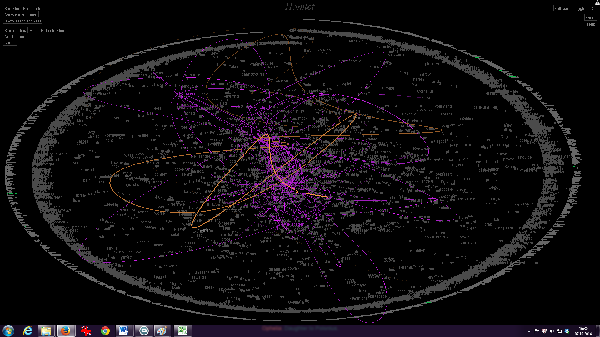
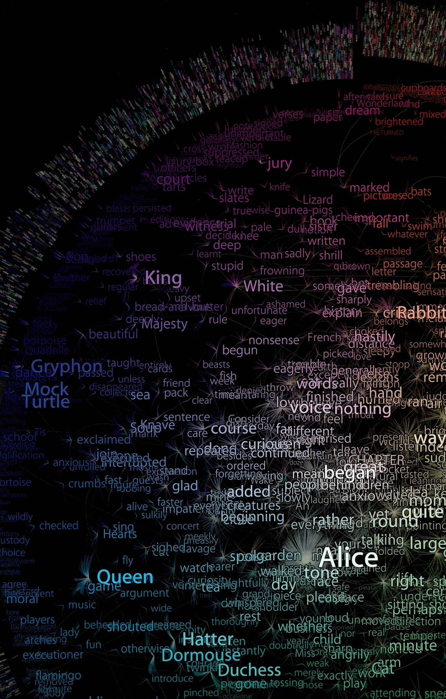

+++
author = "Yuichi Yazaki"
title = "TextArc: A Map for Looking at Alice"
slug = "textarc"
date = "2025-10-02"
categories = [
    "consume"
]
tags = [
    "",
]
image = "images/367_text-arc.png"
+++

In the early 2000s, information designer **W. Bradford Paley** created **TextArc**, a visualization based on Lewis Carroll's *Alice's Adventures in Wonderland*. It is neither a conventional illustration nor a standard analytic chart. It treats the whole text as something to be looked at, turning the story into a map of language.

<!--more-->

## How It Works

In TextArc, the full text is arranged in tiny type along a circular spiral. More frequent words emerge near the center in larger, brighter text.

- Frequent words appear prominently in the middle.
- Their positions in the source text are connected by lines.
- The viewer can see where and how often a word appears across the story.

For example, "Alice" shines near the center and connects to many locations throughout the book. Words that appear only once sink toward the edge like small fragments.

## Reception and Context

TextArc won the Grand Prize in the Digital Art Non-Interactive category at the 6th Japan Media Arts Festival. It was praised for combining data analysis and artistic expression while preserving a sense of the whole literary work.

It is also included in SIGGRAPH-related archives and discussed in the Archive of Digital Art as a work that bridges literature and interface design.

## What It Shows

TextArc changes the act of reading by making the text visible as a whole.

- It gives an overview of the entire work.
- It reveals repeated words and their distribution.
- It creates an aesthetic experience in which text resembles a constellation.

## Summary

**TextArc: Alice's Adventures in Wonderland** is a rare work that connects literature, data visualization, art, and analysis. It maps the appearance and disappearance of words and reveals another form of the text.

## References

- [TextArc print: Alice's Adventure in Wonderland — Japan Media Arts Festival](https://j-mediaarts-festival.bunka.go.jp/award/single/textarc-print-alices-adventure-in-wonderland/index.html)
- [W. Bradford Paley: TextArc — ACM SIGGRAPH History Archives](https://history.siggraph.org/artwork/w-bradford-paley-textarc/)
- [TextArc — Archive of Digital Art](https://digitalartarchive.at/database/work/3358/)
