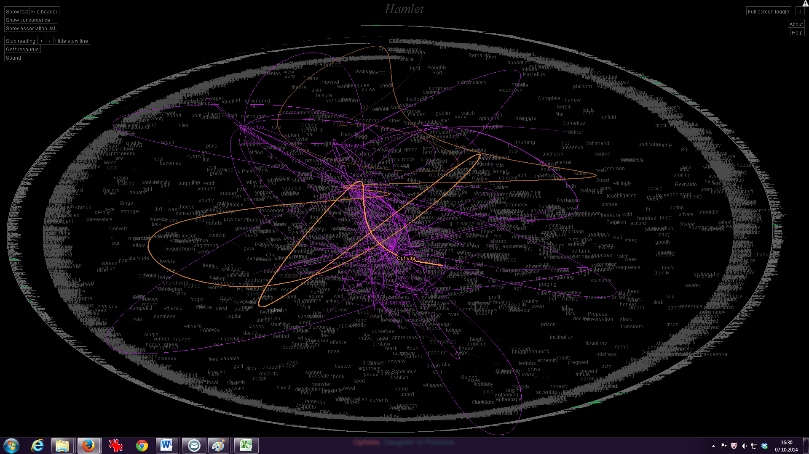
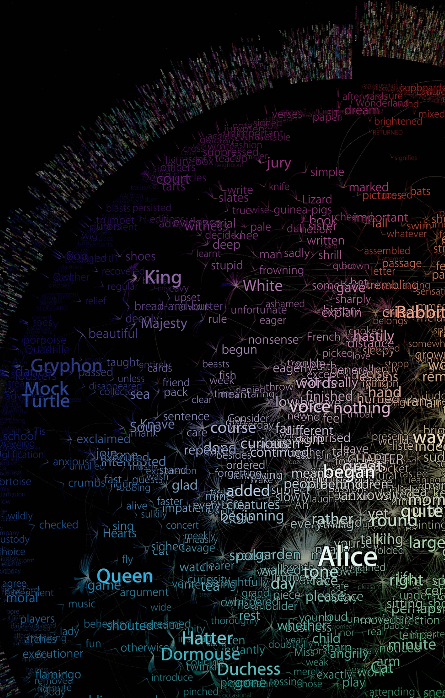

+++
author = "Yuichi Yazaki"
title = "TextArc: アリスを「眺める」ための地図"
slug = "textarc"
date = "2025-10-02"
categories = [
    "consume"
]
tags = [
    "",
]
image = "images/367_text-arc.png"
+++

2000年代初頭、情報デザイナー Bradford Paley は、ルイス・キャロル『不思議の国のアリス』を素材に、独自のテキスト可視化作品 「TextArc」 を発表しました。これは単なる文学の挿絵でもなく、データ解析の図表でもありません。テキスト全体を「読み」ではなく「眺める」対象とし、物語の構造やパターンを一望できる「テキストの地図」として機能します。

<!--more-->

## 作品の仕組み

TextArc では、物語の全文が 円環状の螺旋 に沿って微細な文字で並べられています。これだけでは単なる全文表示ですが、Paley の工夫はそこからさらに進みます。

- 出現頻度の高い単語は、中央に大きく浮かび上がる。
- 出現位置は、外周テキストと中央の単語を結ぶ線で示される。
- こうして、「その単語がどの場面で、どれほど繰り返し登場するか」を一目で把握できる。

たとえば「Alice」は中心に明るく輝き、多数の線で物語全体に結び付けられています。一方で、1回しか登場しない単語は外縁に小さく沈み込み、背景の星屑のように散らばります。

## 評価と文脈

この作品は 第6回文化庁メディア芸術祭 デジタルアート（非インタラクティブ部門）大賞 を受賞しました。審査員は「データ分析と芸術表現を融合させた稀有な試み」と評し、可読性を保ちながら文学の全体像を新しい視点で可視化した点を高く評価しています。

さらに、SIGGRAPH のアーカイブに登録されることで、デジタルアートやコンピュータグラフィックスの歴史の中でも重要な位置を占める作品とされています。
加えて、Archive of Digital Art (ADA) では「文学とインタラクティブアートを橋渡しする作品」として紹介されており、単なるアート作品にとどまらず、テキストを読むための新しいインターフェースの探求という文脈に置かれています。

## 作品が示すもの

TextArc は、「本を読む」という行為を別の角度から体験させます。

- 全体の俯瞰：物語全体を一望できる。
- 出現のパターン：どの単語が繰り返され、どこで現れるかを直感的に把握できる。
- 美的体験：文字が星座のように散りばめられ、テキストが「宇宙」として立ち現れる。

それはまるで、文学作品を「文学的な銀河」として再発見する体験でもあります。

## まとめ

TextArc: Alice’s Adventures in Wonderland は、文学とデータ可視化、アートと分析をまたぐ稀有な試みです。
文学作品をただ読むのではなく、言葉の出現と消失、中心と周縁をひとつの地図に描き出す。そこから見えてくるのは、テキストそのものの「もうひとつの姿」です。

## 参照リンク

- [TextArc print: Alice's Adventure in Wonderland - 文化庁メディア芸術祭](https://j-mediaarts-festival.bunka.go.jp/award/single/textarc-print-alices-adventure-in-wonderland/index.html)
- [W. Bradford Paley: TextArc – ACM SIGGRAPH HISTORY ARCHIVES](https://history.siggraph.org/artwork/w-bradford-paley-textarc/)
- [TextArc - ADA | Archive of Digital Art](https://digitalartarchive.at/database/work/3358/)

