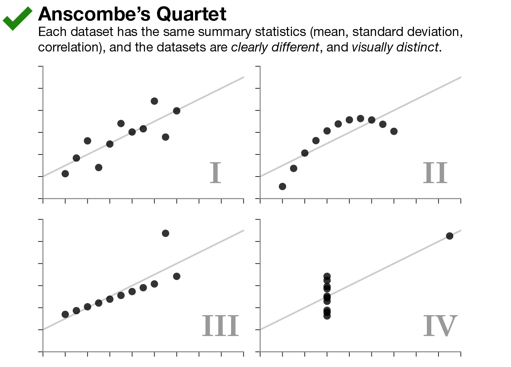
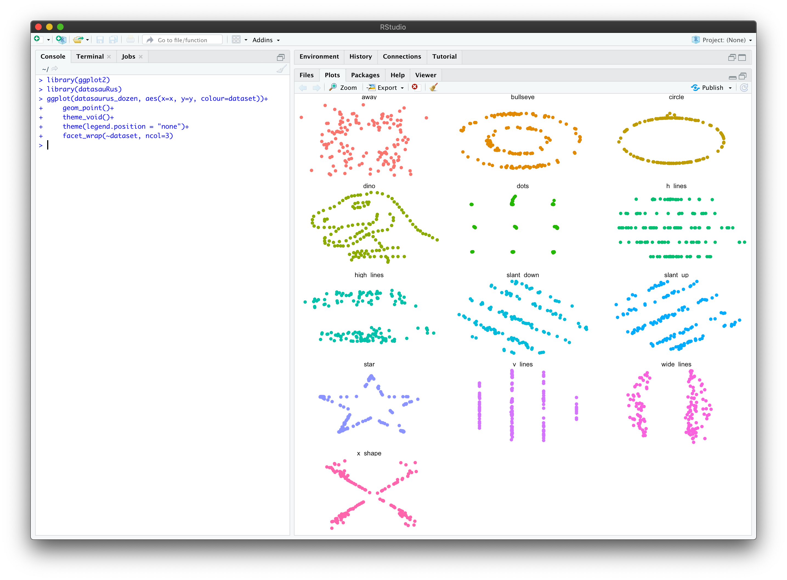

+++
author = "Yuichi Yazaki"
title = "12匹のデータ・ザウルス"
date = "2020-07-11"
description = ""
categories = [
    "consume"
]
tags = [
    "chart",
]
image = "AllDinosGrey_1-2048x1431.png"
+++

データ可視化の有用性を示すために、 Anscombe’s Quartetが参照されることがよくあります。

<!--more-->

[Anscombe’s Quartet](https://www.autodeskresearch.com/publications/samestats)

これは何かというと、要約統計量（平均、標準偏差、相関）が同一のデータセット4つが、実際に散布図として可視化してみると全く異なる姿を描くところから、要約統計量が同一もしくは近似していても、まずは一度は可視化してみるべし、というお話です。

ここで、発想を逆さまにして、要約統計量が小数点２桁まで同一でありながら、散布図化してみると様々な視覚的特徴を描くデータセットを生成するアルゴリズムを考えた人がいます。

その名も The Datasaurus Dozen（12匹のデータ・ザウルス）。恐竜がモチーフになっているのは、Alberto Cairo氏のいたずらのような楽しめる投稿記事に由来します。

- [Download the Datasaurus: Never trust summary statistics alone; always visualize your data](http://www.thefunctionalart.com/2016/08/download-datasaurus-never-trust-summary.html)

## どうやっているのか

共通の要約統計量を持つデータセットをゼロベースから生成するのは難しいと考え、既存のデータセットからスタートし、それらの統計的特性を維持しながら、望みの視覚的印象に近づくまで、少しづつ繰り返し修正を行う、というアプローチをとっています。

- [Animation showing the progression of the Datasaurus Dozen dataset through all of the target shapes.](https://www.autodeskresearch.com/publications/samestats)
- [Same Stats, Different Graphs: Generating Datasets with Varied Appearance and Identical Statistics through Simulated Annealing](https://www.autodeskresearch.com/publications/samestats)

Rのパッケージ化もなされています。R Studioで試してみた様子です。これはシミュレーションではなく、すでに算出されたデータを表示しているだけです。

