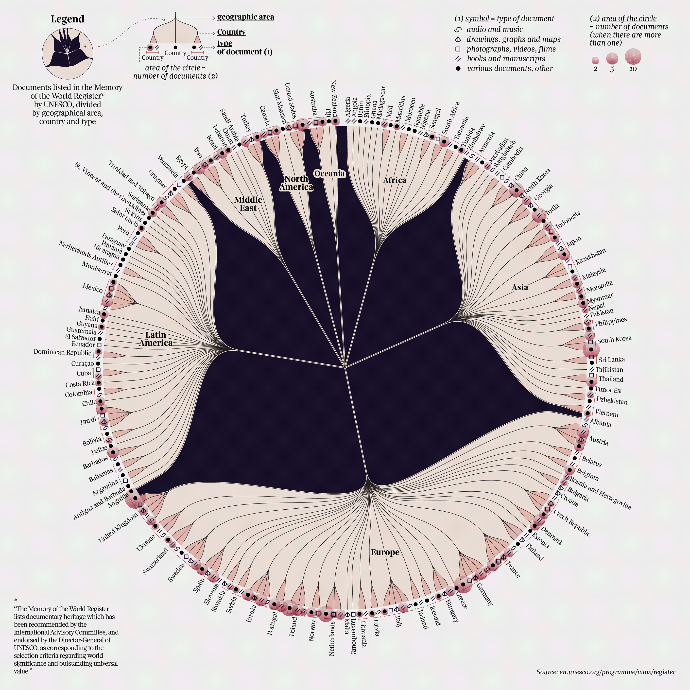
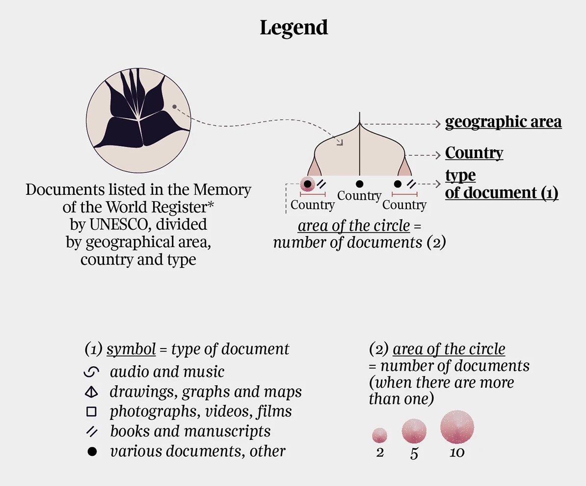

+++
author = "Yuichi Yazaki"
title = "Visualizing The Memory of the World Register"
slug = "the-memory-of-the-world-register"
date = "2025-10-05"
description = ""
categories = [
    "consume"
]
tags = [
    "オリジナルのビジュアル変換",
]
image = "images/cover.png"
+++

This infographic by **Federica Fragapane** visualizes UNESCO's **Memory of the World Register**, focusing on documentary heritage. It classifies registered materials by geographic region, country, and document type, showing how the world's records are distributed across places and media.

The work was created for the *Visual Data* series in *La Lettura*.

<!--more-->

## How to Read the Legend

The infographic organizes UNESCO-registered documentary heritage into three layers: **geographic area -> country -> type of document**.

### Hierarchical Structure

- **Geographic area**  
  Major branches radiating from the center represent regions such as Europe, Asia, Africa, Latin America, the Middle East, North America, and Oceania.

- **Country**  
  Country names appear at the ends of smaller branches.

- **Type of document**  
  Small symbols next to country names indicate the types of registered documentary heritage.

### Symbol Meaning

| Symbol type | English category |
|---|---|
| Curved mark | Audio and music |
| Diamond | Drawings, graphs, and maps |
| Square | Photographs, videos, and films |
| Double slash | Books and manuscripts |
| Dot | Various or other documents |

### Circle Area

The circle area represents the number of documents when more than one item is registered. The legend gives reference sizes for 2, 5, and 10 documents.

### Overall Reading

The radial structure turns the register into a branching map of cultural memory. It lets readers see which regions hold which kinds of documentary heritage, and where particular types of material are concentrated.

## Design Features

Fragapane treats the data as a network of world knowledge rather than as a list. The branching structure suggests roots or growth, while the symbols and circle sizes allow document type and quantity to be compared at the same time.

## Summary

"The Memory of the World Register" visualizes memory as a global, material, and institutional structure. Behind each mark is an effort to preserve documentary heritage considered to have world significance and outstanding universal value.

## References

- [The Memory of the World Register — Behance](https://www.behance.net/gallery/119713231/The-Memory-of-the-World-Register)
- [UNESCO Memory of the World Register](https://en.unesco.org/programme/mow/register)
