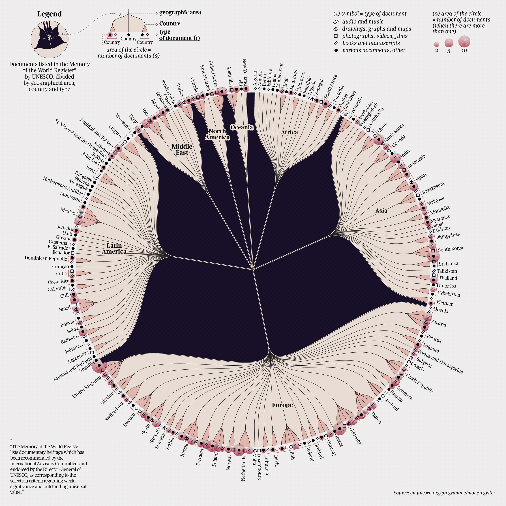
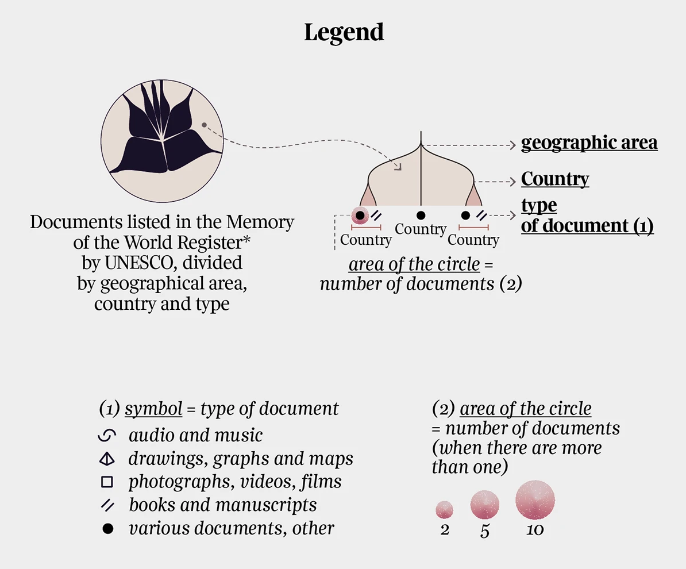

+++
author = "Yuichi Yazaki"
title = "世界の記憶を可視化する「The Memory of the World Register」"
slug = "the-memory-of-the-world-register"
date = "2025-10-05"
description = ""
categories = [
    "consume"
]
tags = [
    "オリジナルのビジュアル変換",
]
image = "images/cover.png"
+++

本作は **Federica Fragapane** による作品で、ユネスコ（UNESCO）が保護対象として登録している「 **世界の記憶（Memory of the World Register）** 」を可視化したインフォグラフィックスです。文化遺産のうち「文書遺産（documentary heritage）」に焦点を当て、地理的地域、国、資料の種類ごとに分類し、世界各地の記録物がどのように分布しているかを円環状に描き出しています。

この作品は、Corriere della Sera紙の文化特集「La Lettura」向けに制作されたシリーズ **“Visual Data”** の一部として発表されました。

<!--more-->

## 図解の見方（凡例の読み解き）

このインフォグラフィックスは、ユネスコ「世界の記憶（Memory of the World Register）」に登録された文書遺産を、**地理的エリア → 国 → 文書の種類**という3階層で可視化しています。凡例はその構造と記号の意味を示しています。

### 階層構造の理解

- **geographic area（地理的エリア）**  
  中心から大きく分かれる枝が、世界の主要地域（Europe, Asia, Africa, Latin America, Middle East, North America, Oceania）を示しています。

- **Country（国）**  
  各地域から伸びる細い枝の先端に国名が並びます。枝の長さや数に比例して、その地域内での登録国の多さが視覚的に示されます。

- **type of document（文書の種類）**  
  各国名の横に並ぶ小さなシンボルが、その国で登録された文書遺産のタイプを表します。

### 記号（symbol）の意味

凡例右側の「(1) symbol = type of document」に示されているように、シンボルは次の5種類です。

| 記号 | 英語分類 | 日本語訳 |
|:---:|:---|:---|
| 〰️（曲線） | audio and music | 音声・音楽資料 |
| ◆（菱形） | drawings, graphs and maps | 図面・地図・グラフ類 |
| □（四角） | photographs, videos, films | 写真・映像・映画資料 |
| //（二重斜線） | books and manuscripts | 書籍・写本類 |
| ●（黒丸） | various documents, other | その他の資料・分類外の文書 |

> ※ 図中では、各国の名前の横にこれらのシンボルが配置され、登録された文書の種類を示しています。

### 円の大きさ（area of the circle）

凡例右下にある「(2) area of the circle = number of documents (when there are more than one)」が示すように、  
**円の面積は登録件数の多寡を表します。**

凡例には基準値として以下の目安が描かれています。

- 小さい円：2件  
- 中くらいの円：5件  
- 大きい円：10件  

このスケールにより、同じ記号でも件数の多い国ほど大きな円で示されます。円の外周には淡いピンクのグラデーションが加えられ、件数の重みが柔らかく視覚化されています。

### 4. 全体構造の読み方

凡例左側の図にあるように、各地域の領域が花弁のように広がり、その中で国ごとに小さな記号と円が並んでいます。  
中央から外へ向かう放射状の配置は、**地域 → 国 → 文書タイプ → 件数**というデータの階層構造をそのまま形として表現したものです。

この構造によって、「どの地域がどの分野の記録遺産を多く保有しているか」を、俯瞰的かつ一目で把握できるようになっています。

### 5. 注釈にある定義文

凡例下部に引用されている注釈：

> *“The Memory of the World Register lists documentary heritage which has been recommended by the International Advisory Committee, and endorsed by the Director-General of UNESCO, as corresponding to the selection criteria regarding world significance and outstanding universal value.”*

この一文は、登録対象の基準を示したユネスコ公式定義です。  
つまり、この可視化に描かれたすべての点と線は、「**世界的意義と顕著な普遍的価値をもつ記録遺産**」の位置づけを持つことを意味します。

この凡例全体は、単なる説明図ではなく、「どのような文脈で“記憶”が可視化されているか」を理解するための縮図になっています。図表全体を読む前に、この凡例を丁寧に読み解くことで、作品の構造的な意図がより明確に理解できるよう設計されています。

## デザイン上の特徴

Fragapaneによる本作では、データを単なる数量の一覧ではなく、「世界の知のネットワーク」として視覚化しています。

- 放射状の構造は、知識や記録が**根を張る植物のように世界中に広がる様子**を連想させます。
- 各国が持つ文化的記録が、地域間でどのように偏在しているかを、形と密度で直感的に示します。
- シンボルの形と円の面積によって、**資料の多様性と量的規模**の両方を一目で比較できるようになっています。

Fragapaneの一連の作品には共通して、「複雑なデータを詩的な形で表現する」という特徴があり、本作もその代表例といえます。

## まとめ

「The Memory of the World Register」は、単なる統計図ではなく、「記憶」という抽象的な概念を世界スケールで視覚化した作品です。  
データの背後には、人類が共有すべき知の遺産と、それを未来へと残そうとする努力の積み重ねがあります。

Fragapaneは、科学的な正確さと芸術的な感性を両立させることで、「情報を読む」だけでなく「感じ取る」インフォグラフィックスを実現しています。

## 参考・出典

- [The Memory of the World Register :: Behance](https://www.behance.net/gallery/119713231/The-Memory-of-the-World-Register)
- [UNESCO Memory of the World Register](https://en.unesco.org/programme/mow/register)
