+++
author = "Yuichi Yazaki"
title = "遠い変化を、部屋の壁にする——Giorgia Lupi / Accurat『The Room of Change』"
slug = "the-room-of-change"
date = "2026-08-16"
description = "紀元前1000年から西暦2400年までの変化を、壁紙として先に見せる Accurat の『The Room of Change』を、データ可視化とスペキュラティブ・デザインの交差から読む。"
categories = [
    "consume"
]
tags = [
    "オリジナルのビジュアル変換",
]
image = "images/cover.jpg"
+++

Giorgia Lupi が共同創業した Accurat（Giorgia Lupi, Gabriele Rossi, Nicola Guidoboni, Giovanni Magni, Lorenzo Marchionni, Andrea Titton, Alessandro Zotta）による『The Room of Change』（2019）は、第22回トリエンナーレ・ミラノ本展 *Broken Nature: Design Takes on Human Survival*（キュレーター：Paola Antonelli）の**最初の部屋**のために委嘱された、約30メートルの手仕事によるデータ・タペストリーです。展覧会公式チェックリストでは4件の特別委嘱のひとつに数えられ、入口で展示全体のトーンを決める役割を担いました。

ここで重要なのは、本作が「正確な科学図」として入口に置かれたわけではない点です。Lupi 側の公式説明は、変化のほとんどが「遠く、高いところから」しか見せられない、という前提から始まります。部屋の中央には NASA の衛星映像が過去20年の地球を上から映し、壁は紀元前1000年から西暦2400年までを横方向に流します。*The New York Times* は、この先を **speculative future**（推測的な未来）と呼びました。データ可視化とスペキュラティブ・デザインが交差するのは、この時間の伸ばし方と、スケールの切り替えにおいてです。

<!--more-->

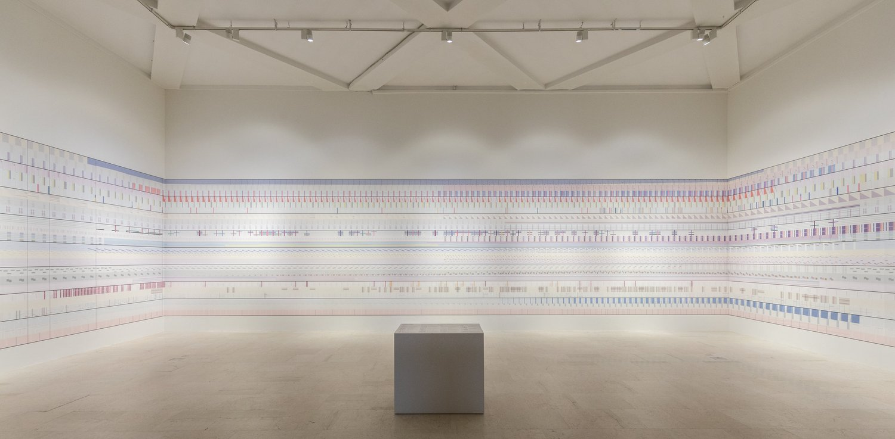

写真はいずれも © La Triennale di Milano — foto Gianluca Di Ioia（制作資料の図は Accurat / Giorgia Lupi）。

## 部屋の構成

部屋は三つの層でできています。

1. **壁**：手仕事の data tapestry / data-driven wallpaper。左から右へ時間が流れ、過去・現在・未来を覆う。
2. **正面の大画面2面**：NASA の *Images of Change*。過去20年の、上空から見た地球の変化。NYT が同定した名称です。
3. **部屋の中央の台座**：凡例。Lupi はこれを、山脈を眺めるときの案内図に喩えています。Accurat のケーススタディは、展望台の解説板のように、部屋全体を特権的に見渡す装置だとしています。

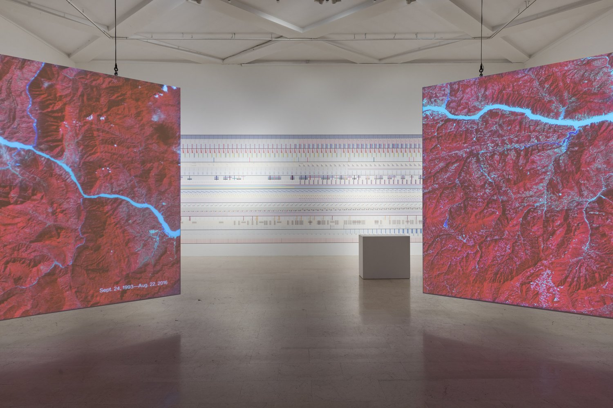

Pentagram のアーカイブは、壁を取り巻くものを *data murals* と呼び、8つのマクロ主題がそれぞれ異なる抽象パターンで表されると書いています。Accurat の現行ページは、生物多様性、気候、資源消費、技術進歩といった長期変化を、グローバルとローカルの両方で描いた、と要約しています。

最初に見えるのは、チャートではありません。Lupi はこう書いています。一見しただけでは、モチーフを組織しているのがデータだと気づかないかもしれない、と。Muted な形と線とパターンが NASA 映像の両脇にあり、それが人新世の歴史を覆っているとは、入室時には登録されないかもしれない——Accurat の旧ケーススタディも同じ観察を繰り返しています。壁紙であることが先で、データであることは後です。

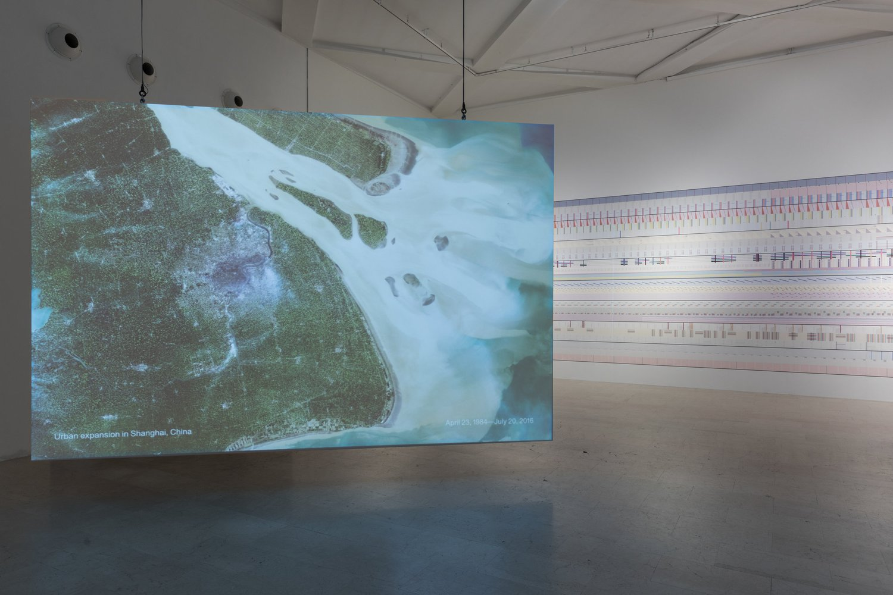

## 作品の見方

公式の読み方は、本のように左から右、そして同時に縦、の二方向です。

1. **横方向は時間です。** 左が過去、中央が現在、右が未来。各垂直断面は、ある瞬間を凍らせたスナップショットです。Accurat は、横に読めば人間の相互作用の8つの章、縦に見れば特定年における力の絡み合い、と書いています。一つの関係の「壊れた自然」を修繕するには、触れるもの・触れられるものすべてとの相互作用を見よ、という提案です。

2. **横縞は、変化の物語です。** 各ストライプは一つのストーリーで、その主題の複数データセットが時間とともに変化します。8つのマクロ主題はいずれも人間に関係しますが、帰結はしばしば他種にも同時に及びます。

3. **グローバルな太い線と、ローカルな細い線を重ねて読みます。** 世界人口、平均気温、疾患率、エネルギー消費などが「広い筆致」で大規模現象を枠取り、その帰結として個別の物語が置かれます。Lupi が本文で例示しているのは、消えゆくアラル海、カンボジア内戦期の平均寿命の落ち込み、韓国輸出の農産・一次産品からハイテクへの急転換です。

4. **中央の凡例で、壁を翻訳します。** Nightingale のインタビューで Lupi は、自分をアーティストではなく情報デザイナーと呼ぶ理由を、凡例に置いています。体験を渡すだけでなく、データへのアクセスを渡すこと。パイロットが着陸判断に使う図ではないから、読む時間を要求してよい、と。部屋の中央に凡例を置くことは、その立場の空間化です。

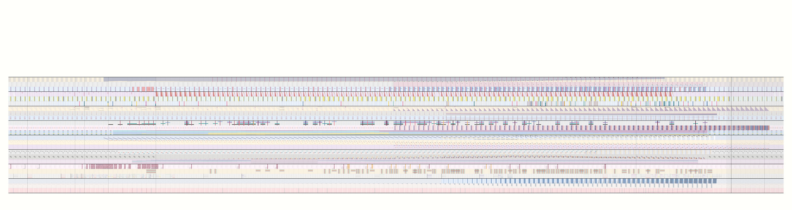

制作資料の模式図は、三面の壁に時間を割り当てています。左壁が紀元前1000–1900年、正面が1900–2000年、右壁が2000–2400年です。20世紀が正面の一壁を占め、その後の400年が右の一壁です。物理的な幅が、時間の均等割ではないことが、ここで読めます。

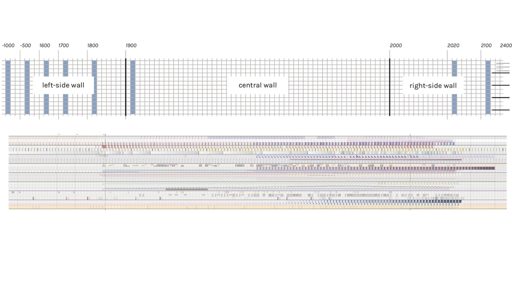

準備スケッチでは、まだマクロ主題は「Humans and nature / Humans / society / Technology / Science / Animals」という人間との関係で仮置きされています。完成形の8主題は、この関係の束を、読める章に切り直したものです。

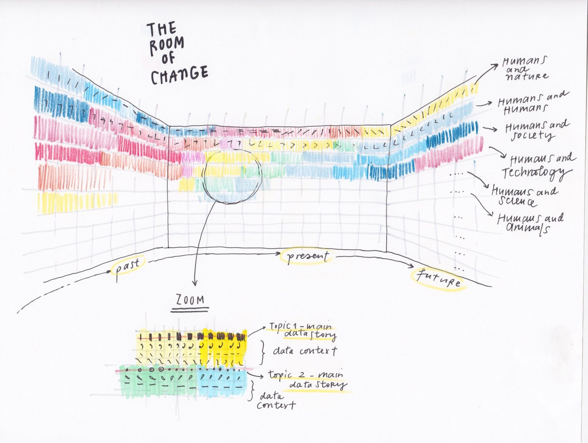

## 8つのマクロ主題

凡例が示す完成形は、各マクロ主題の内側に、地理的に特定された1件とグローバルな2件を重ねる、という型です。Accurat のケーススタディが書いていた「one geo-specific issue and two global subjects」と一致します。以下は、公開されている凡例に記された名称です。

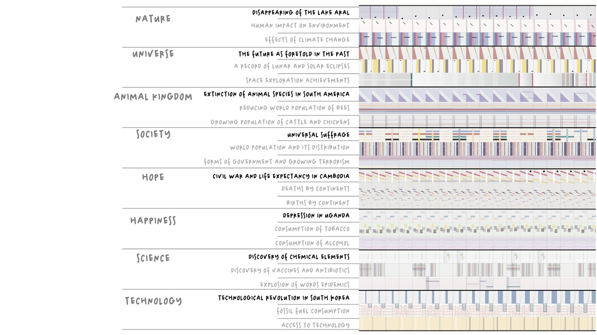

| マクロ主題 | 地理的に特定された物語 | グローバルな対象 |
|---|---|---|
| Nature | アラル海の消失 | 人間の環境影響、気候変動 |
| Universe | （過去に語られた）未来の予言 | 月食・日食の記録、宇宙探査の達成 |
| Animal Kingdom | 南米の種の絶滅 | 世界の蜜蜂の減少、牛・鶏の増加 |
| Society | （各国の）普通選挙の達成 | 世界人口とその分布、統治形態とテロの増加 |
| Hope | カンボジアの内戦と平均寿命 | 大陸別の死、大陸別の生 |
| Happiness | ウガンダにおけるうつ病 | たばこの消費、アルコールの消費 |
| Science | （年表としての）化学元素の発見 | ワクチンと抗生物質、世界の疫病 |
| Technology | 韓国の技術革命 | 化石燃料の消費、技術へのアクセス |

凡例のヘッダは、色のもう一つの軸も説明しています。地理的親和（六大陸）と、文化的親和（ラテンアメリカ、北アフリカと中東など）です。形が主題、色が場所、横が時間、という三重です。

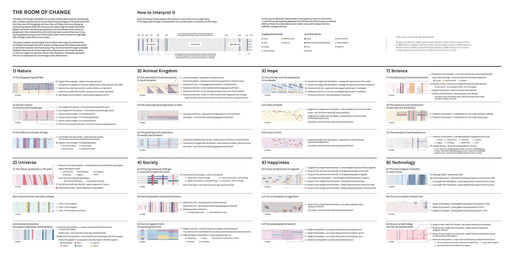

公式ページが *data-detail* として並べている近景が、凡例の記号が壁の上でどう重なるかです。縦の細線が時間の目盛りになり、色の帯・斜線・短冊が変数になります。離れると壁紙で、近づくとデータです。

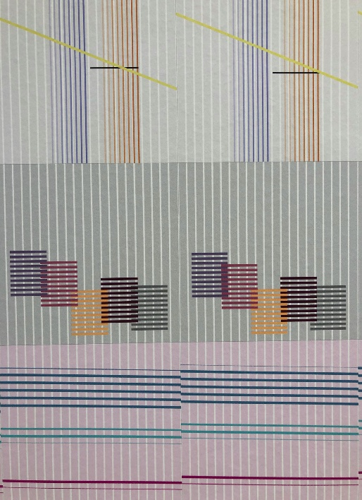
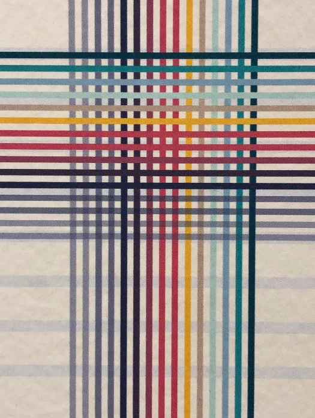

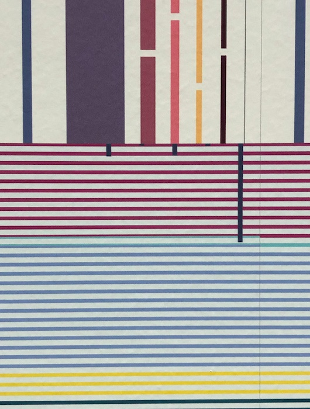
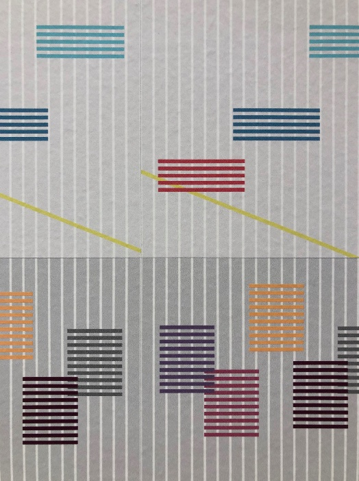

Il Post は開幕時に、八つの視点として「自然、宇宙、動物界、社会、幸福、科学と技術」を括弧書きしました。凡例と照らすと、欠けていたのは **Hope** です。Elle Decor がキュレーション側の Laura Maeran の案内として伝えた「出生、人々の物語、動物界、希望、幸福」は、Hope と Happiness を別章として置く完成形とつながります。

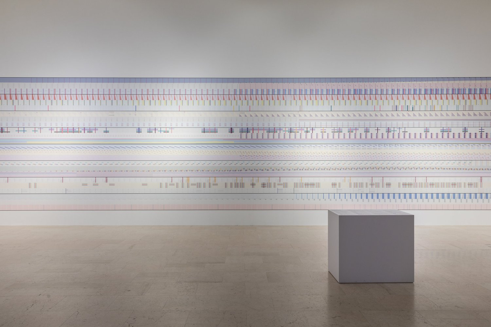

## 一次情報から見える制作条件

委嘱の役割は、Broken Nature の主題を、入口のインスタレーションとして文脈化することです。展覧会は *restorative design*（修復的デザイン）を掲げ、人間と自然環境をつなぐ糸の、ほつれたもの・完全に切れたものを調べます。Antonelli のカタログ結論は NYT が引用しています。「生存の唯一のチャンスは、美しい絶滅を自らデザインすることだ」。壊れたものは元に戻らず、新しいものへ進む。最終なのは絶滅だけだ、と彼女はインタビューで補っています。

タペストリーの時間は、その長い射程に合わせています。Accurat は紀元前1000年〜西暦2400年と明記し、Lupi は「過去何世紀かにどう変わり、いまも変わり、これからもおそらく変わり続けるか」と書いています。*likely* です。確定予報ではありません。

制作の方法は、意図的に人文的だと Lupi は書いています。データは実生活のスナップショットであり、数字は常に何か別のもののプレースホルダである。主観的な収集と解釈に基づき、人によって意味が違う。より冷たく無菌なデータと、より小さく関係しやすい情報を重ねるほど、意味のある結果になる、と。これはのちの Data Humanism マニフェストと同じ骨格です。Nightingale で彼女は、可視化は現実の単純化ではなく、現実をよりアクセス可能にするものだ、とも述べています。

手仕事であることも方法です。Accurat は、手仕事の物質性が人間の行為の持続的な効果を強化し、生データを感情的な体験へ変える、と書いています。Nightingale で Jason Forrest が Anni Albers（当時テートで展覧中）との類似を問うと、Lupi はこう答えています。タペストリーにする判断は先にあった。ただし縦糸と横糸の重なりは、無意識に影響されたかもしれない、と。織物は装飾ではなく、時間（横）と主題（縦）を同時に読むための構造です。

## データ可視化 × スペキュラティブ・デザイン

スペキュラティブ・デザインは、完成解を提示するより、「もしこのままなら」「もし別のスケールで見るなら」という条件を立てて、いま見えていない現実や将来を議論可能にします。本作が自分を speculative とは名乗っていなくても、NYT が未来端をそう呼んだ理由は、データが2400年まで延びているからです。初出は2040年と誤記され、訂正で2400年になりました。400年先と3400年先では、推測の性質が違います。その距離こそが、入口の主張です。

**遠い変化を、身体のスケールに戻す。** 指導原理は、変化のほとんどが遠く高くからしか示されない、ということです。NASA の20年は「大きなスケール」です。タペストリーは、日常と関係しやすい、より小さく、mundane な変化の物語でそれを補う、と Lupi は書いています。Klat は、この対話を「複雑なデータを、環境劣化を理解する鍵にする」と位置づけ、巨大な変化の根には常に個人の選択がある、と足しています。衛星は被害の画像を渡し、壁は被害の文法を渡します。

**壁紙として先に住まわせる。** 凡例の前に、模様があります。Accurat は、穏やかな複雑さが探索を誘う、と書いています。これは Data Humanism の「複雑さを引き受けよ」と、Accurat 自身の原則「美は余分ではない」が重なる地点です。美しさは説得の修辞であり、長い時間を部屋のなかで過ごさせる装置です。チャートとして正しいことと、部屋として滞在可能であることは、別の設計問題です。

**未来を、予測図ではなくシナリオとして置く。** 2400年は、現行軌道の延長です。Lupi の *likely* は、確定ではなく条件です。Broken Nature 全体が、絶滅を前提にした「より優雅な終わり」と、日常で何ができるかの感覚を同時に求めます。Antonelli は NYT に、市民のための展示だ、長期の感覚と、複雑さは敵ではなく友だという感覚を持って帰ってほしい、とも述べています。タペストリーの右端は、その長期を壁の長さとして物質化しています。Universe の章が「過去に語られた未来」——終末の予言——をデータとして持つことも、ここに重なります。推測そのものの歴史が、推測的未来の隣に並びます。

**縦に読むことを、修繕の仮説にする。** 横は物語、縦は同時性です。ある年の断面で、人口と気温と疾患と輸出と幸福が同じ壁に並ぶ。一つの指標を直しても、隣の縞は動かないかもしれない。Accurat は、この先の展示作品を「可能な解決」として見る準備をさせる、と書いています。実際、同じ本展には Dunne & Raby の *Foragers* など、スペキュラティブ・デザインの正典も並びます。入口のタペストリーは、それらの「もし」を受け取るための、長い現在です。

**冷たいデータと、誰かの場所を重ねる。** アラル海、カンボジア、韓国、ウガンダ。グローバル指標の「広い筆致」だけでは、数字はプレースホルダのままです。ローカルな一本が、プレースホルダを地点に戻します。不完全さの引き受け方は、欠損の告白ではなく、スケールの併用です。

## 第三者による評価・評判

公開時の報道は、デザイン／文化メディアが中心です。トーンはほぼ一貫して、「知的／複雑」と「入口で殴られる」の並置です。個別作品の再現精度を検証した評というより、展覧会の導入装置として成立したか、が評価の軸です。

- **The New York Times**（2019-03-20, *The End Is Nigh. Can Design Save Us?*）は、展示は知的だが打撃は強い、人の影響は最初のギャラリーで叩き込まれる、と書いています。NASA の before/after の手前に、色帯と記号の100フィートの壁紙壁画があると記述し、人口・疾患率・エネルギー消費・平均気温の流れだと要約しています。データは紀元前1000年から推測的未来の2400年まで、と明記し、初出の2040年誤記を訂正しています。Antonelli の「長期」「複雑さは友」「日常で何ができるか」という発言も、この部屋の文脈で引かれています。
- **Il Post**（2019-02-28）は、展示の野心は最初の作品で分かると書き、見たことのないほど複雑なインフォグラフィックだが、間違いなく最も芸術的なものの一つだ、と評しています。八つのマクロ視点という整理を、イタリア語圏の読者向けに先に言語化した記事でもあります。
- **Cool Hunting** は、来館者がテーマの頂点に立ち、心と脳に語りかけ、感情と反省を促す、と入口を要約しています。Gabriele Rossi と Giorgia Lupi の名を出し、グローバル現象とローカルな話題を重ねたグラフィック・タペストリーだと紹介しています。
- **Elle Decor**（イタリア版）は、NASA 映像が一種の壁紙になり、最初のエリアで Accurat が過去・現在・未来の多重の変化を視覚的に語る、と案内しています。キュレーション側の言葉として、気候変動の帰結を意識してほしい、ここは出生、人々の物語、動物界、希望、幸福の話だ、と伝えています。
- **Klat** の Antonelli インタビュー記事は、NASA の大きな画像と Accurat の可視化の対話として本作を置き、グローバルと個人の関係を描くデータ可視化だとしています。続く解釈（巨大変化の根には個人の選択がある）は評者側の足しです。一次の自己規定より、展示内での機能の読みに近い。
- **Broken Nature** 公式の portrait 記事は、ハイパー接続の世界で「変化」を味わうこと、グローバルとローカル、集合と個人の絡みを意味づけることの困難を前提に、その複雑さに Accurat が取り組んだ、と編集者ノートを付けています。来館者をギャラリーへ迎え、展示全体のトーンを設定する、という役割規定は、制作側ではなく展覧会側の言葉です。
- **Nightingale**（Data Visualization Society, 2019-08-14）は、NYT の写真を見た Forrest が Albers との関係を一年温めていた、という制作後の専門家コミュニティの受容を残しています。一般紙が「入口の打撃」を書き、可視化の同行者が「凡例と織り」を問う、という分業が、そのまま評判の地図です。
- **IndesignLive** は、Neri Oxman の *Totems*、Sigil の *Birdsong*、Formafantasma の *Ore Streams* と並べ、4件の委嘱の一つとして紹介しています。個別の形式批評というより、本展の柱としての認知です。

Accurat 自身は、Cool Hunting、Frieze、Elle Decor、Corriere della Sera、Il Post、Designboom、そして NYT での扱いを、報道の一次リストとして挙げています。Frieze と Designboom の本文は、本稿では直接確認できていません。Corriere の開幕記事は展示全体の理念が中心で、本作を単独評してはいません。

評価の中心は、再現精度の検証というより、「人新世の長期を、部屋として滞在可能にしたか」です。Lupi の仕事はもともと、論文の可視化ではなく、人が数字に関われる状態を設計することにあります。本作もその延長で読んだ方が筋が通っています。

ただし緊張は残ります。Klat が個人の選択へ回収する読みは、Antonelli が言う市民の日常感覚と接続する一方、システム規模の問題を個人の倫理へ圧縮しうる。Accurat が縦読みで求めるのは、その圧縮の拒否——一本の縞ではなく、同時に並ぶ縞です。複雑さを友にする、というキュレーターの言葉は、凡例を中央に置く設計と対になっています。読め、という要求です。単純化ではありません。

## まとめ

『The Room of Change』は、気候変動を一枚の正しいグラフに圧縮した作品ではありません。**上空の20年**と**壁の3400年**を同じ部屋に置き、変化をチャートとして示す前に、壁紙として住まわせます。横は物語、縦は同時性、中央は翻訳。グローバルな太い線は枠で、アラル海やカンボジアや韓国は、数字を地点に戻すための細い線です。

スペキュラティブであることは、未来を描き込んだ装飾ではありません。2400年までを *likely* として伸ばし、修繕の対象を「一つの関係」から「触れるものすべて」へ開くための条件です。Data Humanism が言う「数字はプレースホルダである」は、ここでは免責ではなく、冷たいデータと関係しやすい物語を重ねる方法です。NASA が見せるのは、すでに起きた地表の差です。タペストリーが見せるのは、その差が、どの主題の、どの年の、どの場所の話として部屋に残るかです。

## 参考・出典

**一次情報**

- [The Room of Change — Giorgia Lupi](https://giorgialupi.com/the-room-of-change)
- [The room of change — Accurat](https://studio.accurat.it/work/the-room-of-change)
- [XXII Milan Design Triennale Commission — Accurat（旧ケーススタディ）](https://beta.accurat.it/work/broken-nature)
- [Accurat—The Room of Change — Broken Nature](http://www.brokennature.org/accurat-the-room-of-change/)
- [Broken Nature portrait #3: Accurat—The Room of Change](http://www.brokennature.org/broken-nature-portrait-3-accurat-the-room-of-change/)
- [Broken Nature Checklist](http://www.brokennature.org/checklist/)
- [‘The Room of Change’ — Pentagram](https://www.pentagram.com/work/the-room-of-change/story)
- Giorgia Lupi, [Data Humanism, The Revolution will be Visualized](https://giorgialupi.com/data-humanism-my-manifesto-for-a-new-data-wold)

**第三者**

- *The New York Times*, [The End Is Nigh. Can Design Save Us?](https://www.nytimes.com/2019/03/20/arts/design/milan-triennial-restorative-design.html)（2019-03-20。2400年への訂正あり）
- Il Post, [“Broken Nature” e come il design potrebbe salvare il mondo](https://www.ilpost.it/2019/02/28/broken-nature-triennale/)（2019-02-28）
- Cool Hunting, [XXII Triennale di Milano: Broken Nature](https://coolhunting.com/culture/xxii-triennale-di-milano-broken-nature-design-takes-on-human-survival/)
- Elle Decor Italia, [Broken Nature, a guide to the XXII Triennale di Milano](https://www.elledecor.com/it/best-of/a26628464/broken-nature-guide-22-triennale-di-milano/)
- Klat, [Paola Antonelli. Design and Survival](https://www.klatmagazine.com/en/design-en/paola-antonelli/65051)
- Nightingale, [The Data We Do Not See: An Interview with Giorgia Lupi](https://medium.com/nightingale/https-medium-com-nightingale-the-data-we-do-not-see-an-interview-with-giorgia-lupi-2b29212d010e)（2019-08-14）
- IndesignLive, [Design for survival or legacy?](https://www.indesignlive.com/news/design-legacy-milan-triennale)
- Dedece Blog, [The Room of Change @ Salone Milan 2019](https://www.dedeceblog.com/2019/04/23/the-room-of-change-salone-milan-2019/)（制作側テキストの再録が中心）
