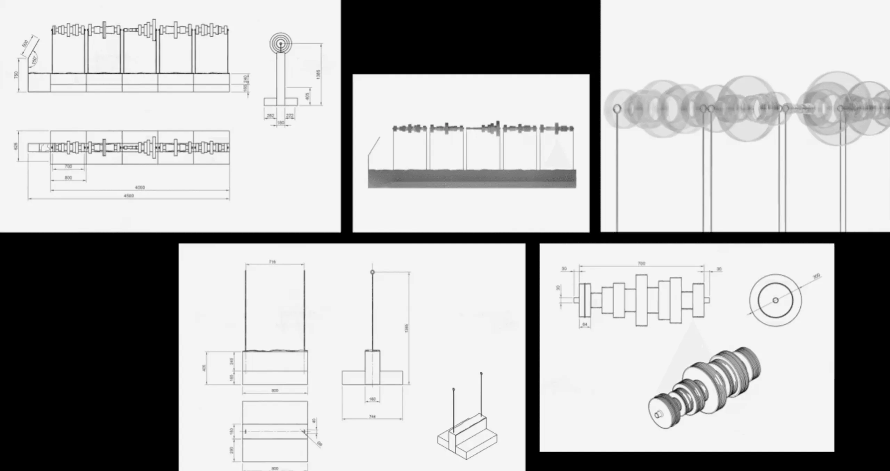

+++
author = "Yuichi Yazaki"
title = "The Wind That Moves Us"
slug = "the-wind-that-moves-us"
date = "2026-01-02"
categories = [
    "consume"
]
tags = [
    "データ物質化",
]
image = "images/3xl-webp_DOMESTIC_DATA_STREAMERS_THE_WIND_THAT_MOVE_US_MANGO_1_1_65a9c71701.png"
+++

「The Wind That Moves Us」は、リサーチ／デザインスタジオのDomestic Data Streamersが、ファッションブランドMangoの40周年に合わせて制作した、データ駆動の彫刻（データ・スカルプチャー）です。

Mangoのチーム（社員）に向けたサーベイ（アンケート）結果を数値化し、その結果をバー・チャートとして設計に落とし込み、彫刻の形状や寸法の一部をデータで決める、参加型の作品として構成されています。

Domestic Data Streamersは、この作品を「チームの価値観をたどる彫刻」と位置づけ、Mangoの5つの企業価値と、地中海的な比喩としての「風」を重ねて語っています。

<!--more-->

## 作品の見方

この作品は、まず「近づいて観る」と「少し離れて全体で観る」で、読み取れるものが変わります。以下の順で観ると理解しやすいです。

1. まずは“5つの価値観”の区切りを見つけます

   台座にはMangoの価値観（Caring / Committed / Entrepreneurial mindset / Authentic / Culturally curious）が並び、作品全体が「価値観ごとのセクション」に分割されていることが分かります。ここが、この作品の“章立て”です。

2. 各セクションの「透明なパーツの連なり」を“バー・チャートの列”として見立てます

   Domestic Data Streamersの公式説明では、アンケート結果を数値化し、それをバー・チャートとして表現したうえで、その輪郭（形）をトレースして彫刻形状を設計した、とされています。つまり、透明なパーツの凹凸や幅の変化は、単なる装飾ではなく「回答傾向（数値）の起伏」を物理形状に写したものだと捉えると読みが立ちます。  
   ここで重要なのは、棒グラフを“平面上の棒”としてではなく、“長手方向に連続する起伏”として身体的に読むことです。

3. 作品の「高さ」ではなく「長手方向のリズム」を読みます

   ふつうの棒グラフは縦方向（高さ）を比較しますが、本作はガラス（または透明素材）の塊が横方向に連続し、起伏のリズムとして見せます。  
   観点は次の2つです。  
   - リズムが細かい／粗い：回答のばらつきや、質問ごとの差の“頻度感”を連想させます。  
   - かたまりが大きい／小さい：特定の問い（あるいは指標）の“強さ”や“偏り”を連想させます。  
   ※ただし、どのパーツがどの質問項目に対応するかなどの厳密な対応表は、公開ページ上では明示されていないため、本記事では推測しません。

4. 「風」という語り（メタファー）で解釈の枠をつくります

   公式説明では、Mangoの価値観を地中海の風に重ね、風が海岸線や地形を彫るように、価値観が組織を形作ってきた、と語られます。  
   ここで作品を“会社紹介のパネル”として読むのではなく、  
   - 価値観＝目に見えないもの  
   - 風＝目に見えないが、地形（形）を変える力  
   - データ＝集団の傾向を可視化する媒介  
   という三者関係として読むと、この作品が「説明」よりも「体験」に寄っていることが見えてきます。

## 背景知識

この作品は、研究領域でいう「データ・フィジカライゼーション（Data Physicalization）」の文脈で理解できます。これは、データを3D形状や素材特性など“物質”として符号化し、コミュニケーションや学習、意思決定などを支える物理的表現を扱う分野です。可視化がピクセル上の表現であるのに対し、フィジカライゼーションは手触りやスケール感、空間配置といった身体性を介して、理解や感情反応に影響しうる点が特徴とされています。

本作も、アンケートの集計結果をバー・チャートとして設計し、それを物理造形へ接続することで、組織の価値観を“触れられる距離のもの”として提示しています。

## データ構造

公開されている一次情報から、この作品のデータは少なくとも次の構造を持ちます。

- 対象：Mangoの全チームに対するサーベイ
- 軸：Mangoの5つの企業価値（Caring / Committed / Entrepreneurial mindset / Authentic / Culturally curious）
- 質問：各価値観について「個人の姿勢（例：Caringなら“聴く”を優先するか“助言”を優先するか等）」を問う質問群
- 変換：回答結果を数値化 → バー・チャート化 → 形状（輪郭）としてトレース → 彫刻の形状・寸法の一部に反映

作品が「データ駆動」であるポイントは、単にデータを説明図として添えたのではなく、造形そのものの決定（測定値や形の一部）にデータを使った、と明言している点です。

## 価値観と「風」の対応

公式ページでは「5つの風を5つの価値観に結びつけた」としたうえで、例として2組の対応を挙げています。公開されていない対応は推測せず、例示されている範囲のみ表にします。

| Mangoの価値観 | 風（公式に例示されたもの） | 公式説明での性格づけ（要旨） |
|---|---|---|
| Entrepreneurial mindset | Tramuntana | 強く、確かで、力強い風として結びつけた |
| Caring | Midday wind | 柔らかく、温かく、南へ向かう風として結びつけた |
| Committed | （未公開） | 公式ページ上で対応する風の名称は明示されていません |
| Authentic | （未公開） | 同上 |
| Culturally curious | （未公開） | 同上 |

## 制作プロセス

公式ページの記述から、制作は大きく次の段階で進んだことが分かります。

- 1. 目的設定  
    - Mango40周年の文脈で、チームの重要性を称え、同時にブランドの価値観と地中海的精神に整合する体験を作る。
- 2. サーベイ設計と実施  
    - 全チームへアンケートを実施し、価値観ごとに“日々の行動原理”を問う。
- 3. データ処理とパラメタ化  
    - 回答を数値化しバー・チャート化、造形の輪郭と寸法へ転写する。
- 4. 素材・構造設計と制作  
    - プロダクトデザイナー（Gennis Sennen）の協力を得て素材性や台座・全体構造を詰め、ガラス作家（Ferran Collado）を含む複数の職人（ガラス／金属／石）と協働して制作する。加えて、小型レプリカも制作し、リテール現場との接続も図った。
- 5. 作品を補助する映像の制作  
    - 作品の物語と制作過程を説明する短編映像を制作。ナレーションは「風」として語られ、カタルーニャ各地の場所性と職人技を通して“現代のクラフツマンシップ”を強調する。ただしこの映像は社内利用を想定したものとされます。

## デザイン上の注意点（鑑賞者／制作者の観点）

- 「数値の正確さ」より「比喩の整合性」を優先して読むと破綻しにくいです  
    - 本作は分析ツールではなく、価値観と集合的な傾向を体験化する作品です。厳密な尺度や凡例が公開されていない以上、読みは“正誤”ではなく“納得”の設計に寄っています。
- 透明素材は「データの客観性」ではなく「手がかりの軽さ」を作ります  
    - 透明であることで、形の起伏は見えるが“押しつけがましく断定しない”印象になります。価値観という抽象概念を扱うとき、断定を避ける素材選択として機能します。
- 台座の言葉が「読む入口」を作り、形が「考える余白」を作ります  
    - ラベルは明確に意味を固定しますが、造形は解釈を開きます。この分業が、社内向け作品としての“共有しやすさ”と“個別の内省”を両立させています。

## まとめ

「The Wind That Moves Us」は、Mangoの5つの企業価値を、地中海の風という比喩で束ね、社員のサーベイ結果をバー・チャートとして設計に落とし込み、造形の一部をデータで決めたデータ彫刻です。

鑑賞のポイントは、作品を“説明図”として読むのではなく、価値観（見えない）→風（見えないが形を変える）→データ（集合の傾向を形へ写す）という連鎖として捉え、台座の言葉で入口を作りつつ、造形のリズムを身体的に読むことにあります。

データを物質化して共有するという点で、本作はデータ・フィジカライゼーションの実践例としても位置づけられ、組織文化の語りを「目に見える形」に変換する試みとして理解できます。

## 参考・出典

- [The Wind That Moves Us | Domestic Data Streamers](https://www.domesticstreamers.com/work/the-wind-moves-us/)
- [Our values | Mango Fashion Group](https://mangofashiongroup.com/en/our-values)
