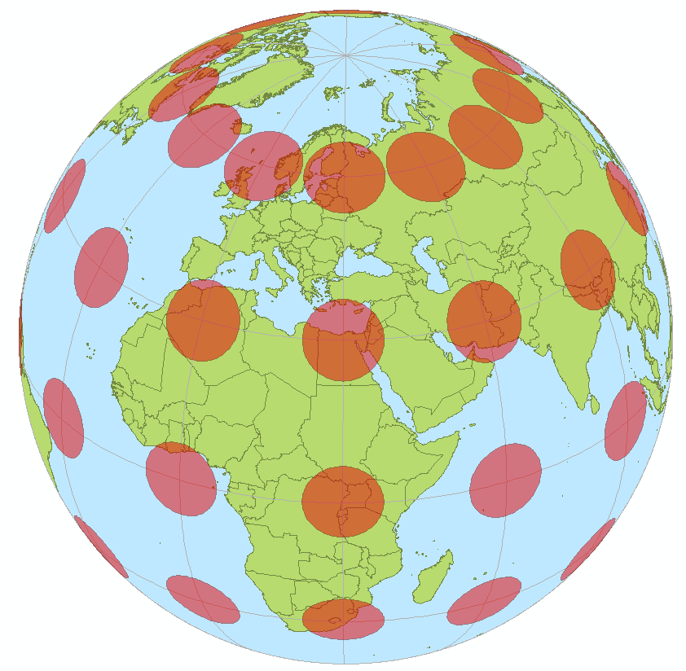
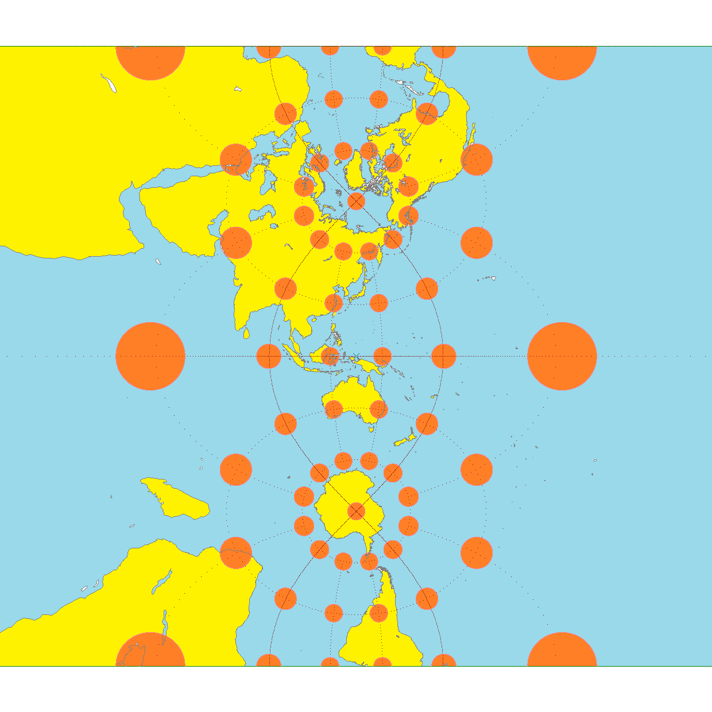
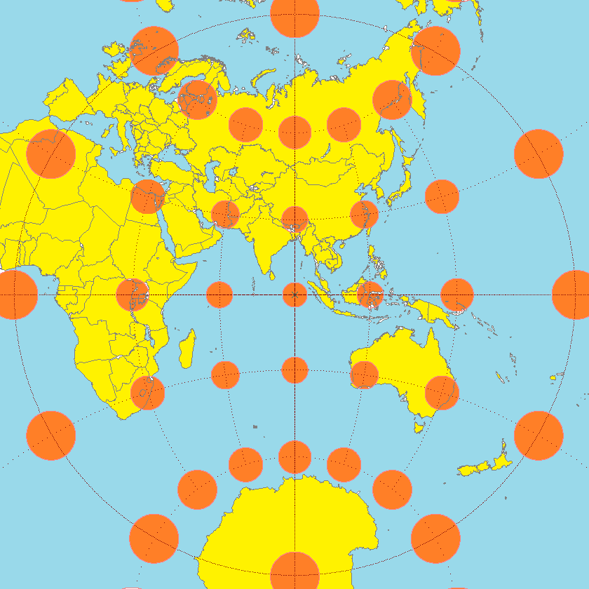
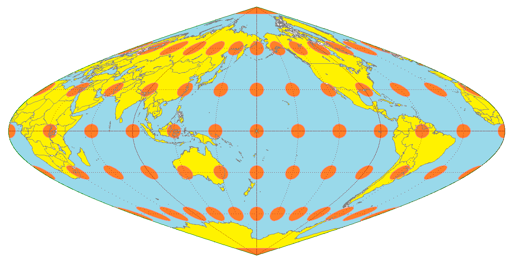
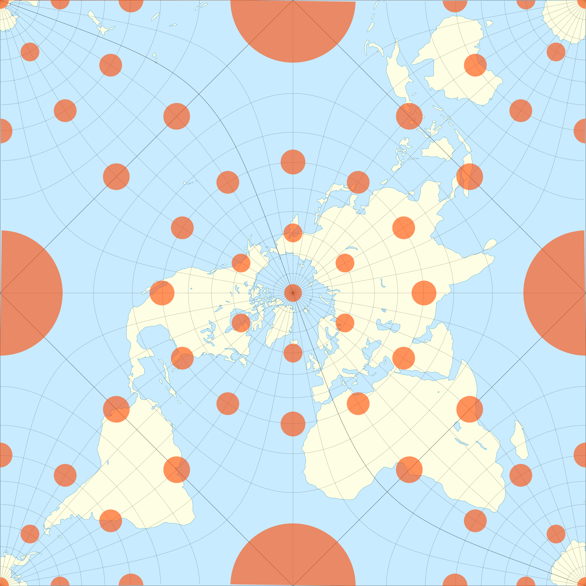
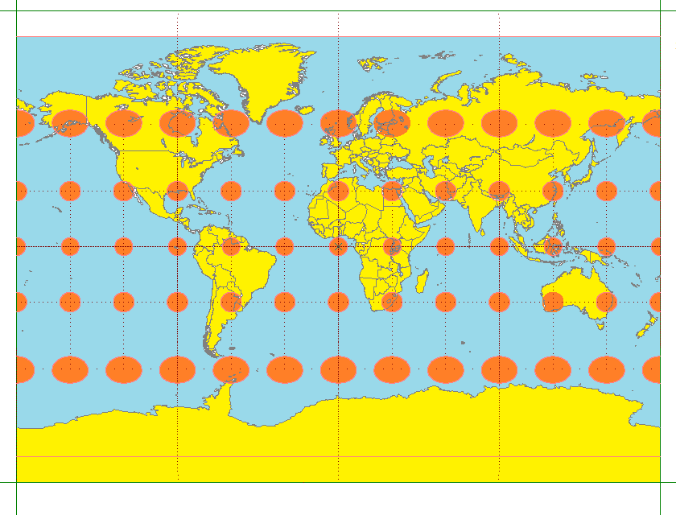
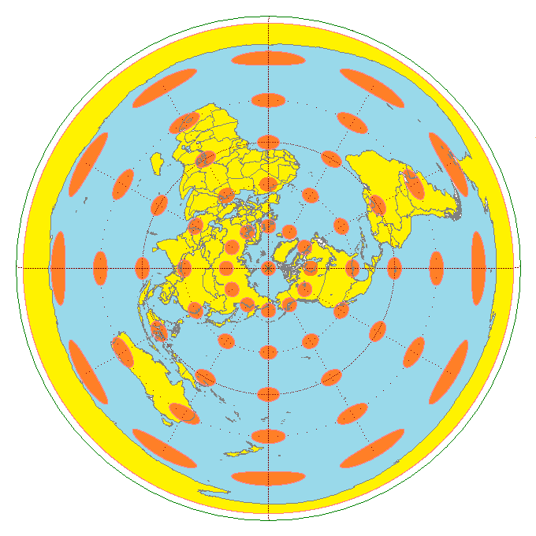
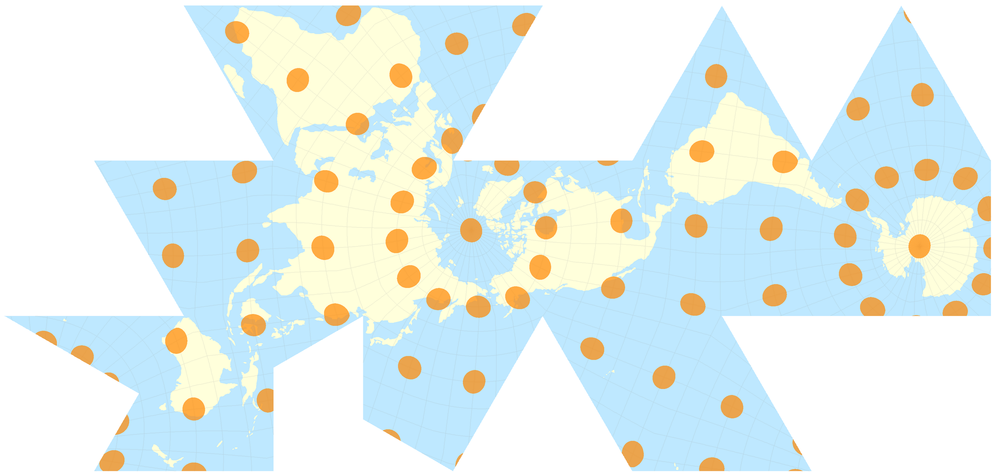

+++
author = "Yuichi Yazaki"
title = "ティソーの指標（Tissot’s indicatrix）"
slug = "tissots-indicatrix"
date = "2025-10-22"
categories = [
    "consume"
]
tags = [
    "教えるための記事",
]
image = "images/Tissot_mercator.png"
+++

地図投影法では、球面の地球を平面上に表現するため、必ずどこかに **歪み（distortion）** が生じます。  
この歪みを定量的かつ視覚的に示す方法として考案されたのが **ティソーの指標（Tissot’s indicatrix）** です。

<!--more-->

## 基本原理

フランスの地図学者ニコラ・ティソー（Nicolas Auguste Tissot）は、1871年にこの手法を発表しました。
地球上のある地点を中心に、半径のごく小さな円を多数配置し、それを地図投影によって平面に写したとき、各円がどのように **形を変えるか（楕円に変形するか）** を観察します。

もし投影が完全に正確であれば、すべての円は地図上でも円のまま残ります。

しかし実際の投影では、円は**楕円**や**変形した図形**になります。

この変形の仕方から、その地点での**方位・面積・形状の歪み**を知ることができます。

## 歪みの読み取り方

| 変化の種類 | 意味 | 可視的特徴 |
|-------------|------|-------------|
| 形が円のまま | 正角（等角）性を保っている | 角度が正確。メルカトル図法など |
| 円が楕円に変化 | 角度の歪みがある | 方位がずれる |
| 面積が変化 | 等積でない | 円が大きくまたは小さくなる |
| 長軸が一定方向に傾く | 方位歪み（directional distortion） | 縮尺の方向依存性がある |

楕円の **長軸の方向** は、最も大きく伸びた方向（＝最大尺度方向）を示します。
**短軸方向** は最も縮んだ方向です。また、**楕円の大きさ**は局所的な面積の拡大・縮小を意味します。

## 可視化の意義

ティソーの指標を用いることで、地図全体の歪み分布を直感的に理解できます。
たとえば：

- **正角図法（メルカトルなど）** では楕円の形は円のままだが、極に近づくほどサイズが大きくなる（＝面積の誇張）。
- **等積図法（モルワイデなど）** では楕円の面積は一定だが、形が横に伸びていく（＝形の歪み）。
- **正距方位図法など** では、中心から離れるほど楕円が放射状に回転し、方位の歪みが見える。

このように、ティソーの指標は「どの投影法にも共通する歪みの地図」を描くための **評価ツール** として利用されます。

## 応用と現代的利用

ティソーの指標は、今日でも次のような場面で利用されています。

- **地図投影法の評価**：GISソフトウェア（QGIS, ArcGISなど）での歪み可視化。  
- **教育・可視化デザイン**：地球儀から地図への変換を直感的に示す教材。  
- **Web地図ツールの研究**：Mapbox, D3-geoなどでもTissot楕円を表示する機能が存在。

近年では、D3.jsやLeaflet、PythonのCartopyなどで動的に生成し、歪みの比較やアニメーション可視化にも応用されています。

## まとめ

ティソーの指標は、地図投影による歪みを「見える化」するための最も基本的かつ普遍的な方法です。

どんな投影法でも、この指標を用いれば「どの場所で、どの方向に、どれだけ歪んでいるか」を同一の尺度で比較できます。

地図を活用する上での **投影法の理解の出発点** となる概念です。

## 参考・出典

- [Tissot’s indicatrix — Wikipedia](https://en.wikipedia.org/wiki/Tissot%27s_indicatrix) 
- [Tissot’s Indicatrix — Cartopy Gallery (SciTools)](https://scitools.org.uk/cartopy/docs/v0.16/gallery/tissot.html)
- [Nicolas Auguste Tissot — Wikipedia](https://en.wikipedia.org/wiki/Nicolas_Auguste_Tissot)
