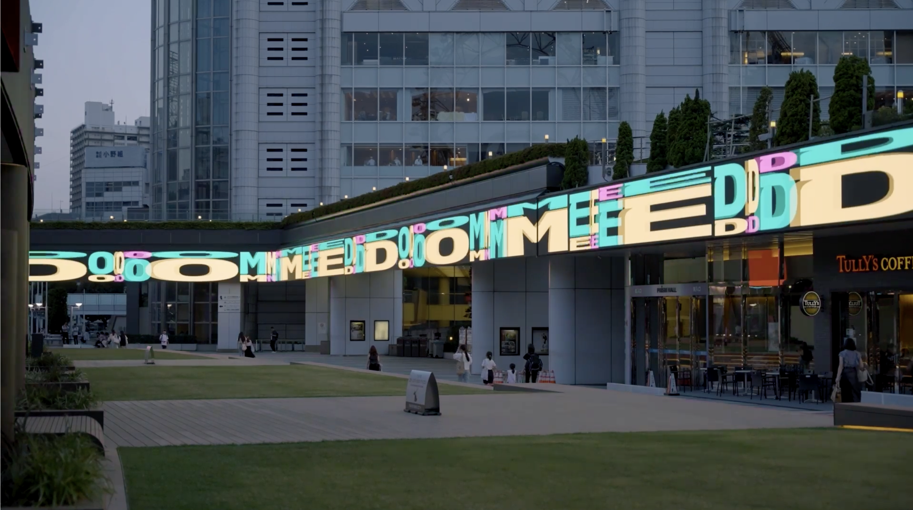

+++
author = "Yuichi Yazaki"
title = "Tokyo Dome City's Adaptive Identity System"
slug = "tokyo-dome-city-adaptive-identity-system"
date = "2026-01-02"
categories = [
    "consume"
]
tags = [
    "",
]
image = "images/cover-tdc.png"
+++

Tokyo Dome City introduced a new visual identity as part of a large renewal carried out from 2023 to 2024. The project was not simply a logo refresh. It was designed as a brand system that can continue to generate and operate across typography, layout, motion, and daily communication.

<!--more-->

At the center of the identity are an original variable font, a variable logo, and software-driven generation. The goal is to express the nature of Tokyo Dome City itself: an urban entertainment environment that changes constantly.



## Brand Context

Tokyo Dome City combines a baseball stadium, amusement park, retail, hotel, spa, and many event spaces. Its audience and communication context change every day, so a fixed identity would not fully capture the site's character.

## Why It Matters

The adaptive identity treats change as a brand asset. Variable typography and generative operation allow the identity to respond to different events, media, and moods without losing coherence.

## Summary

Tokyo Dome City's identity is a strong example of a contemporary adaptive brand system. It uses variable type and software logic to make the brand itself behave like the place it represents.
