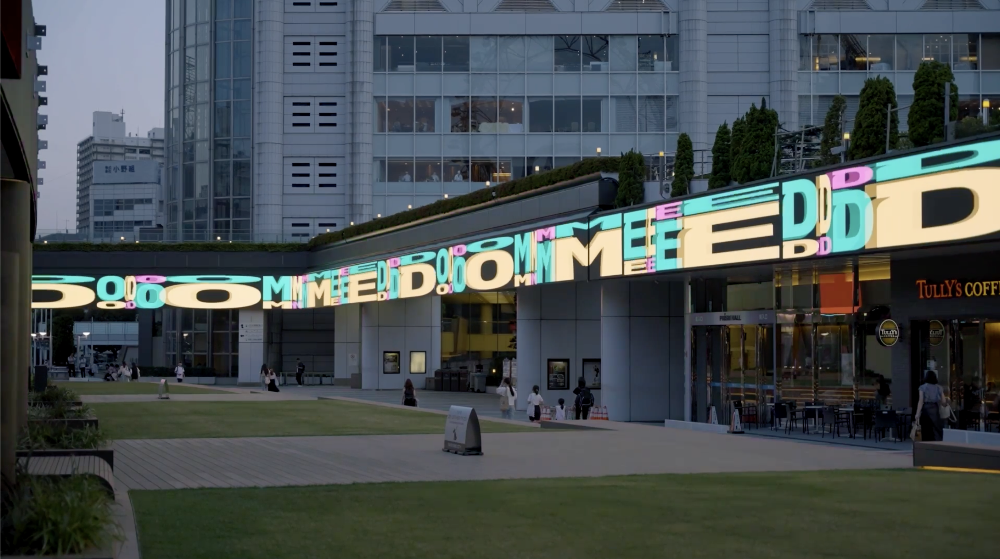
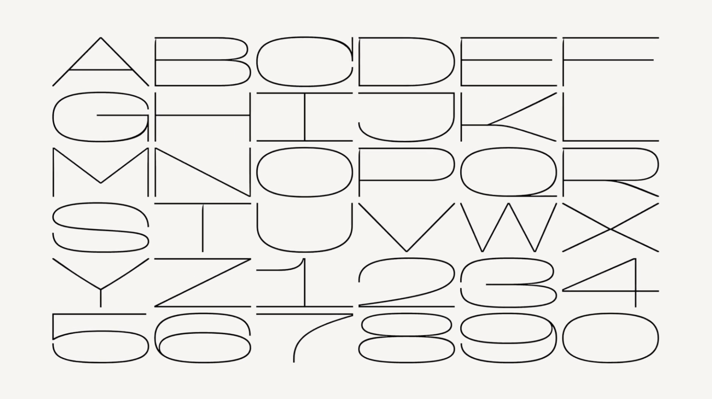
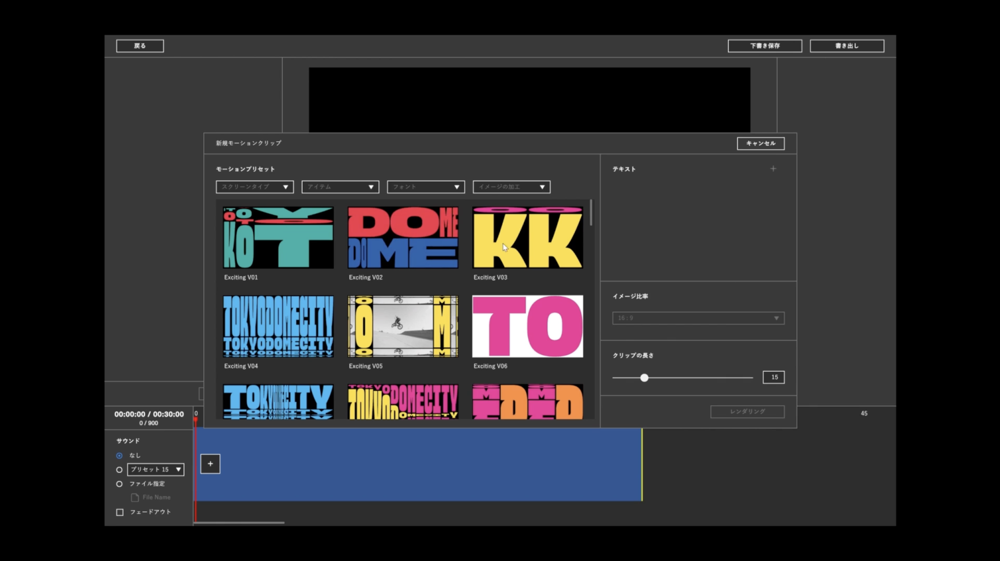
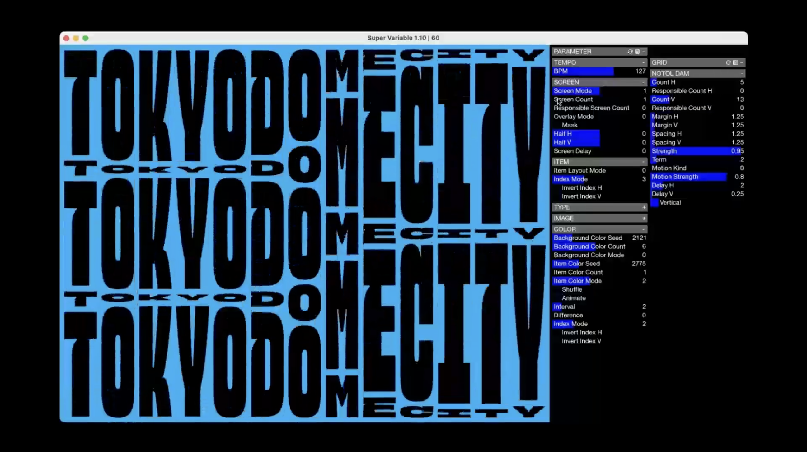
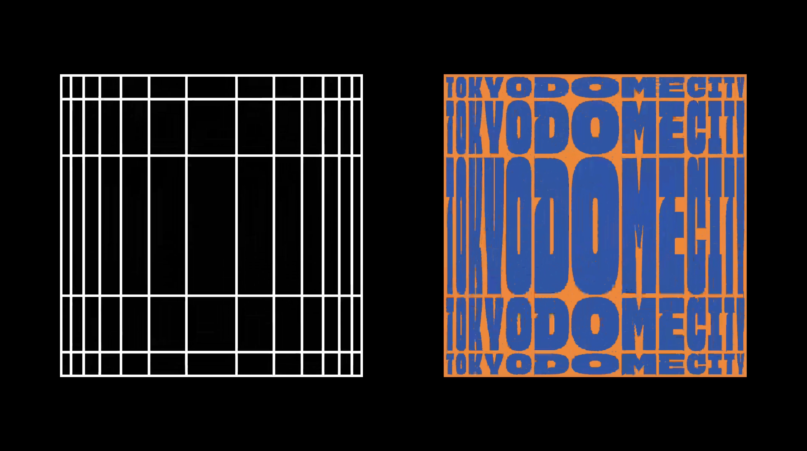
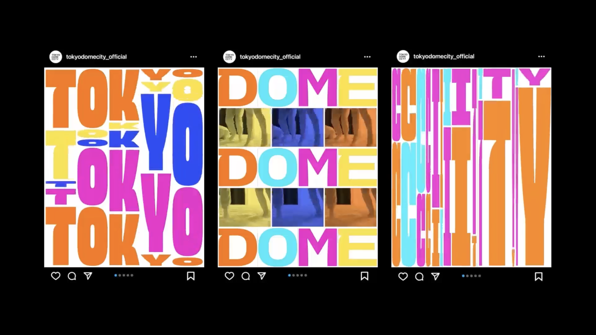

+++
author = "Yuichi Yazaki"
title = "東京ドームシティのアダプティブ・アイデンティティ・システム"
slug = "tokyo-dome-city-adaptive-identity-system"
date = "2026-01-02"
categories = [
    "consume"
]
tags = [
    "",
]
image = "images/cover-tdc.png"
+++

東京ドームシティは、2023年から2024年にかけて実施された大規模リニューアルに合わせて、新しいビジュアルアイデンティティ（ブランドデザイン）を導入しました。本プロジェクトは、単なるロゴ刷新ではなく、文字、レイアウト、モーション、運用方法までを含めた「生成・運用され続けるブランドシステム」として設計されています。

<!--more-->

このビジュアルアイデンティティの中核には、オリジナルのVariable Fontと、それを用いた可変ロゴ、さらにソフトウェア連動による自動生成・運用の仕組みがあります。東京ドームシティという、常に変化し続ける都市型エンターテインメント空間の性質そのものを、ブランド表現として可視化することが目的とされています。



## ブランドデザインの背景

東京ドームシティは、野球場、遊園地、商業施設、ホテル、温浴施設などが複合した都市型エンターテインメントエリアです。年間を通じて多様なイベントが開催され、来場者層や情報発信の文脈も日々変化します。

従来のブランド設計における「固定されたロゴ」「厳格な使用ルール」では、この多様性と動的な環境に十分に対応することが難しくなっていました。そこで新しいビジュアルアイデンティティでは、「変化し続けること」そのものを前提とした設計思想が採用されました。

## デザインコンセプトと設計思想

本プロジェクトの根底にあるのは、ロゴやブランドを「守るべき完成形」ではなく、「状況に応じて生成されるインターフェース」として捉える考え方です。

ロゴは常に同じ形で存在する必要はなく、ルールとパラメータによって無数のバリエーションが生まれること自体が、東京ドームシティの多様性や活気を表現すると考えられています。この思想が、後述する可変フォントやパラメトリックなロゴ設計、運用システムに一貫して反映されています。

## デザインシステムの全体構成

新しいビジュアルアイデンティティは、以下の三層構造で構成されています。

| レイヤー | 内容 |
|---|---|
| タイポグラフィ | オリジナルのVariable Font |
| ロゴ | パラメトリックに生成される可変ロゴ |
| 運用 | ソフトウェア連動による自動生成・展開 |

これらは個別に存在するのではなく、相互に連動することで、一貫性と柔軟性を同時に実現しています。

## オリジナルVariable Fontの技術的特徴

本アイデンティティの中核となる技術が、東京ドームシティのために設計されたオリジナルのVariable Fontです。Variable Fontは、OpenType Font Format 1.8以降で定義された仕組みで、1つのフォントファイルに複数のデザイン軸を内包できます。

公開されている制作事例からは、以下のような軸が想定されます。

| 軸 | 内容 |
|---|---|
| wght | 太さ（Weight） |
| wdth | 文字幅（Width） |
| opsz | 表示サイズに応じた最適化 |
| 独自軸 | 文字の縦横比や密度感の変形 |

特に特徴的なのは、文字の幅と高さを大きく変形できる点で、「TOKYO DOME CITY」という同一の文字列であっても、用途や媒体に応じてまったく異なる視覚的印象を生み出せる設計になっています。

## 可変ロゴ（バリアブルロゴ）の構造

このビジュアルアイデンティティにおいて、ロゴは単一の完成形を持ちません。ロゴは、オリジナルVariable Fontを基盤とし、以下のようなパラメータによって構成されています。

- 文字幅比率  
- 文字高さ比率  
- 行間  
- レイアウト密度  
- 配色  

これらの値を調整することで、縦長サイネージ、横長ビジョン、正方形のSNS投稿、映像フレームなど、それぞれの表示領域に最適化されたロゴが生成されます。

## ロゴの見方（読み解き方）

このロゴを読み解く際に重要なのは、「どの形が正しいか」を探すことではありません。注目すべきなのは、「どのようなルールで生成されているか」です。

文字の歪みや繰り返し、密度の変化は、デザインの破綻ではなく、都市の多様な表情や情報の重なりを象徴しています。ロゴは常に変化しながらも、フォントとルールによってブランドとしての一貫性が保たれています。

## 運用を前提としたシステム設計

本プロジェクトでは、日常的な運用を前提とした専用の生成ツールが構築されています。このツールにより、デザインの専門知識がない運用担当者でも、イベントや時期に応じたビジュアルを生成できます。

重要なのは、属人的なデザイン判断に頼らず、ルールとパラメータによってブランドの一貫性が担保されている点です。これにより、頻繁な更新が必要な都市型施設でも、破綻のないブランド運用が可能になっています。

## モーション表現との連動

ビジュアルアイデンティティは、静的なグラフィックにとどまらず、モーションロゴや映像表現にも展開されています。Variable Fontの各軸は時間軸に沿って連続的に変化させることができ、滑らかな文字変形やリズミカルな動きを実現します。

これにより、ロゴは「動いてもロゴとして成立する」存在となり、デジタルサイネージや大型ビジョンにおいても高い視認性と印象性を保っています。

## デザインと技術の評価ポイント

| 観点 | 特徴 |
|---|---|
| 柔軟性 | 多様な媒体・比率に対応 |
| 運用性 | 非デザイナーでも扱える |
| 一貫性 | ルールとパラメータで担保 |
| 将来性 | デジタル・映像展開に強い |

## まとめ

東京ドームシティの新しいビジュアルアイデンティティは、Variable Fontとパラメトリック設計を核とした、生成型・運用型のブランドデザインです。ロゴを固定された形として扱うのではなく、変化し続ける都市のインターフェースとして再定義している点に、このプロジェクトの本質があります。

この事例は、今後のブランドデザインにおいて、「作ること」以上に「運用し続けること」を重視する潮流を象徴するものと言えるでしょう。

## 参考・出典

- [Tokyo Dome City | PROJECT | Andform](https://andform.jp/work/tokyo-dome-city)
- [Tokyo Dome City rebrand by &Form](https://www.itsnicethat.com/news/and-form-tokyo-dome-city-graphic-design-171023)
- [Tokyo Dome City visual identity](https://www.creativeboom.com/inspiration/tokyo-dome-city/)
- [OpenType Font Variations Overview](https://learn.microsoft.com/en-us/typography/opentype/spec/otvaroverview)
