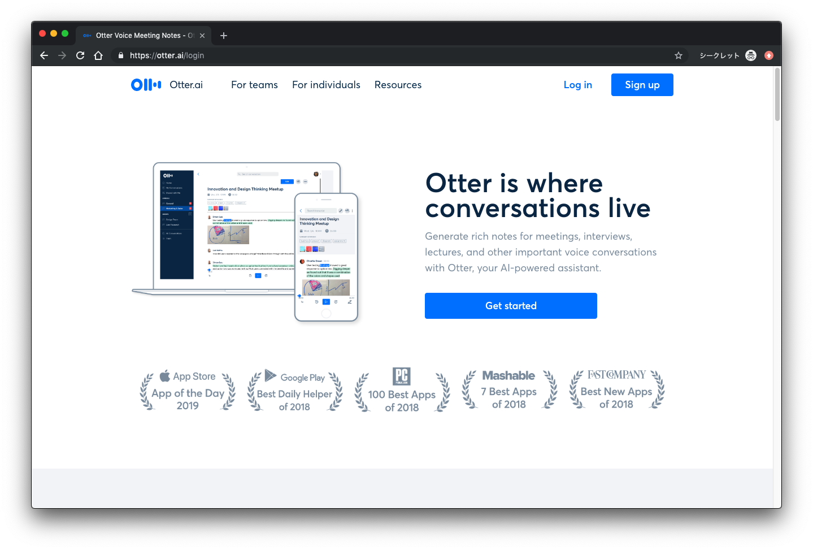
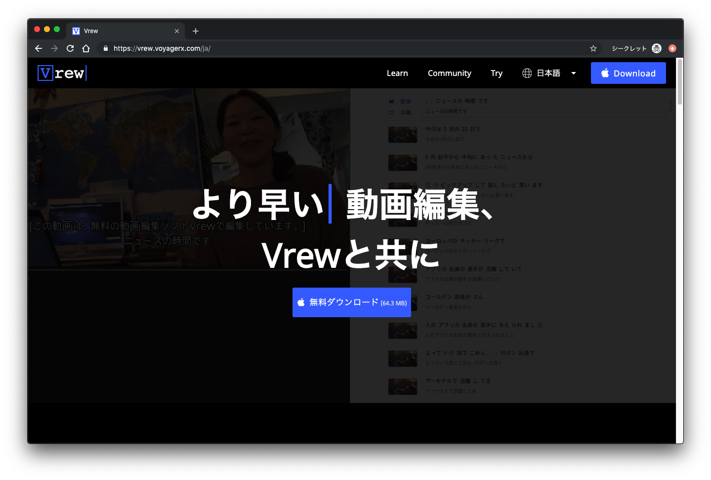

+++
author = "Yuichi Yazaki"
title = "海外カンファレンス参加の強い味方、AI自動文字起こしアプリ四つご紹介"
date = "2019-08-30"
description = "AIによる音声の自動文字起こし（トランスクライブ）、良いサービスが続々登場しています。英語にも当然対応しているので、特に海外のカンファレンスに参加される方には強い味方になります。"
categories = [
    "event"
]
tags = [
    "tools",
]
image = "fi_Transcribe.png"
+++

AIによる音声の自動文字起こし（トランスクライブ）、良いサービスが続々登場しています。英語にも当然対応しているので、特に海外のカンファレンスに参加される方には強い味方になります。ぼくも実際に、カンファレンス会場でのライブ録音や動画ファイルの文字起こしとして、アカウント制限の目一杯まで使いまくっています。

<!--more-->

## 海外カンファレンス参加のお供なら Otter

[Otter](https://otter.ai/referrals/YQD0YS8K)

- ライブ録音：対応
- ファイル読み込み：アップロードのみ
- 提供形態：ウェブサービス
- 対応言語：英語

カンファレンス会場で、スマートデバイスを使って録音した内容を、その場でトランスクライブしてくれるサービス。
ファイルのアップロードにも対応しているが、ウェブサービス上の動画を直接読み込むといったことは出来ない。
動画ファイルをアップロードしても、音声のみがサイトに保存される。講演の様子をみながら音声をみたい場合には Trint を使う。

## 海外カンファレンスの公演録画を活用したいなら Trint

[Trint](https://trint.com/)

- ライブ録音：対応
- ファイル読み込み：ウェブサービス上から
- 提供形態：ウェブサービス
- 対応言語：28言語

カンファレンス会場で、スマートデバイスを使って録音した内容を、その場でトランスクライブしてくれるほか、様々なウェブサービスに掲載されている動画を直接読み込むことができる。Otterでは音声しか残らなかったが、Trintは映像と音声の両方がサイトに保存される。ただし利用料はOtterに比べてかなり高め。

## 自分が作成した動画に自動で字幕をつけたいなら Vrew

[Vrew](https://vrew.voyagerx.com/ja/)

- ライブ録音：非対応
- ファイル読み込み：アップロードのみ
- 提供形態：デスクトップアプリ
- 対応言語：日本語、英語、韓国語

アプリ上で動画を見ながら、AIが自動生成した文言の訂正が行える。作業後、字幕付きの動画として書き出すことができる。

## 自分がイベントを開催する側で字幕を提供したいなら UD Talk

[UD Talk](https://udtalk.jp/)

- ライブ録音：対応
- ファイル読み込み：非対応
- 提供形態：録音用スマートデバイスアプリと文言訂正用デスクトップアプリ
- 対応言語：多数

イベントを開催する際に、自動字幕化と翻訳の両方に対応している。デスクトップアプリを使ってイベントの最中に、生成された文言の訂正が行える。

## 四者四様なので目的に合わせてどうぞ

これまで明瞭に聴き取れなくて諦めていた動画ソースから、自動で文字起こしができる。これは英語のリスニングに慣れていない非英語圏の人にとっては新しい眼を手に入れたようなインパクトがあります。有料サービスですので料金はご確認の上、ぜひ活用してみてください。




