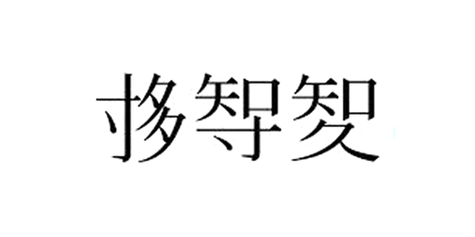

+++
author = "Yuichi Yazaki"
title = "「統計」が「統計」になるまで—訳字論争と'新漢字'の時代感"
slug = "translate-statistics"
date = "2025-09-07"
description = ""
categories = [
    "principle"
]
tags = [
    "",
]
image = "images/translate-statistics.png"
+++

いま私たちが当然のように使う「統計」。その裏側には、statistics を日本語にするために **“新しい漢字”** まで考案した人たちがいた——という静かな驚きがあります。当時の知識人が「ことばを日本語として根づかせる」ために、そこまで試行錯誤していた事実に、思わず息をのむのです。

<!--more-->

## 1889年、論争は始まる

発端は明治22（1889）年。森鷗外（森林太郎）が、エステルレン著・呉秀三訳『医学統計論』の「題言」（序文）で統計観を示したことをきっかけに、スタチスチック社の今井武夫と論争が起こります。やりとりは約10か月に及び、複数の雑誌（『東京医事新誌』『スタチスチック雑誌』など）を舞台に続きました。   

ここで、実際のやりとりをまとめた年表ミニ図をご覧ください。森鷗外（森林太郎）と今井武夫を中心に、複数誌で激しい応酬が続いたことが分かります。

| 年月（明治） | 著者      | 論文・著作名                     | 掲載誌／号数         | 備考                 |
|--------------|-----------|----------------------------------|----------------------|----------------------|
| 22年3月      | 森林太郎  | 統計ト一般ト                     | 東京医事新誌 373号   | 「鴎外全集」第22巻   |
| 22年5月      | 今井武夫  | 統計ト一般ト                     | スタチスチック雑誌 7号 | 「鴎外全集」33巻    |
| 22年6月      | 森林太郎  | 統計ト一般トノ分流               | 東京医事新誌 584号   | 「鴎外全集」第22巻   |
| 22年7月      | 今井武夫  | 再ビ統計ト一般ト                 | スタチスチック雑誌 9号 |                      |
| 22年8月      | 森林太郎  | 統計ト宗論ヲ論ス                 | 東京医事新誌 593号   | 「鴎外全集」第28巻   |
| 22年8月      | 森林太郎  | 統計学総論答今井武夫君           | 東京医事新誌 593号   | 同上                 |
| 22年9月      | 今井武夫  | 三タビ統計ト一般ト               | スタチスチック雑誌 19号 |                      |
| 22年9月      | 森林太郎  | 統計ト一般トヲ論ス               | 東京医事新誌 600号   | 「鴎外全集」第24巻   |
| 22年10月     | 森林太郎  | 再ビ統計学ト宗論ヲ論ス           | 東京医事新誌 606号   | 「鴎外全集」第28巻   |
| 22年11月     | 今井武夫  | 四タビ統計ト一般ト               | スタチスチック雑誌 29号 |                      |
| 22年12月     | 今井武夫  | 四タビ統計ト一般ト（未完）       | スタチスチック雑誌 44号 | 統計博物館所蔵       |

## 争点は3つ

当時の資料を整理すると、争点は次の三本柱でした。

| 争点 | 森鷗外（森林太郎）                        | 今井武夫（杉亨二グループ）                          |
|------|--------------------------------------------|----------------------------------------------------|
| 「スタチスチック」の訳語は「統計」が適切である | スタチスチックは「統べ計る」という訳語で意味は通じる | 中国語の「統計」には合計の意味の外はない |
| 統計学は科学であるのか、方法論であるのか | スタチスチックは科学でなく方法である | スタチスチックは、他の科学を補助する方法のみではなく、人間社会の現象を研究する科学である  |
| 統計は因果関係を探求すべき方法か  | スタチスチックは原因を探り法則を知り得るものではない | 人間社会や国家の諸現象を、いろいろな要因との関係で探討すれば、原因を探り法則を定めることができる |

このように訳語問題は、いつしか科学観・方法論の論争へとせり上がっていきます。のちに日本の統計界で長く続く「社会統計」派と「数理統計」派の視界の差にもつながる論点でした。 

## 「統計」が定着していく

結論としては **「統計」** という訳語が次第に一般化していきます。実際、統計界の重鎮・杉亨二自身が「統計」という語を用いていた事実が、訳語の妥当性を支える根拠として挙げられています（森側の反論点）。 

## そして“新漢字”は残らなかった

一方で、statistics を表すための新造漢字まで試作された時期がありました。読みや意味が直感的に通らず、運用・普及という言語の現実を前に採用は見送られていきます。けれど、その存在が示しているのは、外来概念を日本語の器にきちんと収めたいという切実な意思です。カタカナ表記で済ませず、適訳を磨き、場合によっては文字そのものを作るという発想。明治のことばの現場は、驚くほどクリエイティブでした。

## いまの目から見た教訓

この小さな論争史には、二つの教訓があります。
 - 言葉は単なるラベルではない。 訳語の選び方が、その学問の“輪郭”や“広がり”を規定する。
 - 方法か科学か。 統計をどう位置づけるかは、教育や実務の指針に直結する。
だからこそ **「統計」** という二文字が今日まで生き残った事実には、言語選択と学問観のせめぎ合いが凝縮しているのです。

⸻

## 参考・出典

 - [統計の偉人たち｜統計150年特設サイト｜統計局ホームページ](https://www.stat.go.jp/museum/toukei150/ijin/ijin04.html)
 - [統計エピソード（1）「統計」という言葉の起源｜宇宙統計ステーションNARUHODO](https://www.stat.go.jp/naruhodokids/episode/ep1.html)
 - [統計Today No.136「森鷗外と統計」｜統計数理研究所](https://www.ism.ac.jp/toukei-today/136.html)
 - [J-STAGE｜森鷗外の統計論の源泉（学術論文）](https://www.jstage.jst.go.jp/article/jjscs/37/1/37_1/_article/-char/ja)
 - [CiNii｜森鴎外の統計学観](https://cir.nii.ac.jp/crid/1390001205447263104)
 - [書評「統計学の日本史」｜統計数理研究所](https://www.ism.ac.jp/editsec/toukei/ronbun/vol49/49-2-117.pdf)
