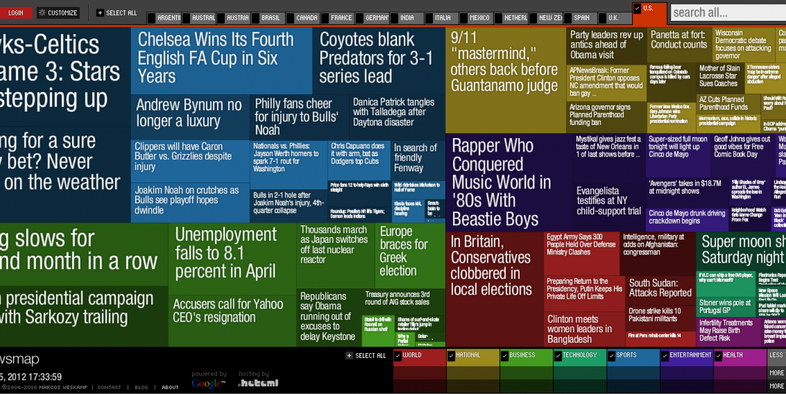

+++
author = "Yuichi Yazaki"
title = "ツリーマップ（Treemap）の事例"
slug = "treemap-example"
date = "2020-08-22"
description = ""
categories = [
    "chart"
]
tags = [
    "ツリー"
]
image = "images/Stock-Market-Treemap.png"
+++

ツリーマップ（Treemap）の事例を紹介します。

<!--more-->

## FinViz

[S&P 500 Map](https://finviz.com/map.ashx)

### 2008年ごろのデザイン

- [Treemaps: Data Visualization of Complex Hierarchies](https://visualizing.jp/treemap/Data%20Visualization%20of%20Complex%20Hierarchies)
- [株式市場へのTreemap適用例：FINVIZ.com](https://visualizing.info/article/463.html)

## Map of the Market

- [Map of the Market](http://www.bewitched.com/marketmap.html)

1998年から10年以上にわたって株式市場のライブデータを表示してきました。長方形の面積はその企業の時価総額に対応し、色で前回の終値から株価がどのように変化したかを知ることができます。「より読みやすく、対話しやすい表示」ため、正方形に近いタイルを作成する独自のアルゴリズムを開発したとのことです。

## Newsmap

Marcos WeskampさんがFlashで実装した、株式市場ではなくニュースリーダーをテーマとしたツリーマップ。

- <a class="link" href="">Newsmap - ニュースを俯瞰する可視化の実験</a>

## Newsmap.JS

Marcosさんのnewsmapにインスパイアされた作品をJSで実装。

- [Newsmap.JS](https://newsmap.ijmacd.com/?edition=JP_ja)

## Every AlgoRiThm has ART in it: Treemap Art Project

- [Treemap Art Project](http://www.cpnas.org/exhibitions/archive/every-algorithm-has-art-in.html)

## Truck Sales Slip, Tripping Up Chrysler

- [Truck Sales Slip, Tripping Up Chrysler](https://archive.nytimes.com/www.nytimes.com/imagepages/2007/02/25/business/20070225_CHRYSLER_GRAPHIC.html)

## Stock Market Overview in Tableau

- [Stock Market Overview in Tableau](https://www.youtube.com/watch?v=fBR8KA_-UsM)

## HistoryWired: A Few of Our Favorite Things

SmartMoneyの「Map of the Market」をベースにしており、ユーザーが博物館のコレクションの一部を探索できるように設計されていました。現在のウェブ標準との互換性がなくなったため、2016年8月にサイトは閉鎖されました。

- [HistoryWired: A Few of Our Favorite Things](https://americanhistory.si.edu/exhibitions/history-wired)

