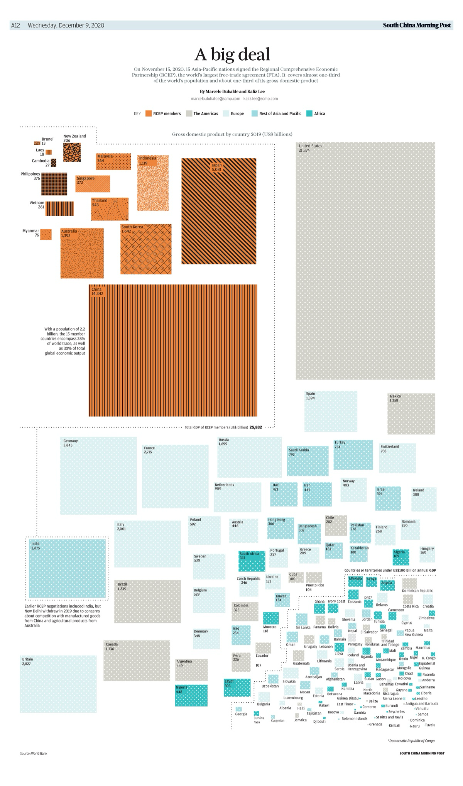

+++
author = "Yuichi Yazaki"
title = "「A big deal」RCEPをめぐる経済規模の可視化"
slug = "treemap-rcep"
date = "2025-09-27"
description = ""
categories = [
    "consume"
]
tags = [
    "",
]
image = "images/scmp-2020-RCEP-cover.png"
+++

2020年11月15日、東アジアを中心とする15か国が署名した RCEP（Regional Comprehensive Economic Partnership, 東アジア地域包括的経済連携協定）は、世界最大規模の自由貿易協定として大きな注目を集めました。人口で世界の約3分の1、GDPで約3分の1、貿易総額で約3割をカバーするという圧倒的なスケール感を誇ります。

この協定には、中国、日本、韓国、ASEAN10か国、さらにオーストラリアとニュージーランドが参加。インドは当初交渉に加わっていましたが、中国からの輸入品や豪州農産物との競合を懸念して最終的に離脱しました。

<!--more-->

## インフォグラフィックの特徴

South China Morning Postが2020年12月9日に紙面で発表した図版「A big deal」では、RCEPの経済的なインパクトが Treemap（樹状矩形図）で表現されています。

- 各国の 2019年のGDP（国内総生産, 単位：10億米ドル）を 面積 によって比較。
- 色と模様で地域ブロックを区分：
    - オレンジ色：RCEP加盟国
    - グレー：米州・ヨーロッパ
    - 水色：アジア太平洋のその他の国々
    - 緑色：アフリカ諸国

この構造により、国ごとの経済規模が直感的に理解できると同時に、RCEP全体の合算規模が米国やEUと並ぶほど大きいことが一目で伝わります。

## 主なポイント
- RCEP加盟国の合計GDPは 23.5兆ドル に達し、単独の米国（21.4兆ドル）を上回る。
- 中国（14.3兆ドル）、日本（5.1兆ドル）、韓国（1.6兆ドル）が経済規模の柱。
- ASEAN諸国もそれぞれの経済力を面積で示し、集合体としての重みが伝わる。
- インドはグラフ外に独立して配置され、交渉離脱の意味が暗示されている。

## 視覚化の意義

新聞記事で用いられたこのTreemapは、数字だけでは把握しにくい「相対的な規模感」を瞬時に理解させる力を持ちます。特に、
- 「RCEP全体」 vs 「米国・EU」
- 「中国」 vs 「その他加盟国」
といった比較関係を可視化することで、協定の持つ戦略的な重みを読者に強く印象づけています。

まさにタイトルの通り、「A big deal」というメッセージが図そのものに込められているのです。

## まとめ

RCEPは経済統合の新たな枠組みとして、加盟国の経済活動や世界経済の流れに大きな影響を及ぼす可能性を秘めています。South China Morning Postのこの図版は、単なる数値の羅列ではなく、可視化によって読者に「規模の実感」を与える好例といえるでしょう。

## 参考・出典

- [South China Morning Post – A big deal (2020年12月9日紙面)](https://www.scmp.com/)
- [World Bank – GDP (current US$)](https://data.worldbank.org/indicator/NY.GDP.MKTP.CD)
- [RCEP 公式情報 – ASEAN事務局](https://asean.org/our-communities/economic-community/regional-comprehensive-economic-partnership/)
- [日本外務省 – RCEPの概要](https://www.mofa.go.jp/mofaj/gaiko/fta/page22_003406.html)