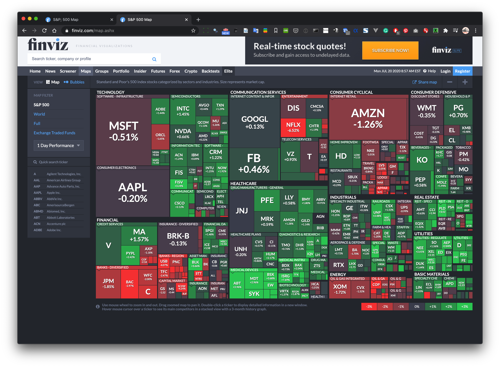
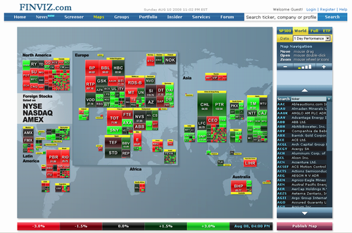
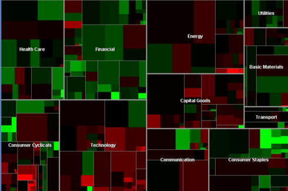
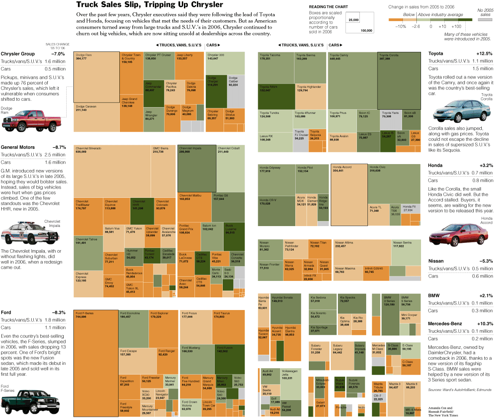
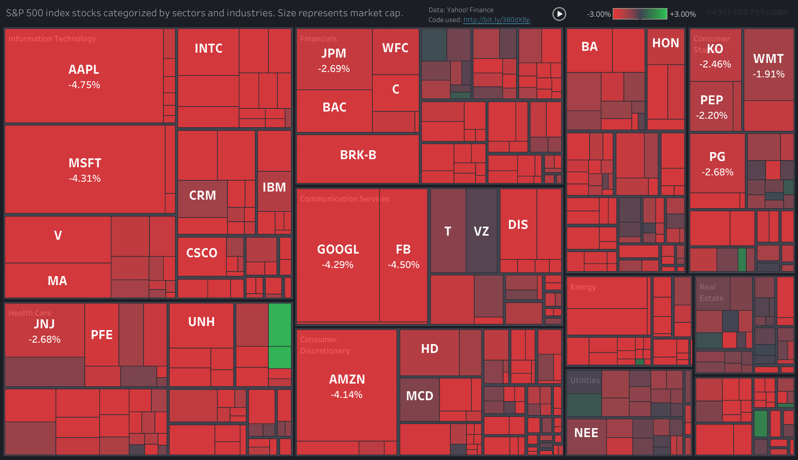
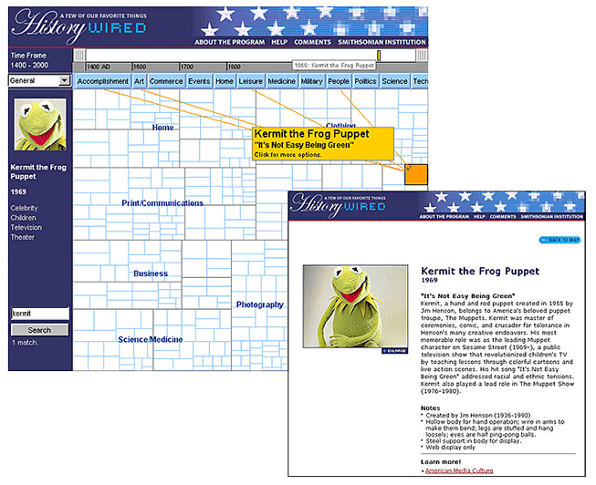

+++
author = "Yuichi Yazaki"
title = "ツリーマップ（Treemap）"
slug = "treemap"
date = "2020-08-22"
description = ""
categories = [
    "chart"
]
tags = [
    "ツリー"
]
image = "images/Stock-Market-Treemap.png"
+++

階層データを可視化するチャートです。
ノードとリンクではなく、空間充填技術を用いて、親と子の関係を表現します。モザイクグラフよりも、より深い階層構造を表現することが可能です。任意の階層数にも対応可能な再帰的な構造が特徴です。各矩形の面積と色は、データセットの属性を表現しています。

<!--more-->

## 主な作例

### FinViz

[S&P 500 Map](https://finviz.com/map.ashx)

#### 2008年ごろのデザイン

- [Treemaps: Data Visualization of Complex Hierarchies](https://visualizing.jp/treemap/Data%20Visualization%20of%20Complex%20Hierarchies)
- [株式市場へのTreemap適用例：FINVIZ.com](https://visualizing.info/article/463.html)

### Map of the Market

- [Map of the Market](http://www.bewitched.com/marketmap.html)

1998年から10年以上にわたって株式市場のライブデータを表示してきました。長方形の面積はその企業の時価総額に対応し、色で前回の終値から株価がどのように変化したかを知ることができます。「より読みやすく、対話しやすい表示」ため、正方形に近いタイルを作成する独自のアルゴリズムを開発したとのことです。

### Newsmap

Marcos WeskampさんがFlashで実装した、株式市場ではなくニュースリーダーをテーマとしたツリーマップ。

- <a class="link" href="">Newsmap - ニュースを俯瞰する可視化の実験</a>

### Newsmap.JS

Marcosさんのnewsmapにインスパイアされた作品をJSで実装。

- [Newsmap.JS](https://newsmap.ijmacd.com/?edition=JP_ja)

### Every AlgoRiThm has ART in it: Treemap Art Project

- [Treemap Art Project](http://www.cpnas.org/exhibitions/archive/every-algorithm-has-art-in.html)

### Truck Sales Slip, Tripping Up Chrysler

- [Truck Sales Slip, Tripping Up Chrysler](https://archive.nytimes.com/www.nytimes.com/imagepages/2007/02/25/business/20070225_CHRYSLER_GRAPHIC.html)

### Stock Market Overview in Tableau

- [Stock Market Overview in Tableau](https://www.youtube.com/watch?v=fBR8KA_-UsM)

### HistoryWired: A Few of Our Favorite Things

SmartMoneyの「Map of the Market」をベースにしており、ユーザーが博物館のコレクションの一部を探索できるように設計されていました。現在のウェブ標準との互換性がなくなったため、2016年8月にサイトは閉鎖されました。

- [HistoryWired: A Few of Our Favorite Things](https://americanhistory.si.edu/exhibitions/history-wired)

## 誰が作ったのか

1990年、Ben ShneidermanとMaryland Human-Computer Interaction Labの学生たちが、空間充填技術を使ってファイルの階層を視覚化する方法として考案しました。

1994 年に Mountaz Hascoet と Michel Beaudouin-Lafon が、「二乗化」アルゴリズムを発明しました（後に Jarke van Wijk によって普及しました）。

1999年にMartin Wattenbergが、株式市場における可視化に利用しました。SmartMoney の “Map of the Market” というサービスのUIとして実装されました。その際は従来のツリーマップの欠点として二つをあげています。

- [Visualizing the Stock Market](http://hint.fm/papers/marketmap-wattenberg.pdf)

1.「スライス・アンド・ダイス」レイアウト “slice-and-dice” layoutでは、アスペクト比が大きすぎて比較が困難。なるべく正方形に近い矩形を創出するようにした。

2.類似した企業やセクターを隣り合わせに配置したい。過去のレイアウト方法では、階層情報のみを使用していたため、それが実現できなかった。

これらを解消するアルゴリズムを独自に実装し「ピボット＆スライス」レイアウトと名付けています。

## 類似する手法

- モザイク・プロット（Mosaic Plot）
