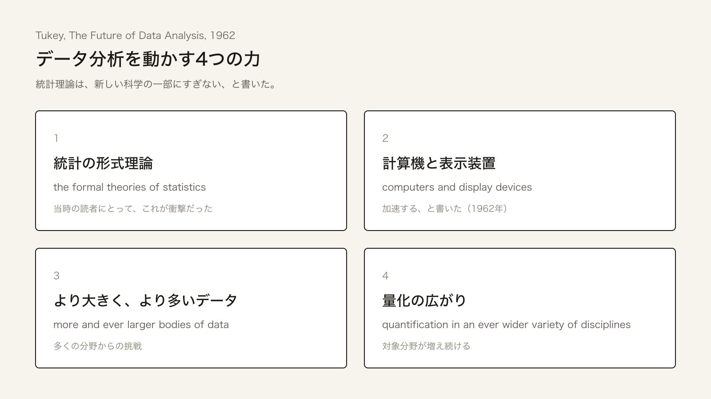

+++
author = "Yuichi Yazaki"
title = "データ分析は科学である──Tukey が 1962年に数理統計学へ書いたこと"
slug = "tukey-future-of-data-analysis"
date = "2026-08-23"
description = "1962年、Tukey は数理統計の中心誌に、データ分析を経験で検証する科学だと書いた。半世紀後、その論文がデータサイエンスの起点として読まれる。"
categories = [
    "technology",
    "principle"
]
tags = [
    "Tukey",
    "データサイエンス"
]
image = "images/cover.png"
+++

1962年、John W. Tukey は数理統計学の中心誌に67ページの論文を載せました。題は "The Future of Data Analysis"。定理も証明もない。冒頭で、自分は長く統計学者だと思っていたが、中心的な関心はデータ分析だと書く。データ分析は科学である、というのが本論です。

半世紀後、David Donoho はこの論文を、データから学ぶ科学の起点として読み直します。David Hand は Tukey を「最初のデータサイエンティスト」と呼びます。いま「データサイエンスの始まり」として語られる出来事は、まずこの論文です。

<!--more-->

## 論文そのもの

書誌は次のとおりです。John W. Tukey, "The Future of Data Analysis," *The Annals of Mathematical Statistics*, Vol. 33, No. 1 (March 1962), pp. 1–67. DOI: [10.1214/aoms/1177704711](https://doi.org/10.1214/aoms/1177704711)。掲載誌は当時、数理統計の最前線です。同じ号の他論文は定義・定理・証明が並ぶ。Donoho は、そこに公開の告白が載った、と書いています。

冒頭は、James R. Thompson が 2001年に「知的革命の宣言」と呼んだ二段落です。

> For a long time I have thought I was a statistician, interested in inferences from the particular to the general. But as I have watched mathematical statistics evolve, I have had cause to wonder and to doubt. [...] All in all, I have come to feel that my central interest is in data analysis, which I take to include, among other things: procedures for analyzing data, techniques for interpreting the results of such procedures, ways of planning the gathering of data to make its analysis easier, more precise or more accurate, and all the machinery and results of (mathematical) statistics which apply to analyzing data.

長く統計学者だと思っていた。関心は、個から一般への推論だった。数理統計学の発展を見るうちに、疑いが出た。中心にあるのはデータ分析である。それに含まれるのは、(1) データを分析する手順、(2) その結果を解釈する技術、(3) 分析がしやすく、より精密・正確になるようデータを集める計画、(4) データ分析に使える数理統計の装置と成果、である。

続けて、標本から母集団への推論は大きい部分だが全体ではない、と書きます。生データからは見えない兆候を切り出す作業も、努力の配分を決める作業も、部分にすぎない。「Data analysis is a larger and more varied field than inference, or allocation.」用語を語源以上に伸ばしている、と本人が認めています。Peter Huber は後年、その伸ばし方で統計の全体を包み込んだ、と評します。

3ページでは、こう問います。「Is it not time to seek out novelty in data analysis?」

## 科学の三条件

4–5ページで、科学であるための条件を三つ挙げます。冒頭の図は、その議論をそのまま置いたものです。

> There are diverse views as to what makes a science, but three constituents will be judged essential by most, viz: (a1) intellectual content, (a2) organization into an understandable form, (a3) reliance upon the test of experience as the ultimate standard of validity. By these tests, mathematics is not a science, since its ultimate standard of validity is an agreed-upon sort of logical consistency and provability. As I see it, data analysis passes all three tests, and I would regard it as a science, one defined by a ubiquitous problem rather than by a concrete subject.

知的内容。理解可能な形への組織化。経験による検証を最終基準とすること。データ分析は三つとも満たす。具体的な対象ではなく、遍在する問題によって定義される科学だ、というのが Tukey の言い方です。同じ三条件で見ると、数学の最終基準は論理的一貫性と証明可能性なので、科学の側には入らない。統計がどこに立つかは、統計家がデータ分析に付くか、純粋数学に付くかで決まる。両方を同時に最終基準にはできない、とまで書いてあります。

科学の側に立つなら、態度も変わります。Michael Friendly が引く箇所です。

- (b1) 安全より、範囲と有用性を求める。
- (b2) 不十分な証拠が正しい答えを示唆する機会を増やすために、中程度の誤りは許容する。
- (b3) 数学的議論は、証明や妥当性の印としてではなく、判断の根拠として使う。

13ページの有名な一文は、この態度の圧縮です。

> Far better an approximate answer to the right question, which is often vague, than an exact answer to the wrong question, which can always be made precise.

正しい問への近似の方が、いつでも精密にできる誤った問への正確な答えよりよい。データ分析の知識は、問題が何であるかについて、せいぜい近似でしかない。だから近似で進むほかない、と続きます。

駆動力は四つです。Donoho が「驚くほど現代的」と呼んだリストです。

Tukey 1962 が挙げた四つの影響。Donoho 2017 が再掲した英語を訳したもの

1. 統計の形式理論
2. 計算機と表示装置の加速
3. 多くの分野における、より大きく、より多いデータ
4. より広い分野での量化

1番が衝撃だった、と Donoho は書きます。統計理論は新しい科学の一部であり、全部ではない、という含意だからです。Tukey は、データ分析は物理・生物・行動科学より複雑になりうるとまで言い、形式構造から密な指針を求めるのは過剰だ、と書きます。「Data analysis can gain much from formal statistics, but only if the connection is kept adequately loose.」

図については、49ページでこう書いています。多くのモデルに対して心に明らかにする力で、一つの技法を上げるなら、単純なグラフだ。予期しない現象の兆候を出す。刺激と反応が一つのときは、定性のほとんどと定量の多くをグラフで表せる。間接的なグラフまで含めれば、グラフは計算を避ける手段ではなく、計算の結果を現前させる手段だ、というのが趣旨です。Friendly は、1900–1950年を可視化の「近代の暗い時代」と呼び、1950–1975年の再生の転換点の一つにこの論文を置きます。

## 科学として教える

論文の教育論は、事実の伝達だけではありません。科学の教え方へ戻せ、という話です。

統計は数学の一部として教えられている (c1)。統計そのものを学ぶとき、データ分析への注意は限られている (c2)。博士課程でも、物理や数学ほど専門家との密な接触がない (c3)。だから、すでに分析している人のそばで学ぶ時間が足りない。科学は事実と確立した構造を教えるだけでなく、その科学の考え方と、いまの信念・実務を教える。データ分析も同じだ、というのが Tukey の要求です。

困難を大きくしているのは、「料理本化を避け、理解を育てるには、証明を重視した数学的扱いしかない」という見方だ、とも書いています。料理本化はデータ分析に固有ではない。解決を数学と証明に集中させるのが固有だ。生化学の教科書は、事実を入れるだけ書いてある。実験的サンプリングで、クラスが自分で事実を確かめられる、とも提案しています。

知っていることを伝え、いまのやり方を見せ、実データのそばで学び、実験で確かめる。数学的厳密さの価値は、ここでは限られる。

## その後、起点として読まれるまで

Tukey の語は **data analysis** です。Mosteller と Tukey は 1968年の章題を "Data Analysis, Including Statistics" にします。探索的データ解析（EDA）の名が広まるのは、1970年前後の予備版と 1977年のオレンジ本です。Friendly は便宜上、EDA の起源を 1962年論文に置きます。

**data science** という名称は、そのあとです。C. F. Jeff Wu は 1997年、ミシガン大学 Carver 教授就任講演 "Statistics = Data Science?" で、統計をデータサイエンスと呼び直せと主張します。William S. Cleveland は 2001年、拡大した分野を明示的に "data science" と呼び、大学の資源配分案を出します。価値の判定基準は、データ分析者の学習をどれだけ助けるかです。Tukey の「実務に沿って発展せよ」を、組織の計画に翻訳した文章です。

1962年の論文を、いまのデータサイエンスの起点として読むのは、さらに後年の評です。

- Donoho（2017, Tukey 生誕100年の講演が原型）は、Tukey が学術統計の改革を求め、データから学ぶ未認知の科学の存在を指した、と書きます。今日のデータサイエンスの瞬間を予言した、というのが彼の読みです。
- Hand（2023, IMS）は 67ページを tour de force と呼び、「最初のデータサイエンティストとみなしてよい」と結論します。
- Thompson（2001）は、Tukey の最重要作かもしれない、統計的思考への革命の呼びかけだ、と評します。
- Mallows（2006）は、主題を再定義し、応用統計家の仕事の名として data analysis を導入した、と書きます。
- Huber（2010）は、最終的には巨大な影響だったが、すぐには認識されず、自分も数年かかった、と書いています。Donoho は、学術統計の全体は Tukey の道へは進まなかった、と見ます。

Donoho の通史では、Bell Labs の同僚（Chambers, Cleveland）は学術統計より Tukey の広い視野を取りやすかった。大学の統計は理論の枠に残り続けた。Cleveland が理論に割り当てた 20% に、当時の学科の仕事の 100% が収まった、という観察が、その通史の核です。Annals に載ったこと自体が異常で、Hodges 編集長の判断だった、という注も Donoho にあります。

Hand は、反復、新しい問い、要約の複数の見方、全員が同じデータを同じに扱うな、自動化への再反論、計算機の影響は「重要だが常に致命的ではない」、など本文の各論まで拾っています。S、Python、R は何十年も後だ、という文脈もそこにあります。1962年の論文は宣言であるだけでなく、手法のカタログでもある。

Friendly は、当時の正統派にはルターの95箇条に見えたかもしれない、と書いています。可視化史では、絵は事実を小数点以下まで述べられない、という半世紀の軽視をひっくり返す転換、というのが Friendly の位置づけです。Stephen Stigler は EDA のオレンジ本そのものの直接効果は小さい、と述べます。影響したのは主題と、学生・同僚による伝播だ、という見方です。1962年論文についても、同じ構造を想定してよい。宣言が先にあり、実装と教育が後から追いつく。

Huber は 2022年の Friendly の記事で、今日の data science は探索できないほど巨大なデータに気を取られ、探索を盲目のバッチ処理に任せている、とも書いています。論文を起点として読むことと、いまの実務が論文の態度を継いでいることは、別の話です。Donoho 自身も、いまの大学のデータサイエンス課程を、Tukey の科学というより統計修士とデータベース修士の妥協だと見ています。

## 使い道

この論文が可視化の仕事に残しているのは、面積の精度ではありません。問の置き方です。

図は、予期しないものを出す装置だ、と Tukey は書いています。正しい問への粗い答えを先に出す。精密な誤答を後回しにする。数学は判断の材料であって、妥当性の印ではない。教育も、証明の演習より、知っていることを伝え、いまのやり方を見せ、実データのそばで学ばせることです。

1962年にあるのは、データから学ぶ活動を科学として扱う、という宣言です。図を描く仕事は、その科学の中心に、論文自身が置いています。

## 参考・出典

**一次情報**

- John W. Tukey, "The Future of Data Analysis," *The Annals of Mathematical Statistics*, 33(1), 1962, pp. 1–67. [doi:10.1214/aoms/1177704711](https://doi.org/10.1214/aoms/1177704711) / [Project Euclid](https://projecteuclid.org/journals/annals-of-mathematical-statistics/volume-33/issue-1/The-Future-of-Data-Analysis/10.1214/aoms/1177704711.full)
- Frederick Mosteller and John W. Tukey, "Data Analysis, Including Statistics," in *Handbook of Social Psychology*, 2nd ed., 1968.
- John W. Tukey, *Exploratory Data Analysis*, Addison-Wesley, 1977.

**第三者評価**

- David Donoho, "50 Years of Data Science," *Journal of Computational and Graphical Statistics*, 26(4), 2017, pp. 745–766. [doi:10.1080/10618600.2017.1384734](https://doi.org/10.1080/10618600.2017.1384734)（オープンアクセス）
- David J. Hand, "Hand Writing: John Tukey, the first data scientist?," *IMS Bulletin*, 2023-09-30. [IMS](https://imstat.org/2023/09/30/hand-writing-john-tukey-the-first-data-scientist/)
- James R. Thompson, "The Age of Tukey," *Technometrics*, 43(3), 2001, pp. 256–265. [Rice リポジトリ](https://repository.rice.edu/bitstreams/a72fddf7-014a-4186-ab3a-25c3d7d208b3/download)
- Colin Mallows, "Tukey's Paper After 40 Years," *Technometrics*, 48(3), 2006, pp. 319–325. [doi:10.1198/004017006000000219](https://doi.org/10.1198/004017006000000219)
- Peter J. Huber, *Data Analysis: What Can Be Learned From the Past 50 Years*, Wiley, 2010.
- William S. Cleveland, "Data Science: An Action Plan for Expanding the Technical Areas of the Field of Statistics," *International Statistical Review*, 69(1), 2001, pp. 21–26. [doi:10.1111/j.1751-5823.2001.tb00477.x](https://doi.org/10.1111/j.1751-5823.2001.tb00477.x)
- C. F. Jeff Wu, "Statistics = Data Science?," H. C. Carver Professor inaugural lecture, University of Michigan, 1997. [スライド](https://www2.isye.gatech.edu/~jeffwu/presentations/datascience.pdf)
- Michael Friendly, "Remembrances of Things EDA," *Nightingale*, 2022-06-16. [記事](https://nightingaledvs.com/remembrances-of-things-eda/)
- John M. Chambers, "Greater or Lesser Statistics: A Choice for Future Research," *Statistical Science*, 8(2), 1993, pp. 182–186.
