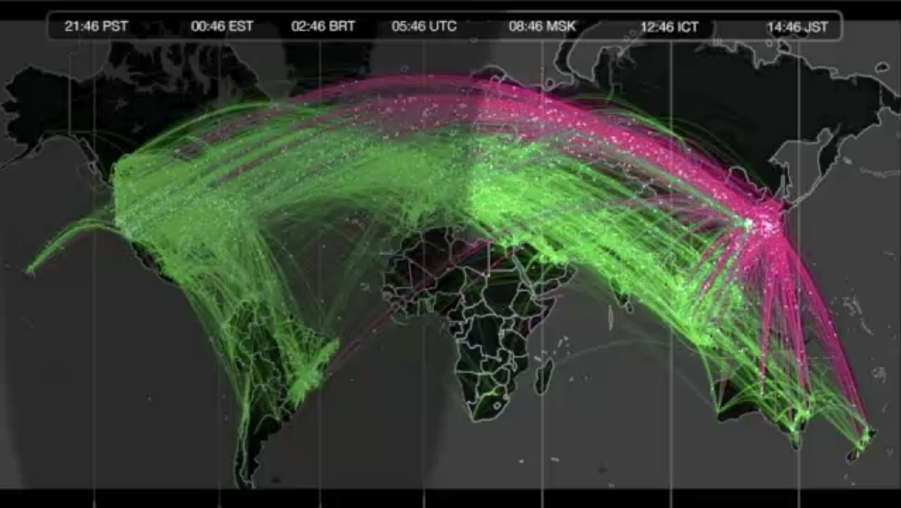

+++
author = "Yuichi Yazaki"
title = "311の際の世界からの応援ツイート"
slug = "twitter-global-pulse"
date = "2020-05-19"
description = ""
categories = [
    "consume"
]
tags = [
    "311"
]
image = "images/5884626815_d851598b9a_c.jpg"
+++

311発生から、普段の5倍以上のツイート量が日本でなされました。家族、友人、知人へ安否を確かめるコミュニケーションが飛び交っていました。

<!--more-->

Twitter社内のConsumer Data Science担当のミゲルさん（Miguel Ríos）がツイートデータを用いて、311発生一時間後の、日本にまつわるツイートをデータ可視化した作品映像を作成、公開しています。

- [Visualization: RTs (Archive)](https://www.flickr.com/photos/twitteroffice/5884626815/)

正確には、日本から発せられたオリジナルのツイートがピンク、そのツイートがリツィートという形で拡散されたものがグリーンで、ダークグレイのベースマップ上に示されています。

Visualization: RTs (Archive) リンク先で動画が視聴できます。

- [公式ブログ](https://blog.twitter.com/official/en_us/a/2011/global-pulse.html)