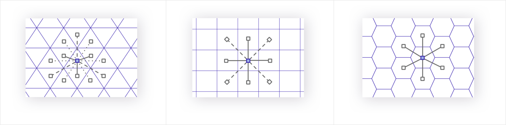
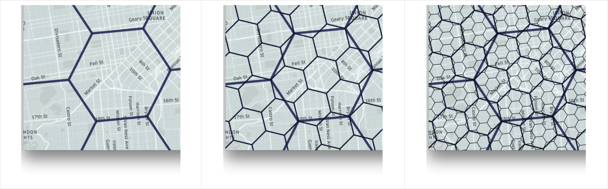
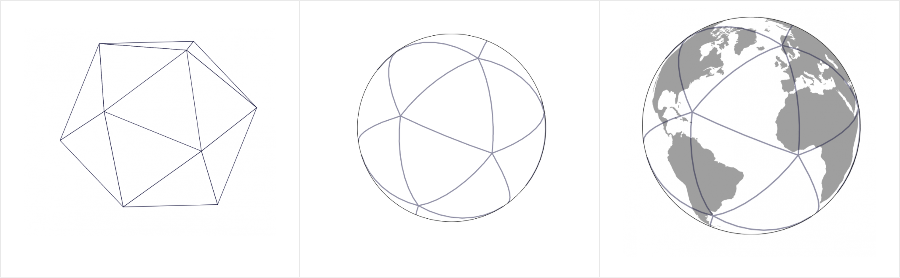

+++
author = "Yuichi Yazaki"
title = "Uber H3"
slug = "uber-h3"
date = "2020-05-18"
description = ""
categories = [
    "consume"
]
tags = [
    "map","uber"
]
image = "images/Twitter-H3.png"
+++

Uberが、地理空間上のビッグデータを効率よく扱うためのフレームワークであるh3を公開しています。こちらをご紹介します。

<!--more-->

- [H3: Uber’s Hexagonal Hierarchical Spatial Index](https://www.uber.com/en-JP/blog/h3/)

彼ら自身の課題を解決する目的から生まれています。というのも、提供するサービスにおいて、毎日何百万ものイベントが発生しており、これらを利用して、マーケットプレイス全体の分析と最適化するために活用したい、と。たとえば、需要と供給の関係によって、ダイナミックに価格を変更したりといったことです。

データから情報や洞察を導き出すには、都市全体のデータを分析する必要があります。そのために地理空間のインデックス（グリッドシステム）が必要ですが、緯度経度で管理するのは計算コストが高すぎる。

そのためのグリッドシステムとしてH3を開発しました。h3は、六角形を単位とし、さらに階層構造を持っています。地表を六角形のグリッドで覆ってしまうことで、

- 計算量を削減する
- 六角形であれば、接するグリッドとの距離が均等。三角形や四角形ではそうはいかない。
- グリッドセルをクラスタリングすることで、近隣地域を効率的に表現することができる。別なクラスタリング方法、たとえば郵便番号では行政の都合である時突然変更してしまうが、そのようなこともない。
- 紙の地図でいうところの縮尺、グーグルマップでいうところのズームレベルも、六角形で表現できる。

六角形であれば、接するグリッドとの距離が均等。三角形でも四角形でもそうはいかない。

紙の地図でいうところの縮尺、グーグルマップでいうところのズームレベルも、六角形で表現。
グローバルグリッドシステムには、通常、地図投影と地図の上に敷き詰められたグリッドの2つが必要です。グリッドはすでに説明した六角形で、地図投影にはメルカトルなどの歪みがある地図投影法ではなく、正二十面体の面を中心とした心射方位図法を採用しています。

正二十面体の面を中心とした心射方位図法を採用。

C言語だけでなく、Python、Goなど様々な言語版も開発され、すべてオープンソースで公開されています。