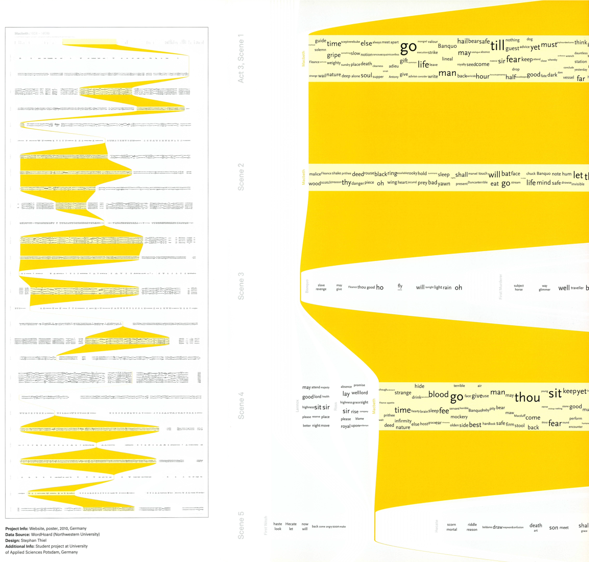
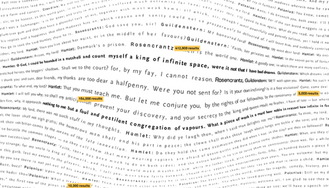
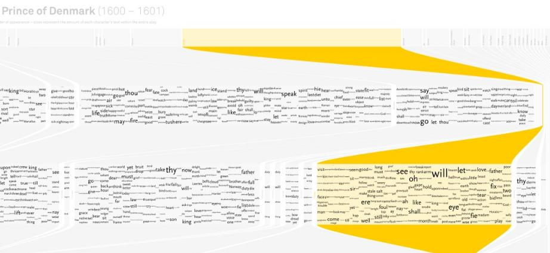

+++
author = "Yuichi Yazaki"
title = "A New Way to Read Shakespeare"
slug = "understanding-shakespeare"
date = "2025-10-03"
description = ""
categories = [
    "consume"
]
tags = [
    "言葉"
]
image = "images/cover.png"
+++

**Understanding Shakespeare** is a BA thesis project by German designer **Stephan Thiel**, created in the Interface Design program at the University of Applied Sciences Potsdam. The project proposes a new way to rediscover Shakespeare's plays through information visualization.

Rather than replacing reading, it uses visual patterns to reveal structure, vocabulary, character distribution, and recurring language.

<!--more-->

The project uses text data from Northwestern University's **WordHoard** project. Computational methods are applied to extract hidden structures from the plays and visualize what Thiel describes as narrative algorithms.

## How to Read It

The works were designed as large posters, around 90 cm by 220 cm, so the printed experience differs from viewing them on a screen.

- Horizontal direction: progression of the play, including acts and scenes
- Vertical direction: vocabulary and character distribution by scene
- Yellow bands: passages where specific words appear frequently
- Text size: frequency of word use
- Placement: distribution of speech and language across characters and scenes

Words such as "time" or "man" appear large when they recur throughout a play, making themes visible across the whole structure.

Some visualizations combine Shakespeare's text with contemporary Google search results. Important quotations are searched, and the number of returned results influences the visual emphasis, creating a dialogue between classical literature and modern attention.

## Methods

The project was built with Processing, toxiclibs, Classifier4J, and related natural-language processing tools. Intermediate PDF outputs were also turned into process videos, documenting the design experimentation.

## Five Approaches

Thiel presents the work as a starting point for discussion rather than a complete substitute for reading. The approaches include:

- vocabulary distribution by character
- word repetition across scenes
- quotation visibility through Google search results
- character entrances and exits
- large-scale text patterns

## Summary

"Understanding Shakespeare" turns reading into a visual design problem. It helps readers and viewers notice patterns that are difficult to perceive line by line, bringing literary studies, data analysis, and information design together.

## References

- [Understanding Shakespeare / Approaches](http://understanding-shakespeare.com/index.html)
- [Understanding Shakespeare with visualization — FlowingData](https://flowingdata.com/2010/08/23/understanding-shakespeare-with-visualization/)
