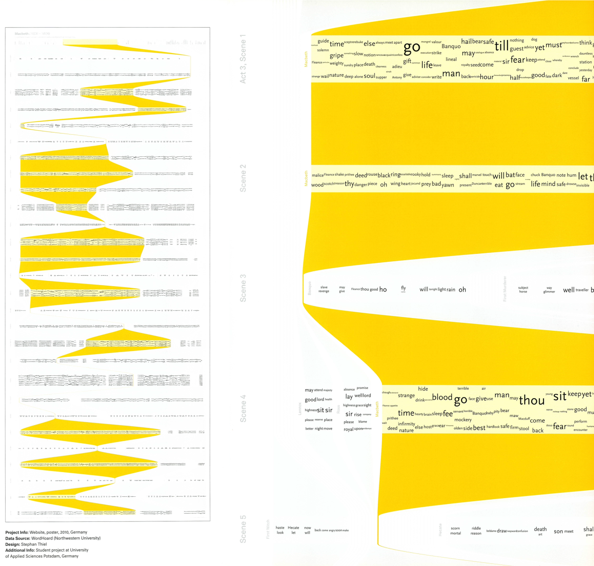
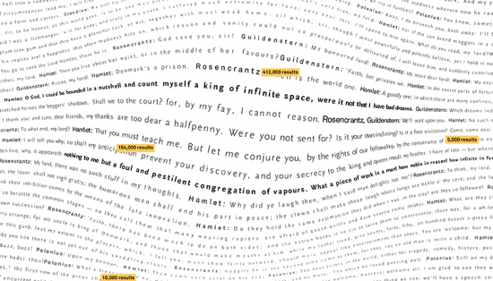
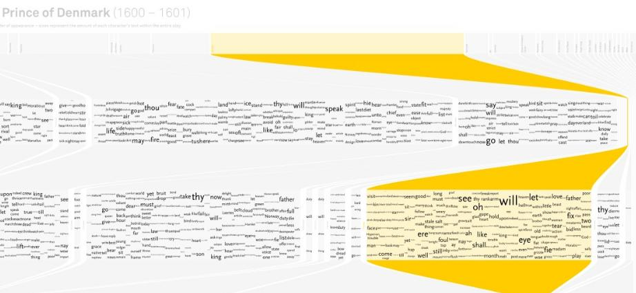

+++
author = "Yuichi Yazaki"
title = "シェイクスピアを「読む」新しい方法"
slug = "understanding-shakespeare"
date = "2025-10-03"
description = ""
categories = [
    "consume"
]
tags = [
    "言葉"
]
image = "images/cover.png"
+++

Understanding Shakespeare は、ドイツのデザイナー Stephan Thiel がポツダム応用科学大学（University of Applied Sciences Potsdam）のインターフェースデザイン学科で制作した B.A. 卒業制作です。その目的は、シェイクスピアの戯曲を従来の読み方とは異なるかたちで再発見させることにあります。近年の「物語を消費する習慣の変化」に対応し、インフォメーション・ヴィジュアライゼーションの力を借りて、戯曲の構造や言葉のパターンを直感的に理解できる新しい読書形態を提案しています。

<!--more-->

プロジェクトは、ノースウェスタン大学の WordHoard プロジェクトのテキストデータを利用。計算機的手法を用いてテキストの中に潜む情報を抽出し、作品全体の「物語のアルゴリズム」を可視化する試みとして展開されました。ここで示された5つのアプローチは、こうした新しい読書体験の第一歩として、シェイクスピア作品を現代的に再解釈し直す試みです。

## 図解の見方

作品は大判ポスター（90cm × 約220cm）の展示形式を想定しており、Web 上で見るのと印刷物で体験するのとでは印象が大きく異なります。

- 横方向：戯曲の進行（幕や場の順序）
- 縦方向：シーンごとの語彙や登場人物の分布
- 黄色い帯：特定の語が多用された部分を示す
- 文字サイズ：単語の使用頻度の多寡を表す
- 配置：キャラクターごとのセリフや場面での使用状況がわかる

たとえば “time” や “man” のような語は全体を通じて大きく表示され、劇中で繰り返し使われる重要なテーマであることがひと目で理解できます。視覚的なパターンを追うことで、どの場面で特定の言葉が強調されているかを発見できる仕組みになっています。

また、現代の Google 検索結果を組み合わせた可視化も含まれており、古典文学の分析に現代的データを掛け合わせるユニークな手法が採用されています。

マクベスとハムレットをGoogle検索結果を通して見るというもので、重要な引用を見つけるために、フレーズを検索し、返された結果の数に基づいて単語に力を加えて、重要な部分を魚眼レンズでズームした文書のように見えます。

これにより、単なるテキスト解析を超えた「現代との対話」を試みています。

## 背景と制作手法

この作品は Processing と toxiclibs（幾何学や色計算ライブラリ）、さらに Classifier4J など自然言語処理のツール群を用いて制作されました。途中経過は PDF 出力を重ねて動画化し、試行錯誤のプロセスを記録しています（一部の「Enter, Exit」アプローチのみ手作業による仕上げ）。

さらに、imagekind.com で一部の作品はポスターとして購入可能になっており、展示用の大判印刷を想定してデザインされています。可読性の観点から原寸大での印刷が推奨されますが、Google 検索を使ったアプローチなど一部は小さめでも楽しめると案内されています。

## 「五つのアプローチ」と議論の出発点

Thiel はこれを「完全な読書の代替」ではなく、あくまで「議論の出発点」として提示しています。

- 登場人物ごとの語彙分布
- シーンの進行と語の繰り返し
- 外部データ（Google 検索結果）を通した引用や関心の強さ
- 出入りするキャラクターの動線（Enter, Exit）
- テキストのパターンを俯瞰できるビジュアル構造

これらのアプローチは、文学研究の枠を越えて一般の観客に開かれた“新しい読み方”を提供し、文化的遺産であるシェイクスピア作品への関心を呼び戻すことを目指しています。

## まとめ

「Understanding Shakespeare」は、シェイクスピアを「読む」行為を情報可視化に変換し、デザインを介して再提示する挑戦的なプロジェクトです。大判の印刷物として全体構造を体験できるよう設計され、文学研究者から一般読者まで幅広い層に向けて、新しい洞察を呼び起こす仕組みを備えています。

文学、データサイエンス、情報デザインが交差する地点に立つこの作品は、古典を現代に生き返らせる試みとして注目に値します。

## 参考・出典

- [Understanding Shakespeare / Approaches](http://understanding-shakespeare.com/index.html)
- [Understanding Shakespeare with visualization – FlowingData](https://flowingdata.com/2010/08/23/understanding-shakespeare-with-visualization/)

