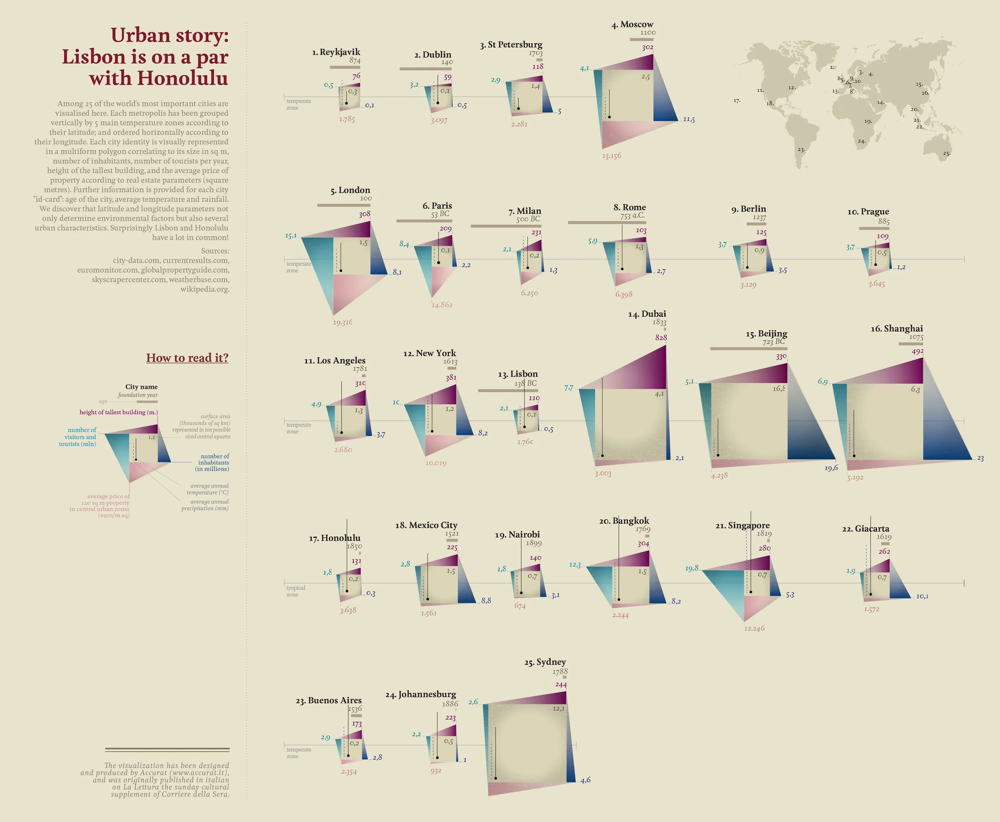
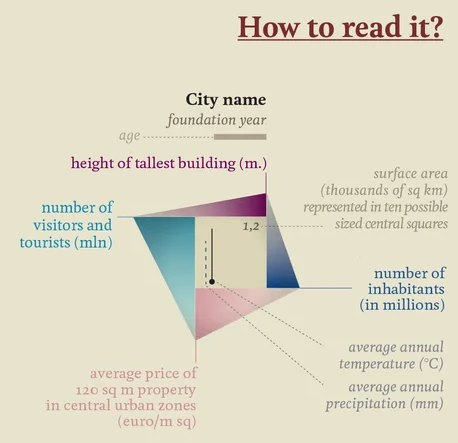

+++
author = "Yuichi Yazaki"
title = "Urban Story: Lisbon Is on a Par with Honolulu"
slug = "urban-story"
date = "2025-10-05"
description = ""
categories = [
    "consume"
]
tags = [
    "オリジナルのビジュアル変換",
]
image = "images/cover.png"
+++

This work is part of the *Visual Data* series created by data visualization artist **Giorgia Lupi** for *La Lettura*, the cultural supplement of *Corriere della Sera*.

It compares 25 cities around the world and represents each city's character through multiple dimensions. As the title "Lisbon is on a par with Honolulu" suggests, cities that are geographically and culturally distant can show surprising similarities when compared through data.

<!--more-->

## How to Read It

At the center of the work, each city is represented by a polygon-like chart. The form condenses several urban indicators into a single visual profile.

### City Name and Basic Information

The **city name** is accompanied by the **foundation year**, shown in italic. The city's **age** is represented by a solid line, giving a visual sense of historical depth.

### Indicators

- **Top edge**: height of the tallest building, in meters
- **Bottom edge**: average price of a 120 sq m property in central urban zones
- **Left edge**: number of visitors and tourists, in millions
- **Right edge**: number of inhabitants, in millions
- **Inner diagonal marks**: average annual temperature and precipitation
- **Square size**: city surface area, shown through a ten-step scale

## What the Work Reveals

The piece is less about ranking cities than about showing unexpected similarities and differences. Lisbon and Honolulu, for instance, are far apart geographically, but their climate, scale, and urban profile can appear surprisingly close.

The polygon shapes let readers recognize each city as a kind of data portrait. Megacities such as Beijing or Shanghai stand out through population and visitor volume, while places such as Reykjavik or Dublin are distinguished by climate and scale.

## Background

The visualization integrates climate data from weatherbase.com, economic data from euromonitor.com, demographic data from city-data.com, and architectural data from skyscrapercenter.com.

In typical Accurat fashion, the piece does not present numbers as a table. It turns them into a visual language for urban identity.

## Summary

"Urban story: Lisbon is on a par with Honolulu" is a geopolitical portrait of cities in data form. It shows how temperature, density, history, real estate, tourism, and architecture combine into the personality of a city.

## References

- [Visual Data — Giorgia Lupi](https://giorgialupi.com/lalettura)
- [Skyscraper Center](https://www.skyscrapercenter.com/)
- [Weatherbase](https://www.weatherbase.com/)
- [Euromonitor International](https://www.euromonitor.com/)
- [City-data.com](https://www.city-data.com/)
- [Wikipedia](https://www.wikipedia.org/)
