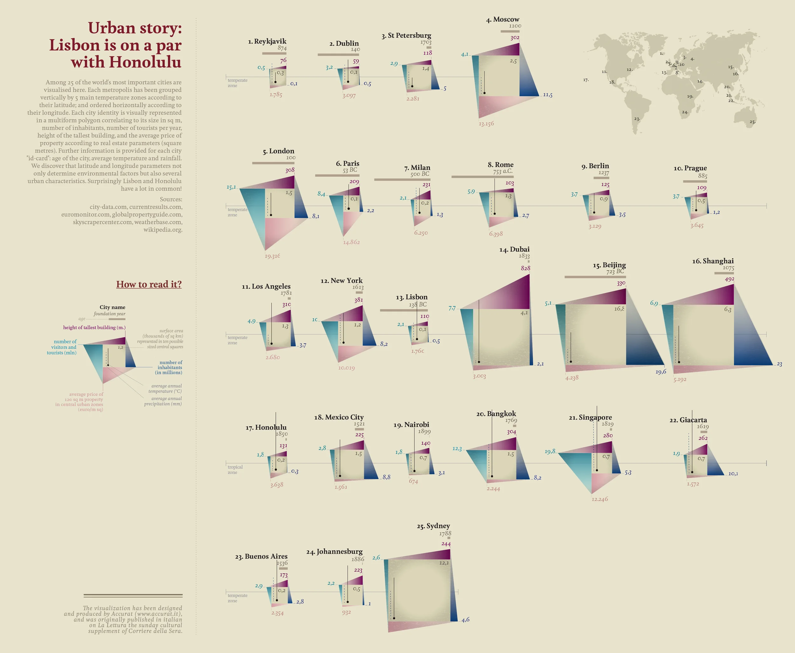
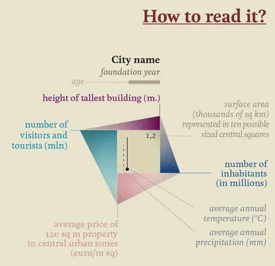

+++
author = "Yuichi Yazaki"
title = "Urban story: リスボンはホノルルと肩を並べる"
slug = "urban-story"
date = "2025-10-05"
description = ""
categories = [
    "consume"
]
tags = [
    ""
]
image = "images/cover.png"
+++

この作品は、データビジュアライゼーション・アーティストのジョルジア・ルピ（Giorgia Lupi）が、イタリアの日曜版紙 *La Lettura*（Corriere della Sera）のために制作した「Visual Data」シリーズのひとつです。

世界25都市を比較し、それぞれの都市の特徴を多次元的に表現しています。
タイトルの「Lisbon is on a par with Honolulu（リスボンはホノルルと肩を並べる）」が示すように、地理的にも文化的にも遠い都市同士が、意外な共通性を持つことを可視化する試みです。

<!--more-->

## 図解の見方

作品の中心には、各都市を表す多面体（ポリゴンチャート）が描かれています。  
この図は、都市の複数の特徴量を一度に視覚的に把握できるよう設計されています。

### 都市名と基礎情報

- **City name（都市名）** の下には **foundation year（建設年）** が斜体で記されています。  
  例：*1825*（ニューヨーク）や *138 BC*（リスボン）など。

- 都市の **age（年齢）** は実線で示され、都市の歴史の長さを暗示します。

### 指標

- **正方形の上辺（12時方向）**
	- **Height of tallest building（最も高い建物の高さ, m）** 都市の垂直的な発展を示します。

- **正方形の下辺（6時方向）**
	- **Average price of 120㎡ property in central urban zones（都心部120㎡物件の平均価格, €/㎡）** 生活コストや地価を反映します。

- **正方形の左辺（9時方向）**
	- **Number of visitors and tourists（訪問者・観光客数, 百万人）** 観光的魅力度を表します。

- **正方形の右辺（3時方向）**
	- **Number of inhabitants（人口, 百万人）** 都市規模の大きさを表します。

- **正方形内部の左下**
	- **average annual temperature (°C)** 上側の斜め破線。年間平均気温を示します。
	- **average annual precipitation (mm)** 下側の斜め破線。年間降水量を示します。

- **正方形そのものの大きさ**
	- **surface area（面積, 千km²）** 都市の面積を、10段階のサイズの中央スクエアで表します。

## 表現の意図と発見

この作品は単なる都市比較ではなく「地理的距離」と「文化的距離」のズレに着目しています。  
例えば、リスボンとホノルルは地理的に離れていますが、平均気温・降水量・都市規模などの多くの点で似通っていることがわかります。  
また、ポリゴンの形状を通して、都市ごとの「プロフィール」が直感的に理解できるようになっています。  
たとえば **北京や上海** のようなメガシティは、人口や観光客数で突出した形状を持ち **レイキャヴィークやダブリン** のような都市は、気候要因で特徴づけられます。

## 背景

この可視化は **気候データ（weatherbase.com）** **経済データ（euromonitor.com）** **人口統計（city-data.com）** **建築情報（skyscrapercenter.com）** など、複数の公的データソースを統合して作成されています。

ジョルジア・ルピが率いる **Accurat** による「データを人間的に語る」スタイルが顕著で、数字が「都市の肖像」として詩的に立ち上がる構成になっています。

グラフは単なる比較表ではなく、文化的・環境的アイデンティティを表すビジュアル・ポエトリー（visual poetry）です。

## まとめ

「Urban story: Lisbon is on a par with Honolulu」は、都市を“データのかたち”で描いた地政学的ポートレートです。

数値を超えた「都市の性格」が、温度や色、面積の広がりを通して伝わります。  
単一の指標に頼らず、複数の要素の組み合わせによって、多様な都市像を一望することができる点が本作の魅力です。
ジョルジア・ルピらしい人文主義的なデータアプローチがここに表れています。

## 参考・出典

- [Visual Data — Giorgia Lupi](https://giorgialupi.com/lalettura)
- [Skyscraper Center](https://www.skyscrapercenter.com/)
- [Weatherbase](https://www.weatherbase.com/)
- [Euromonitor International](https://www.euromonitor.com/)
- [City-data.com](https://www.city-data.com/)
- [Wikipedia](https://www.wikipedia.org/)