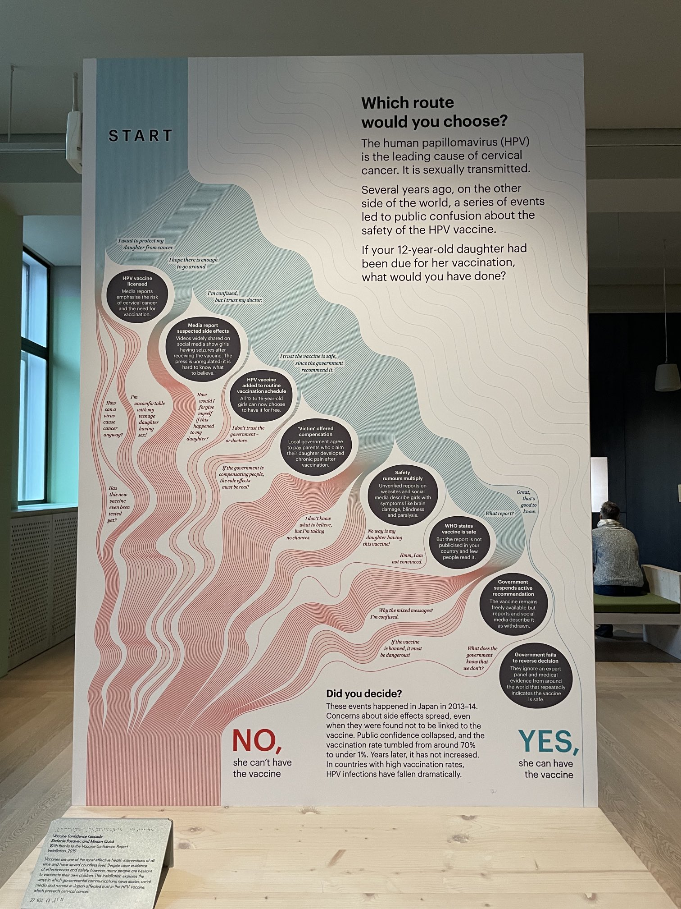
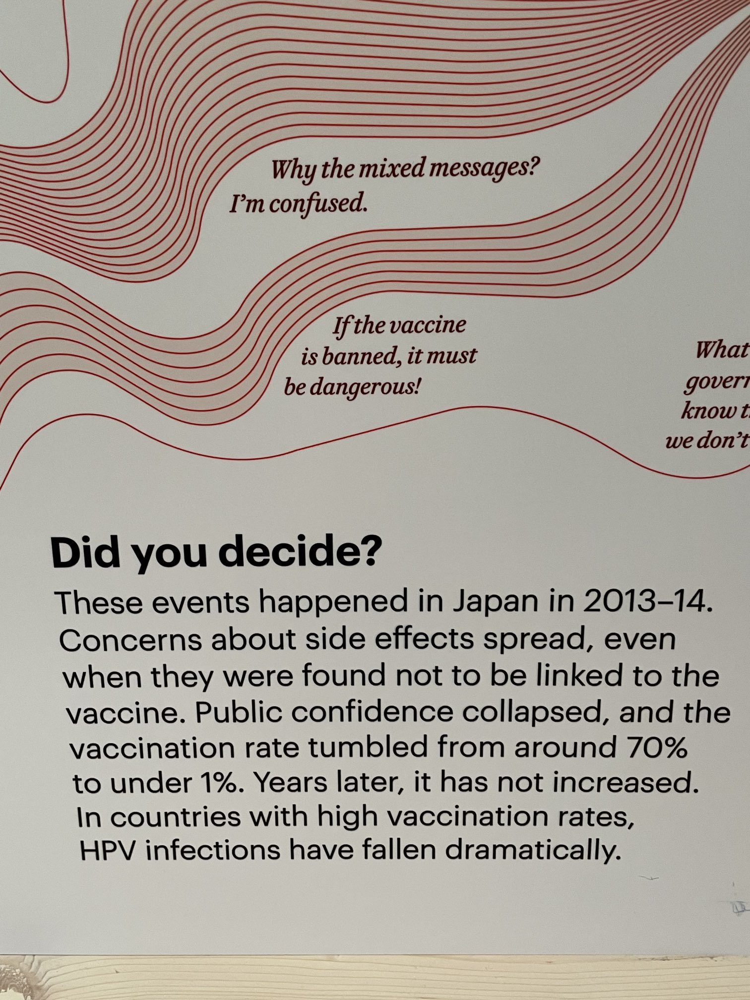
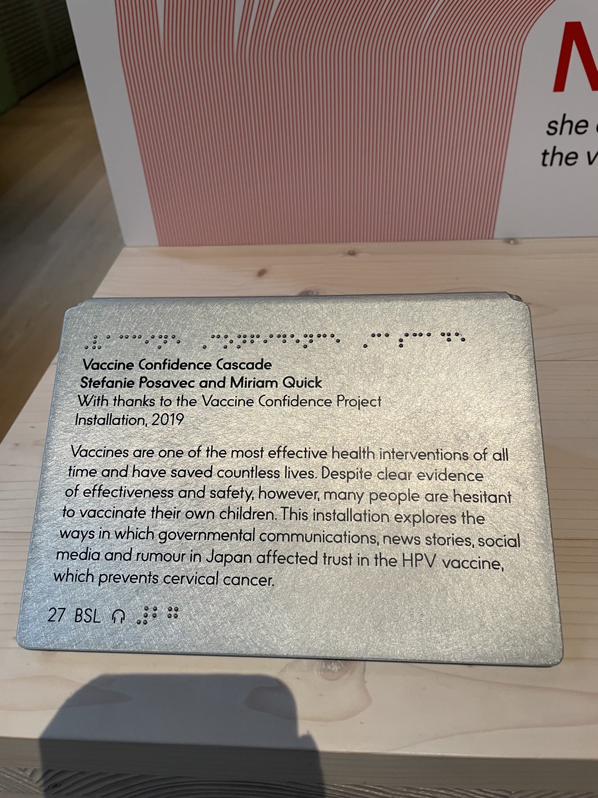
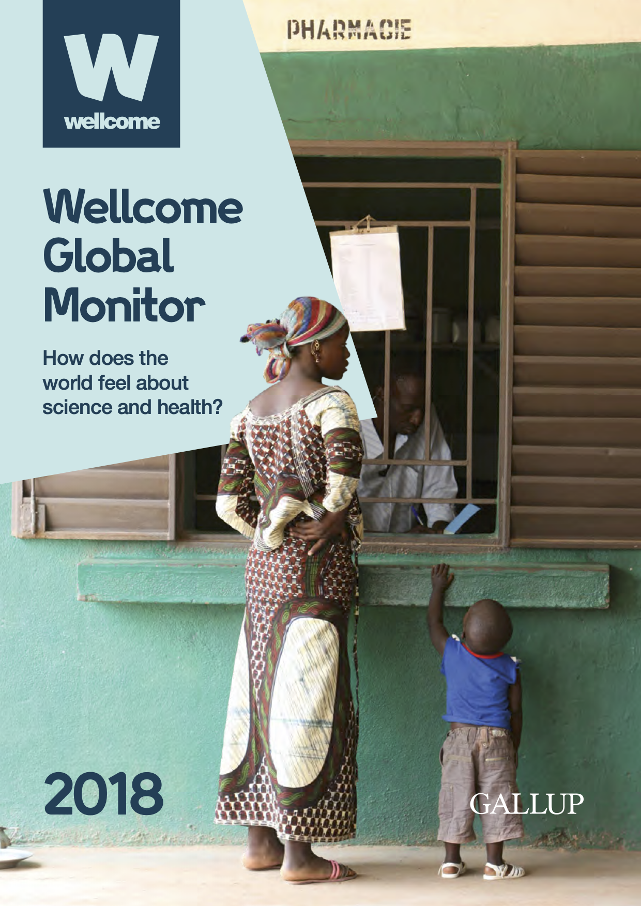
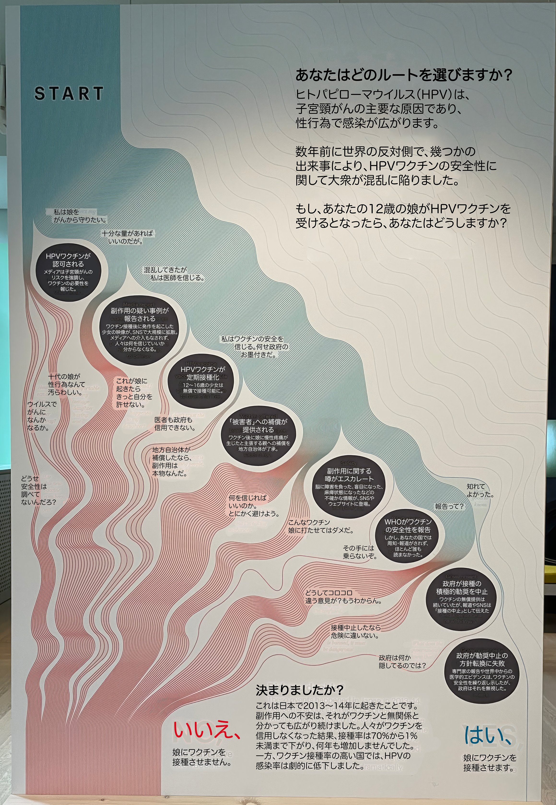

+++
author = "Yuichi Yazaki"
title = "ワクチンへの信頼をめぐる - Stefanie Posavec《Vaccine Confidence Cascade》"
slug = "vaccine-confidence-cascade"
date = "2025-09-28"
categories = [
    "consume"
]
tags = [
    "",
]
image = "images/vaccine-confidence-cascade-cover.jpeg"
+++

ロンドンの Wellcome Collection は「健康と人間の経験」を探る博物館・ライブラリーとして、科学や社会に関する企画展を多数行っています。その一つに、2019年に展示された Stefanie Posavec の作品《Vaccine Confidence Cascade》があります。本作はデータビジュアライザーである Posavec が、ライター Miriam Quick と共同で制作したインスタレーションで、ワクチンへの信頼が cascade する（滝のように連鎖的に崩れる／積み重なる）様子を視覚化したものです。

<!--more-->

- [Xユーザーの縞うさぎ／詫摩雅子さん:どのルートを選びますか？と題したインスタレーション...](https://x.com/shima_usa96/status/1633840716991586306)

## 作品の題材 — 日本における HPVワクチン問題

展示キャプションによれば、この作品が焦点を当てたのは 日本での HPVワクチンをめぐる不信と接種率の急落です。
2013年、副反応に関する報道が大きく広がり、科学的な因果関係は確認されなかったにもかかわらず、政府は積極的な接種勧奨を中止しました。その結果、接種率はかつての 約70%から 1%未満へと激減し、世界的にも「ワクチン・ヘジタンスの象徴的事例」となりました。

作品は、左側の赤い流れが「ワクチンを接種しない」選択へ至る道筋（副反応報道→混乱→不安→拒否）を、右側の水色の流れが「接種する」選択へ至る道筋（WHOや政府の推奨→安心→接種継続）を描き出しています。中央には「情報の錯綜」による混乱の声が吹き出しとして配置され、意思決定の揺れを体感的に示しています。

- [Xユーザーの縞うさぎ／詫摩雅子さん:どのルートを選びますか？と題したインスタレーション...](https://x.com/shima_usa96/status/1633840716991586306)

## 背景となるデータ — Wellcome Global Monitor

この作品が展示されたのと同じ年に公開された Wellcome Global Monitor は、140か国・14万人以上を対象とした大規模意識調査です。その中でも 日本のワクチン信頼は特筆すべき事例として取り上げられています。

- 「日本とオーストリアは先進国で例外的にワクチン信頼が低い。特に HPVワクチンや他のワクチンの安全性をめぐる問題が、ここ数年で信頼を損ねた」  
- 「過去20年間の政府対応は、麻疹や風疹の再流行を招いた」  
- 子どもにワクチンを接種したと回答した割合（日本）Yes: 88% / No: 7% / Don’t know: 5%  

- 引用文献  
  - [Tanaka N. et al. (2017) "History repeats itself in Japan: Failure to learn from rubella epidemic leads to failure to provide the HPV vaccine."](https://pmc.ncbi.nlm.nih.gov/articles/PMC5557250/)
  - [The Japan Times 社説 "Japan’s backward vaccination policy"](https://www.japantimes.co.jp/opinion/2018/06/26/commentary/japan-commentary/japans-backward-vaccination-policy/)

このように、国際的な調査の中でも「日本の HPVワクチンをめぐる不信」が公式に位置づけられており、Posavec の作品はその社会的背景を直接題材としたものだと理解できます。

## 作品とデータをつなぐ意味

Posavec の作品は、これらの調査結果や報道を背景に、「信頼が cascade（連鎖的に崩れていく／形成されていく）」構造を体感的に表現しています。公式調査（Wellcome Global Monitor）で数値化された「日本におけるワクチン信頼の低下」という事実と、可視化作品の体験的表現が重なることで、社会における「情報と信頼の脆さ」を強く訴えています。

## 作品上で日本語訳をオーバーレイしたもの

- [Xユーザーの𝑷𝑲𝑨さん: とても良い展示なので、日本語化しときましたよ...](https://x.com/PKAnzug/status/1691383931168550912)

## 参考・出典

- [Stefanie Posavec: Vaccine Confidence Cascade（作品ページ）](https://www.stefanieposavec.com/archive/confidence-cascade)
- [Wellcome Collection（公式）](https://wellcomecollection.org/)
- [Wellcome Global Monitor](https://wellcome.org/engagement-and-advocacy/engaging-people/wellcome-global-monitor)

