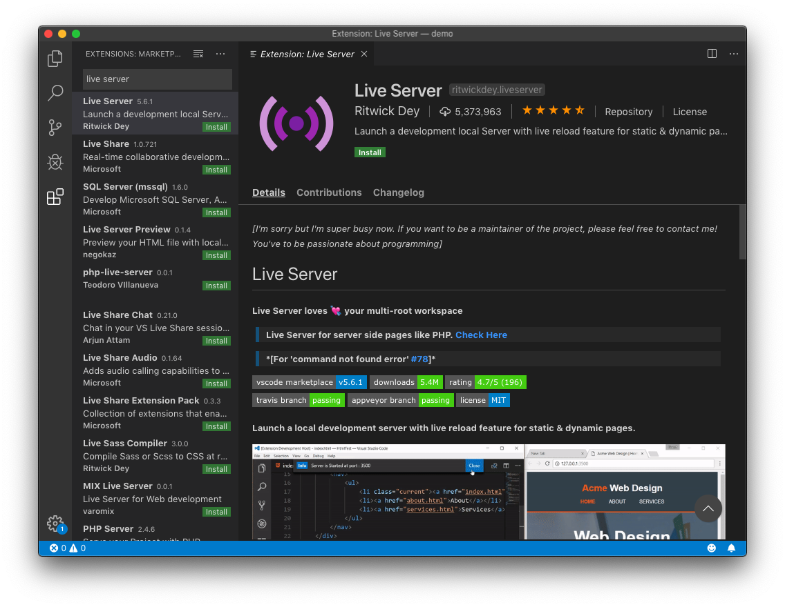
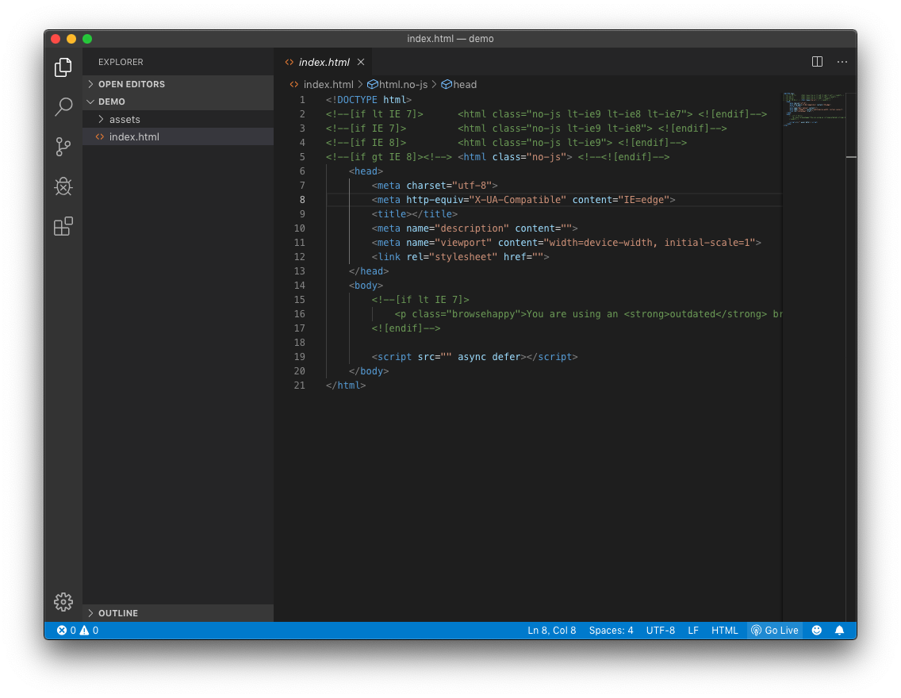
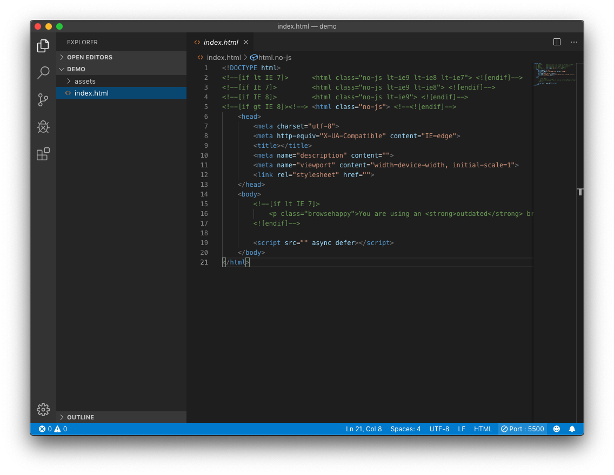

+++
author = "Yuichi Yazaki"
title = "【ワークショップなどで便利】ローカル環境で、自動リロードする簡易サーバを手軽に【Visual Code EditorとLive Server】"
slug = "vcs-liveserver"
date = "2019-08-24"
categories = [
    "technology"
]
tags = [
    "visualcodeeditor",
]
image = "images/fi_VcsLiveServer.png"
+++

ローカル環境で簡易サーバを手軽に起動できる方法の一つとして、テキストエディタを使った例を紹介します。

#### テキストエディタ：Visual Studio Code

- [テキストエディタ：Visual Studio Code](https://azure.microsoft.com/ja-jp/products/visual-studio-code/)

#### メリット

- テキストエディタで開発しつつ、その場で簡易サーバとしての動作の確認が行えます。
- ファイルを修正し保存すると、自動でブラウザをリロードしてくれますので、何度もブラウザをリロードする手間から解放されます。

#### Live Serverのインストール

- [Live Serverのインストール](https://marketplace.visualstudio.com/items?itemName=ritwickdey.LiveServer)

Extension（拡張）としてインストールします。

#### 作業するディレクトリを開く

Explorerから、作業するディレクトリを開きます。

#### サーバを起動する

ウインドウ右下の Go Live をクリックします。

#### サーバを停止する

ウインドウ右下の Go Live があった場所でポート番号が表示されています。ここをクリックするとサーバは停止します。

#### そのほか

ポート番号は5500が使われます。複数のプロジェクトで同時に使用することもできます。その場合は、5501、5502…とポート番号が1づつ増えていきます。
