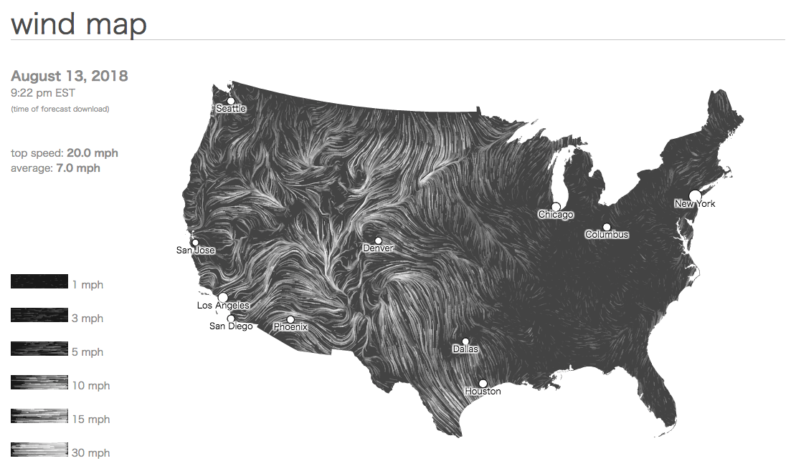
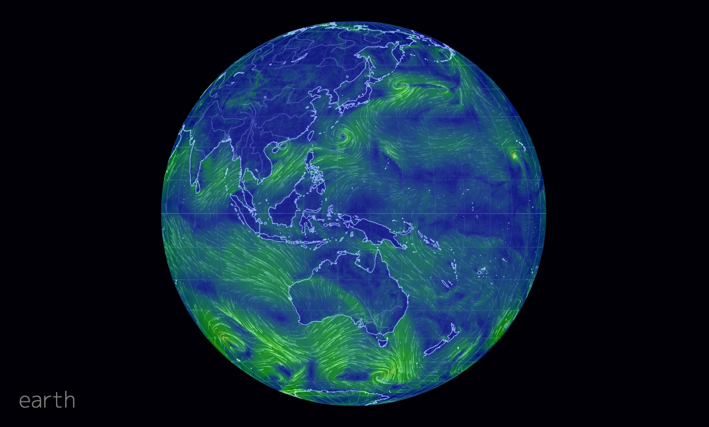
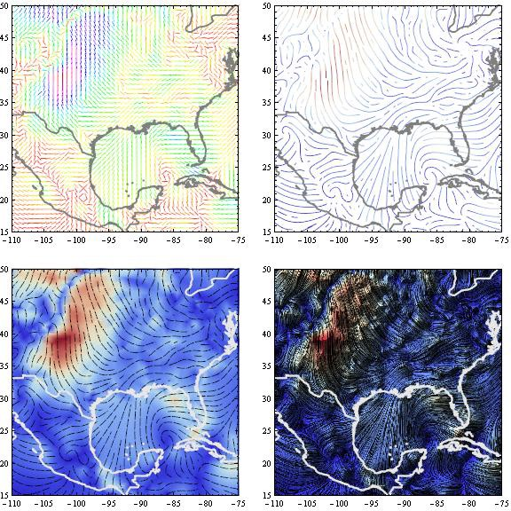
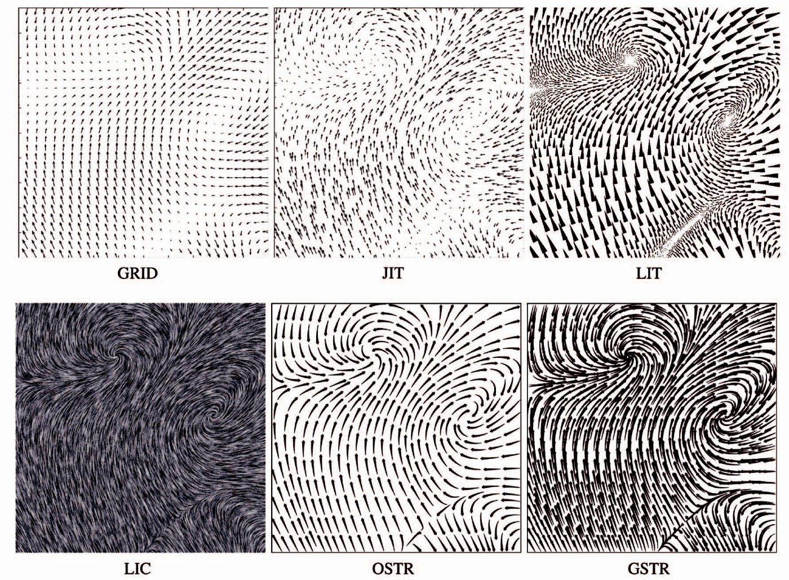
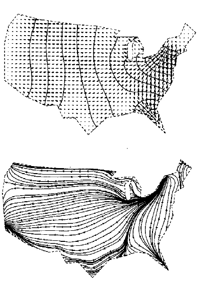

+++
author = "Yuichi Yazaki"
title = "ベクター・フィールド・マップ（Vector Field Map）"
slug = "vector-field-map"
date = "2020-08-11"
description = ""
categories = [
    "chart"
]
tags = [
    "地図",
]
image = "images/null_earth.png"
+++

ベクター・フィールド・マップは、連続的な位置において、多変量のベクター（ベクトル）を持ちます。幾何学的には各点は、方向と長さを持っています。この方向と長さを、グリフ（例えば、長さと幅にデータ値を反映させた矢印）を使用して、場の力と方向を示すための地図です。

<!--more-->

ある点での（外向きの）拡散と（内向きの）吸収の傾向を予測するために使用することができます。

## 作例

### wind map

[Wind Map](http://hint.fm/wind/)

フェルナンダ・ヴィーガス（Fernanda Viegas）とマーティン・ワッテンバーグ（Martin Wattenberg）による個人的なアートプロジェクト。

エネルギー源としての風の視覚化を目的としています。

「目に見えない古代のエネルギー源が、私たちを取り囲んでいます。これは、世界の最初の探検を推進するエネルギーであり、将来の鍵となる可能性があります。」

全米デジタル予測データベース（the National Digital Forecast Database）のデータを使用して、北米における風力を示し、1時間ごとに更新されています。
過去のエピックな日付へのリンクも用意され、その特定の日時の風の様子を再現することが可能です。

### Earth

[earth :: a global map of wind, weather, and ocean conditions](https://earth.nullschool.net/)

キャメロン・ベッカリオ（Cameron Beccario）による個人作品。”wind map”にインスピレーションを受けて制作されました。数時間ほどのタイムラグがあるデータを反映しており、様々なデータを、様々な地図投影法で可視化しています。

### 2008年9月1日のハリケーン・グスタフによる風速

[https://www.wolfram.com/mathematica/newin7/content/VectorAndFieldVisualization/VisualizeWindVelocityData.html](https://www.wolfram.com/mathematica/newin7/content/VectorAndFieldVisualization/VisualizeWindVelocityData.html)

### 2Dベクトルフィールド可視化手法の比較

ある実験では、異なる可視化イディオムを６つ用意し、これに対する人間の応答を比較したものがあります。

[https://www.cs.unc.edu/Courses/comp715-s14/papers/laidlaw_vector_vis_user_study_01359732.pdf](https://www.cs.unc.edu/Courses/comp715-s14/papers/laidlaw_vector_vis_user_study_01359732.pdf)

- GRID: 通常のグリッド上のアイコン
- JIT: ジッタード・グリッド上のアイコン
- LIT: 油絵の概念を借用している可視化手法のレイヤー
- LIC: 線積分畳み込み
- OSTR: イメージガイド流線（積分曲線）
- GSTR: 規則的なグリッドにシードされた流線

## 誰が作ったのか

不明。

## 以前の似た作例

コンピュータによるマイグレーション・マッピングの実験

[(PDF) Experiments In Migration Mapping By Computer](https://www.researchgate.net/publication/253604711_Experiments_In_Migration_Mapping_By_Computer)

## 類似する地図

特にありません。

## 他の呼び名
Migration Maps

## 参考文献

Katy Börner — Atlas of Knowledge
Katy Börner — Atlas of Science
Tamara Munzner — Visualization Analysis and Design