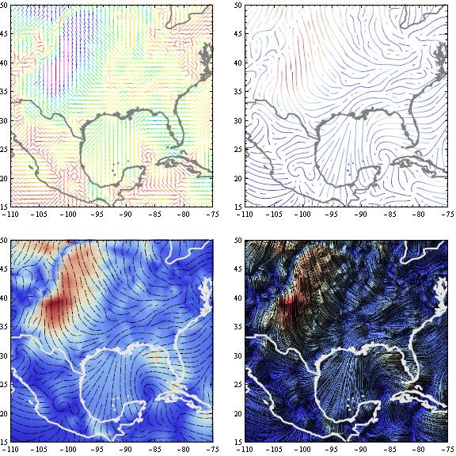

+++
author = "Yuichi Yazaki"
title = "ベクトル・フィールド・マップ（Vector Field Map）"
slug = "vector-field-map/"
date = "2025-10-11"
categories = [
    "chart"
]
tags = [
    "地図",
]
image = "images/cover.png"
+++

ベクトル・フィールド・マップ（Vector Field Map）は、**空間内の各点における方向と大きさを矢印（グリフ）で同時に可視化する地図表現**です。風向・風速、海流、電場・磁場など、方向性を持つデータの空間分布を直感的に把握するために使われます。矢印の長さや色でベクトルの強度を、角度で方向を表し、ある点での拡散や吸収の傾向を予測することもできます。

<!--more-->



## 歴史的経緯

ベクトル・フィールドの可視化は、19世紀の物理学や流体力学の発展とともに始まりました。マイケル・ファラデーは磁力線の概念を図として表現し、ベクトル場の視覚的理解に大きく貢献しました。その後、ジェームズ・クラーク・マクスウェルがベクトル場の数学的理論を体系化し、電磁気学の基盤を築きました。20世紀に入ると、数値流体シミュレーション（CFD）やリモートセンシング技術の進歩により、高密度なベクトルデータを地図上で動的に可視化する手法が発展しました。現在では気象予報や海洋学の分野を中心に、リアルタイムのベクトル・フィールド・マップが日常的に利用されています。

## データ構造

ベクトル・フィールド・マップに必要な基本的なデータ構造は以下のとおりです。

| 項目 | 内容 | 例 |
|------|------|-----|
| 位置座標（x, y） | 各ベクトルが配置されるグリッド上の座標 | 緯度・経度、グリッドセルの中心点 |
| ベクトルの方向（角度） | 各点における流れや力の向き | 風向（0〜360度）、電場の向き |
| ベクトルの大きさ（スカラー値） | 各点における強度 | 風速（m/s）、磁束密度（T） |
| 補助スカラー値（任意） | 色で表す追加変数 | 温度、圧力、高度 |

## 目的

ベクトル・フィールド・マップの主な目的は、空間上に分布する方向性データの全体的なパターンや局所的な変動を視覚的に把握することです。流れの方向、渦の発生箇所、収束・発散の傾向など、数値だけでは認識しにくい空間的特徴を直感的に理解できるようにします。

## ユースケース

- 気象学における風向・風速図や台風の流れ解析
- 物理学における電場・磁場の空間分布の可視化
- 流体力学での流速ベクトルによる渦や収束・発散の分析
- 医学・生理学でのMRIベースの血流方向可視化
- 海洋学での海流パターンの追跡と予測
- コンピュータグラフィックスでのテクスチャ生成や視覚的エフェクト

## 特徴

| 特徴 | 説明 |
|------|------|
| 方向と大きさの同時表現 | 矢印一つで向きと強度を同時に表現できます |
| 空間パターンの把握 | 渦、収束、発散などの構造を直感的に認識できます |
| スカラー場との重ね合わせ | 温度や圧力などのスカラー値と組み合わせて多次元的な表現が可能です |
| 密度の調整が可能 | グリッドの解像度を変えることで、表示の密度を制御できます |
| 動的表現への拡張 | アニメーションと組み合わせることで、時間変化する流れを表現できます |

## チャートの見方

| 要素 | 表すもの | 説明 |
|------|-----------|------|
| 矢印の方向 | ベクトルの向き | 各点における流れや力の方向を示します。例えば風向や電場の向きを意味します |
| 矢印の長さ | ベクトルの大きさ（強度） | 長い矢印は強い力・速い流れ、短い矢印は弱い力・遅い流れを示します |
| 矢印の色 | 強度やスカラー値 | 大きさを補助的に表したり、別の変数（温度や圧力など）を示す場合もあります |
| 背景グリッド | 位置の基準 | 各ベクトルがどの位置に対応しているかを示す座標系です |
| 等高線や陰影 | 補助的スカラー場 | ベクトルと同時にスカラー値の分布（例：速度ポテンシャル）を重ねることもあります |

## デザイン上の注意点

- 矢印の密度が高すぎると視覚的に混雑し、パターンの読み取りが困難になります。適切なグリッド解像度の選択が重要です
- 矢印の長さのスケーリングに注意が必要です。極端に長い矢印は隣接するベクトルと重なり、可読性を損ないます
- 色と長さの両方でベクトルの大きさを二重にエンコードする場合、凡例を明示して読み手の混乱を防ぐことが大切です
- 背景地図やスカラー場を重ねる際は、矢印の視認性が保たれるよう、背景のコントラストを調整します
- インタラクティブな環境では、ズームレベルに応じて矢印の密度を動的に調整すると効果的です

## 応用例

- **気象予報サービス**：風向・風速データをリアルタイムで地図上に表示し、天気予報や防災情報に活用されています
- **海洋モニタリング**：海流の方向と速度を可視化し、船舶の航路計画や海洋汚染の拡散予測に利用されます
- **航空工学**：翼周りの気流シミュレーション結果をベクトル・フィールド・マップで表示し、空力特性の分析に用いられます
- **地球物理学**：地殻変動や地磁気の変化をベクトル場として表現し、地震予測研究に役立てられています

## 代替例

| 手法 | 特徴 | 比較点 |
|------|------|--------|
| ストリームライン（Streamline） | 連続した線で流れの方向を示す | 流れの連続性を強調できます |
| パスライン（Pathline） | 粒子の時間経過を追跡 | 動的な流れを表現できます |
| グリフ・プロット（Glyph Plot） | 矢印や円錐などの形状でベクトルを表す | 多次元データにも応用可能です |
| コンツアー・マップ（Contour Map） | スカラー値を等高線で表す | ベクトルと重ねて使うと効果的です |

## まとめ

ベクトル・フィールド・マップは、方向と大きさを同時に表現することで、空間的な力や流れの関係を理解するのに非常に有効な手法です。気象学、物理学、流体力学、海洋学など幅広い分野で利用されており、現代ではインタラクティブな操作やアニメーションと組み合わせることで、動的なデータの探索にも活用されています。適切なグリッド密度やスケーリングの設定が、効果的な可視化の鍵となります。

## 参考・出典

```
- [Wikipedia - Vector field](https://en.wikipedia.org/wiki/Vector_field)
- [ParaView Official Site](https://www.paraview.org/)
- [D3.js Official Site](https://d3js.org/)
```
