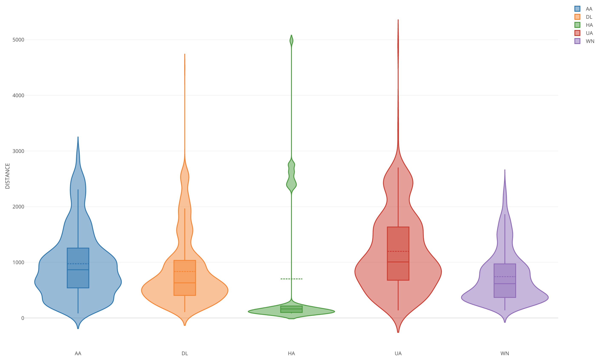

+++
author = "Yuichi Yazaki"
title = "バイオリン・プロット"
slug = "violin-plot"
date = "2025-10-11"
categories = [
    "chart"
]
tags = [
    "",
]
image = "images/cover.png"
+++

**バイオリン・プロット（Violin Plot）** は、データの分布を可視化するための図であり **箱ひげ図（Box-and-Whisker Plot）とカーネル密度推定（Kernel Density Estimation, KDE）を組み合わせた** チャートです。データの中央値や四分位範囲といった要約統計量に加え、分布の形状を滑らかに示すことで、より直感的に「データの山（モード）」や「広がり」「偏り」を読み取ることができます。

<!--more-->

## チャートの見方

バイオリン・プロットは、中心に箱ひげ図の要素を含み、両側に分布を反映した「バイオリン（弦楽器）」のような形状が描かれます。以下の要素で構成されます。

| 要素 | 意味 |
|------|------|
| 外形（バイオリン部分） | データの分布密度を示す（左右対称のカーネル密度曲線） |
| 太線（中央の黒線など） | 中央値（Median）を示す |
| 箱（四分位範囲） | 第1四分位（Q1）から第3四分位（Q3）の範囲を示す |
| 上下のひげ（Whisker） | 外れ値を除いたデータ範囲を示す |
| 点（外れ値） | 分布から大きく外れた値を示す |

## 利点と活用例

バイオリン・プロットは、単なる箱ひげ図よりも **分布の形状やモードの数を視覚的に把握できる** 点が優れています。  
特に以下のような場面で有用です。

- グループごとのデータ分布を比較するとき（例：性別別テストスコア）
- データが正規分布でない場合や複数モードを持つ場合
- サンプル数の多いデータにおける偏りの可視化

また **Seaborn（Python）** や **Plotly** **ggplot2（R）** などの主要な可視化ライブラリでも標準機能としてサポートされています。

## 他の図との違い

| 比較対象 | 特徴 | 適するケース |
|-----------|------|---------------|
| 箱ひげ図 | 四分位数のみ表示。分布の形状は不明 | シンプルな分布比較 |
| ヒストグラム | 分布形状は見やすいが、カテゴリ比較には不向き | 単一変数の分布解析 |
| バイオリン・プロット | 四分位数＋分布形状を統合 | グループ間比較・分布の偏り検出 |

## 背景：カーネル密度推定とは

バイオリン・プロットの滑らかな形状は **カーネル密度推定（Kernel Density Estimation, KDE）** という統計的手法によって生成されます。KDEは、ヒストグラムよりも滑らかに分布を近似する方法で、バンド幅（Bandwidth）の設定によって滑らかさを調整します。

## まとめ

バイオリン・プロットは、単なる中央値や範囲だけでなく **分布の形そのものを「見せる」可視化手法** です。  
特に、複数のグループや条件でデータの分布を比較する際に、従来の箱ひげ図よりも豊かな情報を伝えることができます。  
視覚的なわかりやすさと統計的な深みを兼ね備えたこのチャートは、探索的データ分析や教育の現場でも広く活用されています。

## 参考・出典

- [Seaborn Violinplot — official documentation](https://seaborn.pydata.org/generated/seaborn.violinplot.html)  
- [ggplot2 Reference — geom_violin](https://ggplot2.tidyverse.org/reference/geom_violin.html)  
- [Plotly: Violin Plots in Python](https://plotly.com/python/violin/)  
- [Wikipedia: Violin plot](https://en.wikipedia.org/wiki/Violin_plot)
- [Introduction to Vionlin Plot](https://exploratory.io/note/kanaugust/Introduction-to-Vionlin-Plot-jAq8egs3VC/note_content/note.html)
