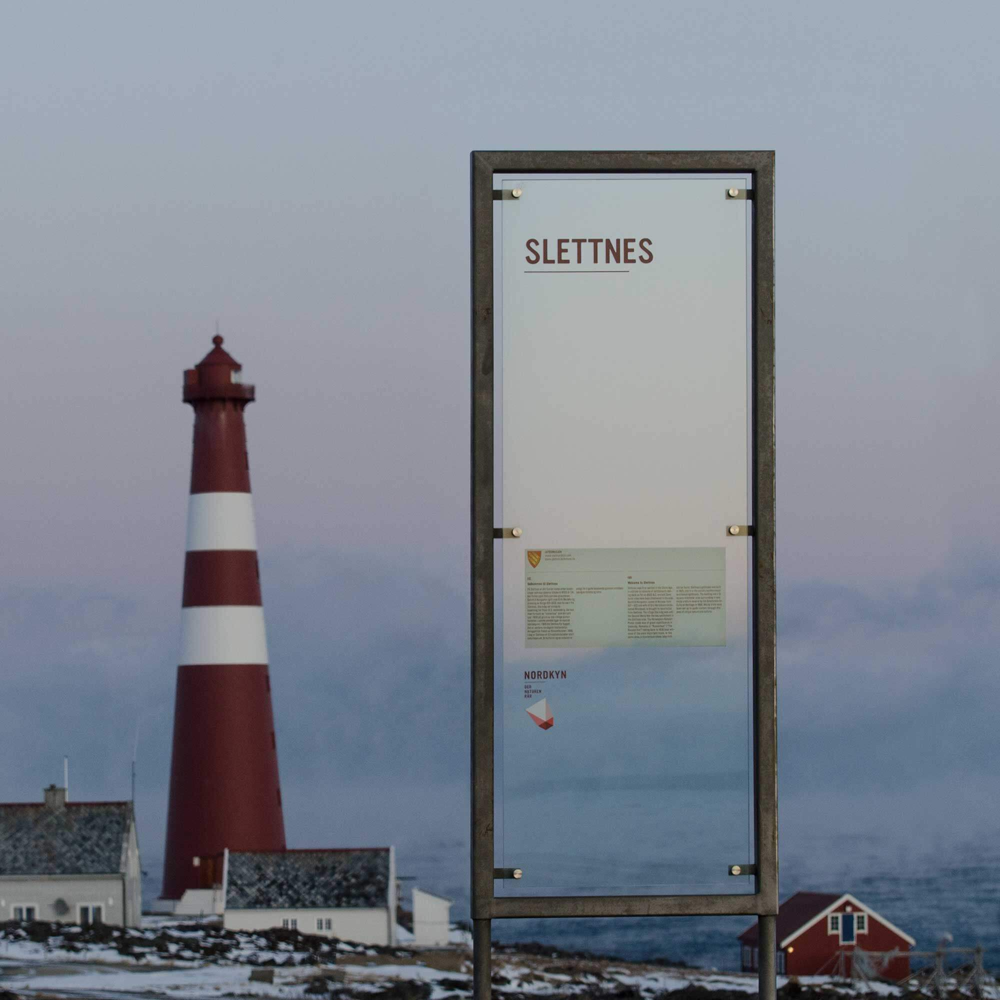
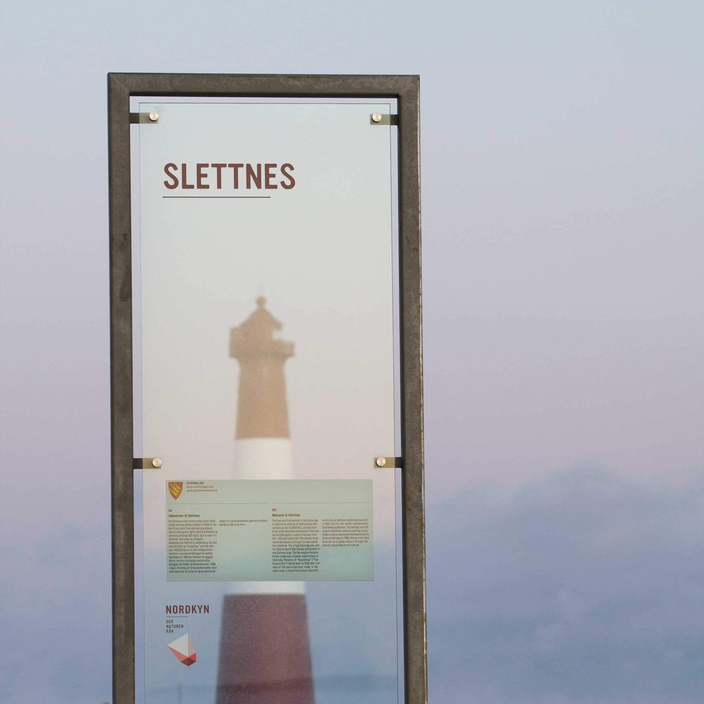
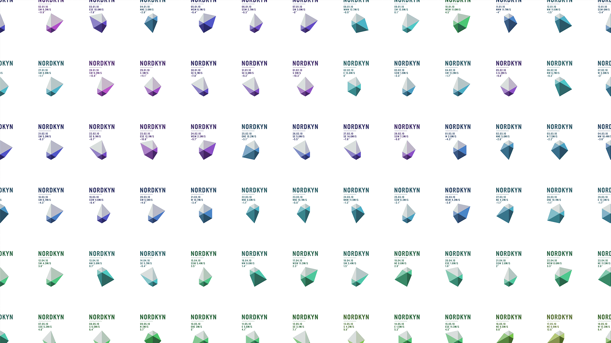
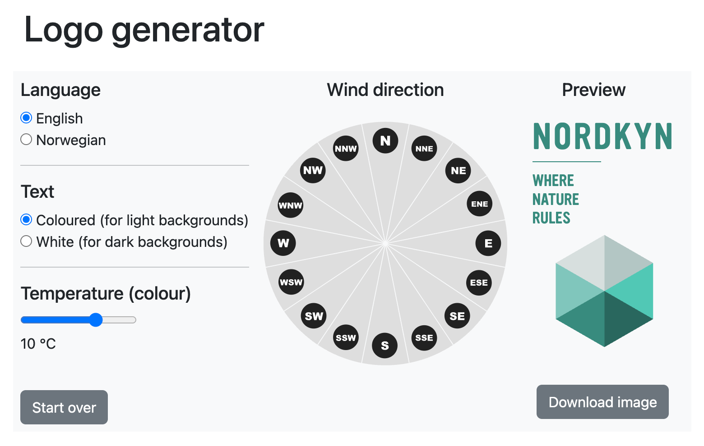

+++
author = "Yuichi Yazaki"
title = "北ノルウェーの自然を映すロゴ──Visit Nordkynの動的アイデンティティ"
slug = "visit-nordkyn-logo"
date = "2025-09-26"
description = ""
categories = [
    "consume"
]
tags = [
    "オリジナルのビジュアル変換",
]
image = "images/cover.png"
+++

ノルウェー最北部、ノードキン（Nordkyn）を舞台とする観光プロジェクト「Visit Nordkyn」。この地域の魅力を表現すべく、デザイン・スタジオ Neue は“ただ刻一刻と形を変えるロゴ”を提案しました。風、温度といった自然の要素を可視化し、ブランドと気候がリアルタイムにつながる「動的ロゴ（Dynamic Logo）」の手法は、従来の静的ロゴの枠を超えた表現として、ブランディング界でも注目を浴びています。本記事では、Visit Nordkyn の動的ロゴの背景、仕組み、意義、課題・可能性について整理・考察します。

<!--more-->

## 背景：なぜ動的ロゴが求められたか

### 地域と自然との結びつき

Nordkyn はノルウェー北部、フィンマルク県に位置する半島地域。海、風、寒さ、そして厳しい気象が日常の要素です。地域住民の暮らしもまた自然との関係性に大きく依存しており、その環境性をブランドの根幹に据えたいという意図がありました。
「Where Nature Rules（自然が支配する場所）」というスローガンが示すように、自然が主役である地域性を、ロゴ自体に落とし込もうという発想です。  

### ブランド統一と連携強化

Visit Nordkyn は、複数の町・自治体・観光事業者が連携して観光振興を図る組織です。地域の各プレイヤーの意見、視点、訴求ポイントを統合しつつ、それぞれを束ねる共通のビジュアル表現を持つ必要がありました。静的なロゴではなく、柔軟で変化できる表現は、それぞれの関係性をうまく包摂できる可能性を秘めています。  

## 動的ロゴの仕組み・設計

### データ連携 ─ 気象情報をロゴに反映

ロゴは、ノルウェー気象庁などのリアルタイム気象データと連携しています。風向・風速・気温などのデータを入力源とし、ロゴの形状、配色、構成が変化します。  

たとえば、気温の変動に応じて色調がマゼンタ系またはターコイズ系に移行する、風向・風速によってロゴの幾何形状がねじれたり伸びたり変形する、といった動きが設計されています。  

ウェブ上では、このロゴは 5 分ごとに更新される仕組みになっており、常に現在の気象条件を反映します。  

### ジェネレーティブ・システムと制約設計

無秩序に変わる表現ではなく、一定のルールと制約（グリッド構造、頂点の拘束、変形可能域など）を設けることで、動的変化の中にも一貫性と識別性を保つよう設計されています。いわゆる「システムとしてのロゴ」構造です。  

このような生成的アプローチ（generative approach）は、動的アイデンティティ論において近年注目される手法であり、ロゴの「形」そのものよりも、その「変換メカニズム（プロセス）」を重視する視点を反映しています。  

### ロゴジェネレーター（Logo Generator）

Visit Nordkyn は、ユーザーが気象条件を入力してその時点に即したロゴバリエーションをダウンロードできる「ロゴジェネレーター」機能を Web 上に実装しています。たとえば、「10 °C」「風向 NorthEast」などを条件設定し、生成されたロゴを取得可能です。  

このジェネレーターは、ブランドとユーザーのインタラクションを拡張する手段としても機能します。

## 成果・意義

### ブランド体験と共感性の向上

ロゴがその場その時の自然状況を映すことで、「自然との共鳴」「地域との結びつき」を実感させる表現が可能になりました。訪問者やユーザーにとって、単なる視覚記号ではなく「その土地と呼吸する存在」としてロゴが機能します。

### 差別化と話題性

伝統的なロゴ設計とは異なるアプローチゆえに、デザイン界やマーケティング界で話題になりました。動的アイデンティティとして先進性を示す事例として参照されることも多いようです。  

### 柔軟性と拡張性

ロゴの可変性により、異なるメディア・用途に適応しやすいという利点があります。静的表現をベースに、必要に応じてその場に合わせたカスタム表現を導出できる設計は、ブランド展開の自由度を高めます。

## 課題・制約・注意点

### オフライン適用の制限

印刷物、看板、グッズ等、アニメーションやリアルタイム更新ができない媒体では、必然的に静的なロゴ表現を選択せざるを得ません。その場合、どの時点のロゴを「代表」とするか、あるいは特定のバリエーションを定番とするか、方針を定める必要があります。

### 識別性と一貫性の維持

動きが多様になるほど、ロゴが「どれも似ていて同じブランドのもの」と認識されることが難しくなるリスクがあります。変化のパラメータ範囲やテンプレート制約を慎重に設計しないと、ブランドアイデンティティがぼやけてしまう可能性があります。

### 技術的・運用コスト

リアルタイム気象データ連携、ロゴ生成スクリプトやインフラの整備と維持が必要です。また、ロゴ更新頻度やデータソースの信頼性、対応フォーマットの多様性（ラスタ／ベクター、各種解像度対応など）も考慮しなければなりません。

### ユーザー理解と受け入れ

一般ユーザーやブランド関係者にとって「ロゴが変わる」＝「変わっていいのか」「混乱しないか」という抵抗感が出る可能性があります。変化の意図や仕組みを丁寧に説明・可視化する設計が求められます。

## 応用可能性

- 気象以外のリアルタイムデータ（観光客数、ソーシャルメディアの投稿数、潮位、植物の季節変化など）を入力源とするロゴ変化
- 現地サインや空間看板に動的要素を導入（LED サイン、スクリーン表示など）
- ユーザー参加型（ユーザーが気象条件を“予測”してロゴを作る、アプリ連携など）
- 他地域観光ブランド、自治体、自然保護団体などへの転用・事例展開

## まとめ

Visit Nordkyn の動的ロゴは、単なる視覚的な記号から抜け出し「地域の自然をリアルタイムに表現する存在」へと拡張された表現手段です。その構想と実装には、デザインとテクノロジー、ブランド戦略を重層的に統合する意図が込められています。

一方で、実運用や普及に際しては、識別性、一貫性、コスト、理解促進といった課題と向き合わなければなりません。しかし、こうしたチャレンジを経て得られる「生きて変わるブランド体験」は、今後のブランディングの新たな方向性を指し示すものとなるでしょう。

## 参考・出典

- [About - Visit Nordkyn](https://visitnordkyn.com/About)
- [Neue Design Studio - Visit Nordkyn](https://neue.no/work/visit-nordkyn/)