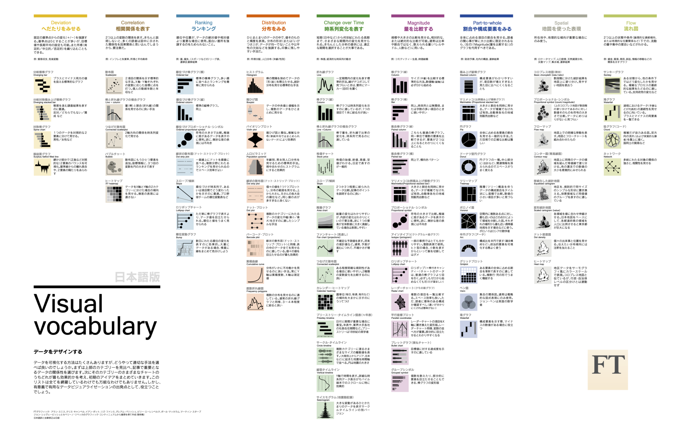

+++
author = "Yuichi Yazaki"
title = "Visual Vocabulary"
slug = "visual-vocabulary"
date = "2020-08-30"
description = ""
categories = [
    "chart"
]
tags = [
    "",
]
image = "images/Visual-vocabulary-JP.png"
+++

FTのAlan Smith氏が公開している、チャートの分類や種類を視覚的にまとめた一覧です。

<!--more-->

- [Visual Vocabulary](https://github.com/ft-interactive/chart-doctor/blob/master/visual-vocabulary/Visual-vocabulary-JP.pdf)
- [Finantial Times インタラクティブ版](https://ft-interactive.github.io/visual-vocabulary/)
- [Tableau Public版](https://public.tableau.com/en-us/gallery/visual-vocabulary)
- [Power BI版](http://sqljason.com/2018/12/financial-times-visual-vocabulary-power-bi-edition.html)
- [Vega版](https://gramener.github.io/visual-vocabulary-vega/)