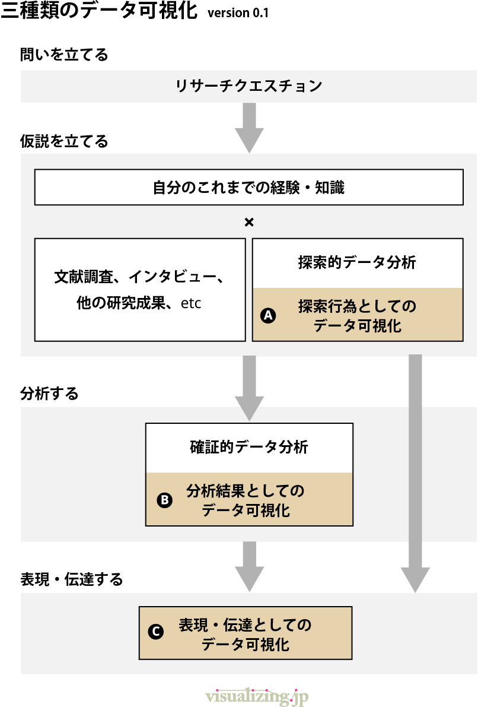
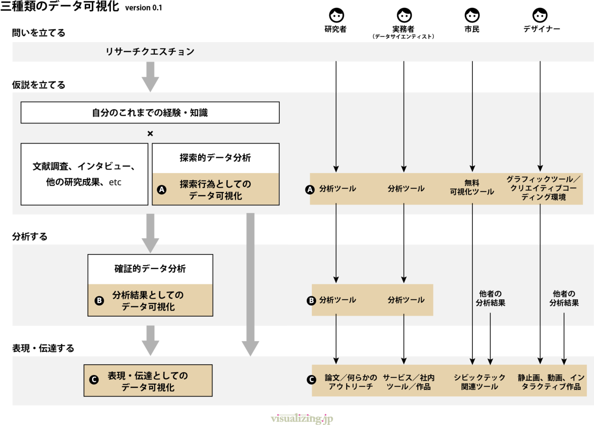

+++
author = "Yuichi Yazaki"
title = "「データ可視化」の指す、三種類の行為"
slug = "viz-for-whom"
date = "2019-08-24"
categories = [
    "principle"
]
tags = [
    "",
]
image = "images/picture_pc_508a912df679a6045d79eb479914817f.png"
+++

「データ可視化」という言葉を使うとき、何だかふわっとしてるなと感じませんか？

デザイナーとしての一個人としてはこのようなモヤモヤ体験があります。

「あくまでデータ分析がメインなのであって、可視化はその結果、おまけにすぎない」  
「そのインフォグラフィック、良いんだけど、でもそれって統計的有意はないのでしょう？」

私が思うに、世間一般的に **「データ可視化」** という言葉が指し示している対象が異なるのではないでしょうか。異なることを語っているのに同じ言葉を使っているのですれ違ってしまう。外来語あるあるですね。

- １つ目、 **探索行為** としてのデータ可視化。
- ２つ目、 **分析結果** としてのデータ可視化。
- ３つ目、 **表現や伝達** のためのデータ可視化。

です。図示すると以下の通りです。

**「問いを立てる」** というのは、知りたいこと、調べたいこと、関心があることなどテーマ全般を指すものとします。

**「仮説を立てる」** というのは、すでに出版されている本や研究結果を知ったり、詳しい人や当事者に聞きに行くことと同様に、すでに存在しているデータや自分で集めたデータを元にして可視化をする。それらのことで仮説を立てる、ということを指します。

**「分析する」** というのは、データ分析全般をここではざっくり指すものとします。ここも学術・手法・目的などでいくらでも細分化できそうですが、本文章ではスコープ外としてこの程度の言及とさせてください。

**「表現・伝達する」** というのは、表現であれば最終的な成果物（アウトプット）として完成させることや、それを他者へ伝えることを指します。

ここへさらに**「誰にとって」**という視点を加えると、より違いが鮮明になります。

ここではデータサイエンティストを社会の実課題を解決につなげることを目的とする実務者に含めています。

研究者や実務者にとって、探索的データ分析・可視化や、確証的データ分析・可視化は馴染み深いものだと思います。

市民データサイエンスとして、ここに市民が付け加わります。市民にとっての探索的データ可視化は、たとえば大多数の関心はないけれども自分にとっては切実な問題や、思いつきや問題意識です。この図の冒頭にリサーチクエスチョンとありますが、何をテーマだと思うかは、研究成果ということに範囲を絞らなければ、市井（しせい）の人、どなたにでも開かれているものだと思います。ただ思いついただけでは、誰かに伝えることができませんし、言葉で伝えたとして聞いた人が正確に伝言ゲームに参加できるかというと、記憶の細かさはどうしても落ちてしまいますし、そもそもその思いつきがどのくらいのインパクトのあるものなのか、客観的に人へ示すことができません。ここに具体的な手段を提供するのが市民にとってのデータ可視化です。

デザイナーやアーティストにとっては、探索的行為としてのデータ可視化と表現・伝達としてのとデータ可視化が明確に区別されていないと感じることがあります。テーマとコンセプトとデータと表現が、自分の得意な手法であらかじめ決め打ちされてしまっているといいますか…。この辺りの問題意識を昨年から多摩美術大学で持たせていただいている三年生向け「可視化演習」では取り組んでいこうとしています。

こうしてみていきますと、データ分析の結果としてのデータ可視化以外にもデータ可視化の使い所はあります。インフォグラフィックの内容が統計的有意を含めなくてもよい点についてはここで書ききれていないのでまた今度。

そして長くなってしまったので記事を改めますが、次以降の記事では**「誰」×「指し示している対象」**別に、必要なことや課題を取り上げていこうと思います。
