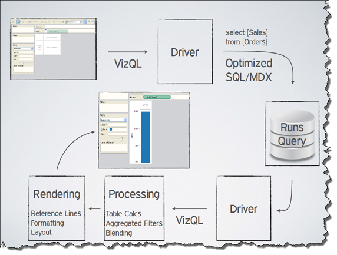

+++
author = "Yuichi Yazaki"
title = "What Is VizQL?"
slug = "vizql"
date = "2026-01-20"
categories = [
    "consume"
]
tags = [
    "",
]
image = "images/whatisvizql1.png"
+++

VizQL, or Visualization Query Language, is the declarative visualization language at the core of Tableau. It is based on the idea that visualization itself can be described as a query, rather than treating data retrieval, analysis, and visual rendering as separate manual steps.

VizQL originated from the Stanford research system Polaris and was formalized as part of turning that research into a commercial visual analytics tool.

<!--more-->

## Basic Idea

In Tableau, users drag fields onto shelves such as rows, columns, color, and size. Those visual choices are translated into VizQL, which then generates database queries such as SQL or MDX and returns results for visual rendering.

This makes interaction with a chart equivalent to querying data. Changing the view is not simply changing graphics; it changes the analytical query.

## Why It Matters

VizQL lowers the barrier between data analysis and visual design. Users do not need to write SQL for every operation, but the system still preserves a structured model of the query behind the view.

## Design Lessons

- Visual interfaces can be declarative, not only manual drawing tools.
- Analysis and visualization can share one grammar.
- Drag-and-drop interaction can still produce formal queries.
- A good visualization system must connect marks, data fields, aggregation, and database execution.

## Summary

VizQL is one of Tableau's foundational ideas: the chart is a query. This makes interactive visual analysis possible at scale because visual operations can be translated into structured data operations.
