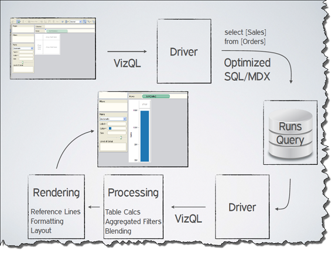
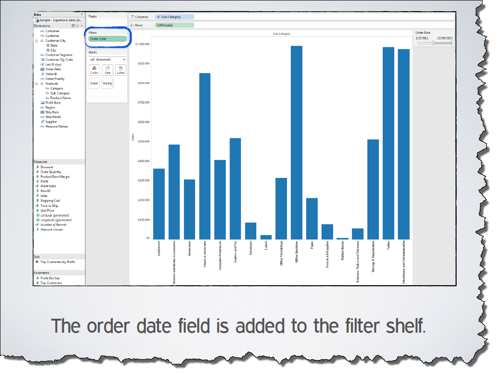
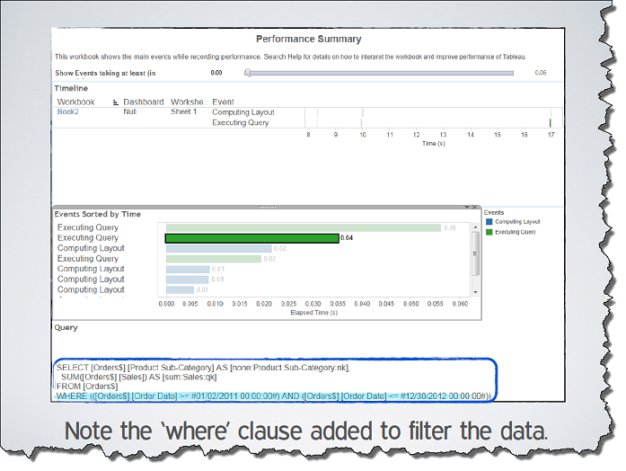

+++
author = "Yuichi Yazaki"
title = "VizQLとは何か"
slug = "vizql"
date = "2026-01-20"
categories = [
    "consume"
]
tags = [
    "",
]
image = "images/whatisvizql1.png"
+++

VizQL（Visualization Query Language）は、Tableauの中核を成す **可視化のための宣言的クエリ言語** です。  
VizQLは、データの取得・分析・可視化を個別の工程として分離するのではなく **「可視化そのものをクエリとして記述する」** という考え方に基づいて設計されています。

この言語は、スタンフォード大学で研究されたPolarisを起源とし、その研究成果を商用ツールとして成立させるために体系化されたものです。

<!--more-->

## 背景：SQLと可視化の断絶

従来のデータ分析では、以下のような分業構造が一般的でした。

| 工程 | 主な手段 |
|---|---|
| データ取得・集計 | SQL / MDX |
| 分析 | スプレッドシートや統計ツール |
| 可視化 | 別のグラフ作成ソフト |

SQLやMDXは強力なクエリ言語ですが、**結果をどのように視覚的に表現するか**についてはほとんど考慮されていません。そのため、分析結果を「見る」ためには、必ず別の可視化レイヤーが必要でした。

VizQLは、この分断そのものを問題として捉え、**クエリと可視化を単一の言語で扱う**ことを目的に設計されています。

## VizQLの基本思想

VizQLの設計思想は、論文およびTableau公式資料で一貫しています。

- 可視化は後処理ではなく、分析の中心である  
- ユーザーは「どう描くか」ではなく「何を見たいか」を指定すればよい  
- 実行方法（クエリ生成・最適化・描画）はシステムが担う  

このためVizQLは、**宣言的言語**として定義されています。  
ユーザーは最終的に得たい「絵（picture）」を記述し、低レベルな処理はすべて自動生成されます。

## PolarisからVizQLへの継承

VizQLは、Polarisで提案された以下の概念を明確に引き継いでいます。

| Polarisでの概念 | VizQLでの位置づけ |
|---|---|
| 可視化＝クエリ | 可視化を記述する正式な言語 |
| 表（rows / columns / layers） | ビュー構造の基本単位 |
| 多次元データのsmall multiples | 言語仕様として統合 |
| SQLとの統合 | SQL / MDXへのコンパイル |

Polarisが研究プロトタイプとして示した枠組みを、VizQLは**製品レベルで実行可能な言語仕様**にまで落とし込んでいます。

## VizQLで扱える表現範囲

VizQLは、特定のチャートタイプに依存しません。  
論文では、VizQLは以下を単一の枠組みで記述可能だとされています。

- 表（テキスト・クロス集計）
- グラフ（棒・線・散布図など）
- 地図
- 時系列
- small multiples（表形式の多数ビュー）

重要なのは、これらが「別々の機能」ではなく、**同一言語内で相互に切り替え可能**である点です。  
この性質により、VizQLでは理論上「表現の数に上限がありません」。

## VizQLとTableau UIの関係

Tableauのユーザーインターフェースは、VizQLを**直接操作するためのGUI**です。

- Rows / Columns  
- Marksカード  
- 各種Shelves（Color, Size, Detail など）

これらにフィールドをドラッグ＆ドロップする行為は、内部的にはVizQL式を構築・変更していることに相当します。

ユーザーはVizQLを「書いている」意識を持たずに、VizQLを操作しています。この点が、VizQLを**露出しない中間言語**として成立させている大きな要因です。

## VizQLとShow Meの関係

VizQLは、後に導入されたShow Me機能の前提条件でもあります。

- VizQLが  
  - ビュー構造  
  - 軸の型  
  - マークとエンコーディング  
  を形式的に表現できるからこそ
- Show Meは  
  - 「この条件なら、このVizQL式が適切」という判断を自動化できる  

つまり、

| レイヤー | 役割 |
|---|---|
| VizQL | 可視化を記述する文法 |
| Show Me | 文法に基づく自動設計ルール |

という関係にあります。

## VizQLの意義

VizQLの意義は、単に新しい言語を作ったことではありません。

- クエリと可視化の分断を解消したこと
- 可視化を「結果」ではなく「分析操作」として扱ったこと
- 探索的分析を前提とした言語設計を行ったこと

これらにより、VizQLは**Tableauという製品の内部言語であると同時に、Polaris以降の可視化研究を実務へ接続する要石**となりました。

## まとめ

VizQLは、可視化を単なる描画処理から解放し、**クエリと同等の第一級の分析操作**として扱えるようにした言語です。  
Polarisで生まれた理論を、Show MeのようなUX機能と接続しながら実務へと橋渡しした存在がVizQLだと言えます。

Tableauの操作がなぜ直感的で、かつ破綻しにくいのかを理解するためには、VizQLという設計思想を知ることが不可欠です。

## 参考・出典

- [VizQL: a language for query, analysis and visualization (SIGMOD 2006)](https://dl.acm.org/doi/pdf/10.1145/1142473.1142560)
- [What is VizQL? (Tableau公式)](https://www.tableau.com/ja-jp/drive/what-is-vizql)

