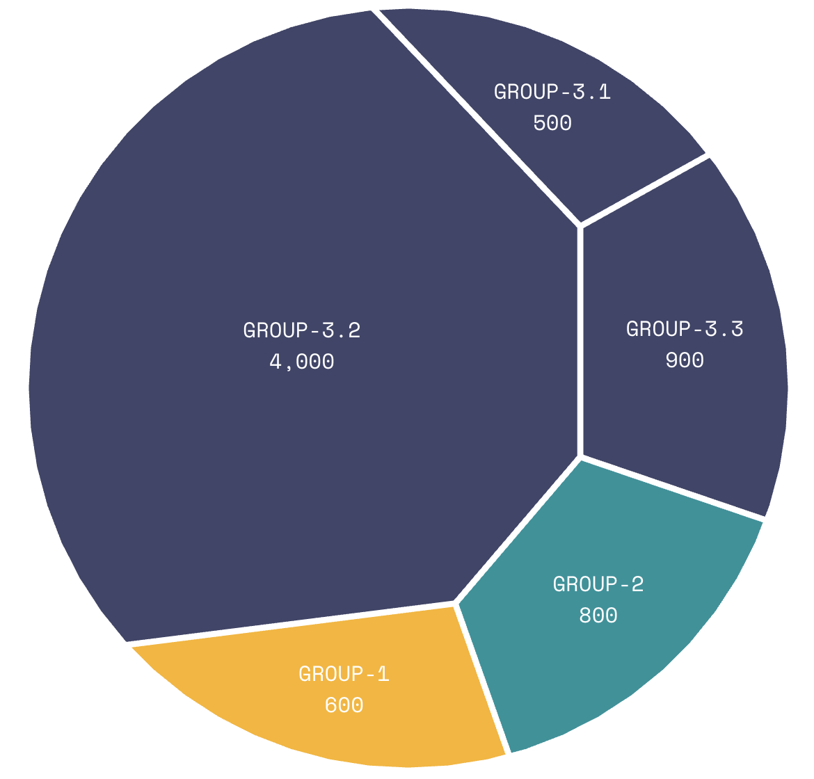
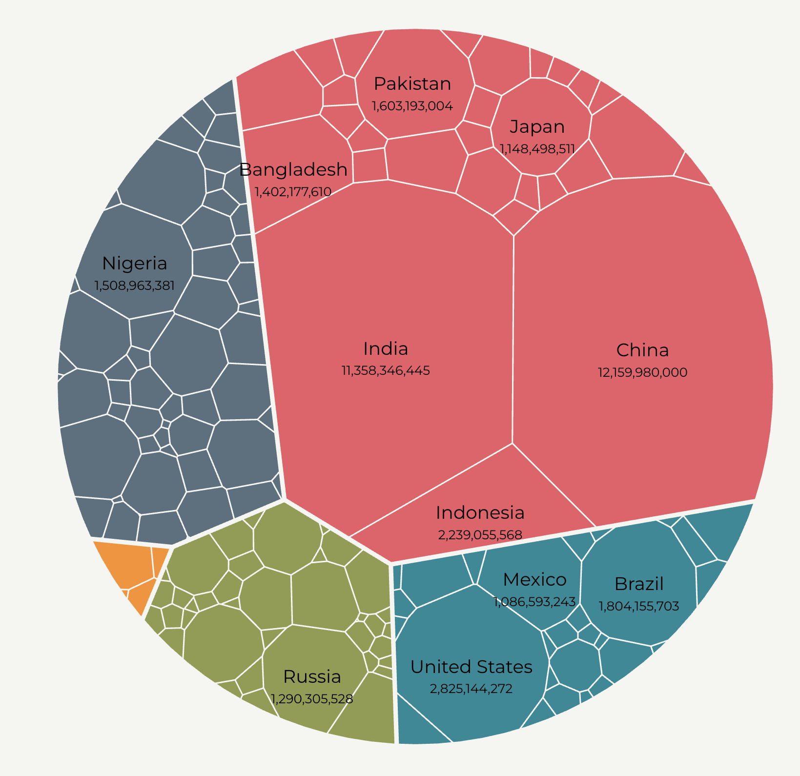

+++
author = "Yuichi Yazaki"
title = "Circle Voronoi Treemaps"
slug = "voronoi-treemaps"
date = "2025-10-11"
categories = [
    "chart"
]
tags = [
    "",
]
image = "images/cover.png"
+++

Circle Voronoi treemaps visualize hierarchical data by partitioning an area into irregular polygons using Voronoi diagrams. Unlike rectangular treemaps, they use organic polygonal regions within a circular boundary, often producing a more natural-looking layout.

<!--more-->

## Historical Background

Voronoi treemaps were proposed in the early 2000s, especially through work by Michael Balzer and Oliver Deussen. They addressed limitations of rectangular treemaps, such as extreme aspect ratios and reduced readability.

## Purpose

The purpose is to show hierarchical part-to-whole structure while allowing a more organic layout than rectangular subdivision.

## Design Notes

- Use labels carefully because polygon shapes vary.
- Keep hierarchy depth manageable.
- Use color to reinforce grouping.
- Consider ordinary treemaps when precise area comparison is more important.

## Summary

Circle Voronoi treemaps are visually distinctive hierarchical visualizations. They are useful when organic form and grouping matter, but they can be harder to compare precisely than rectangular treemaps.
