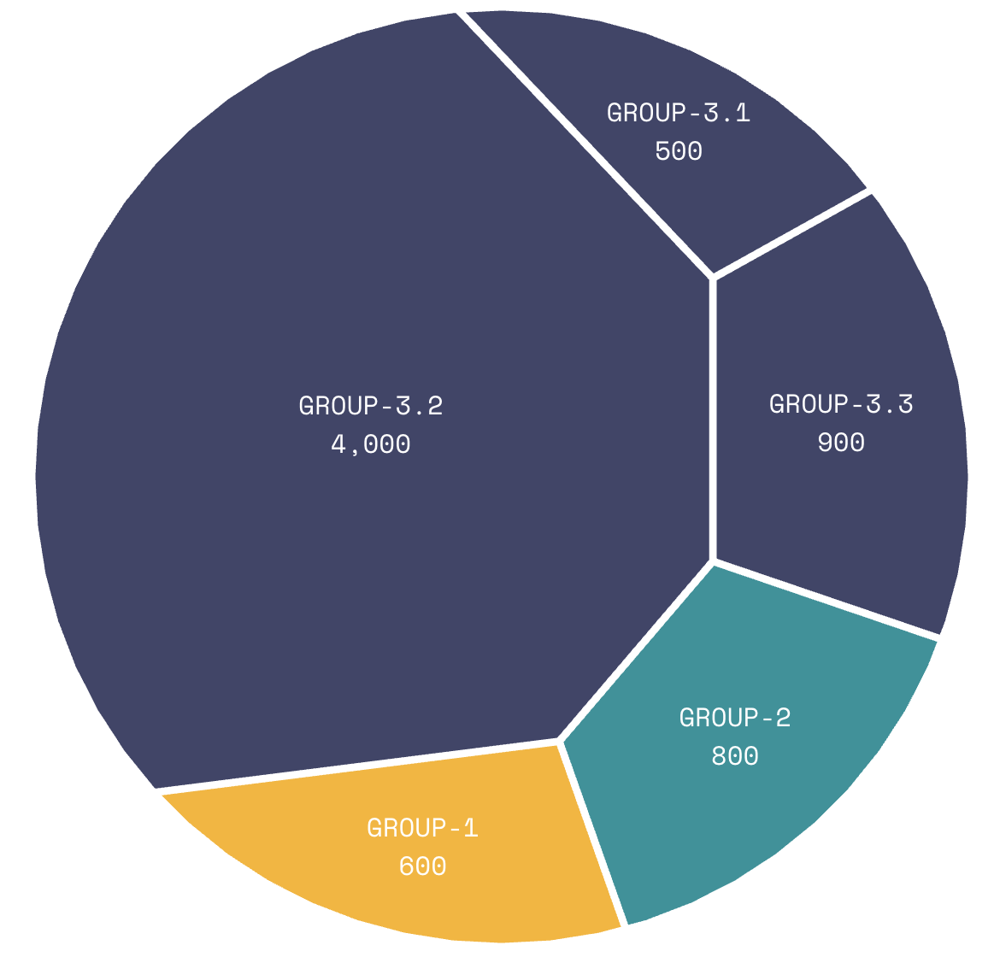
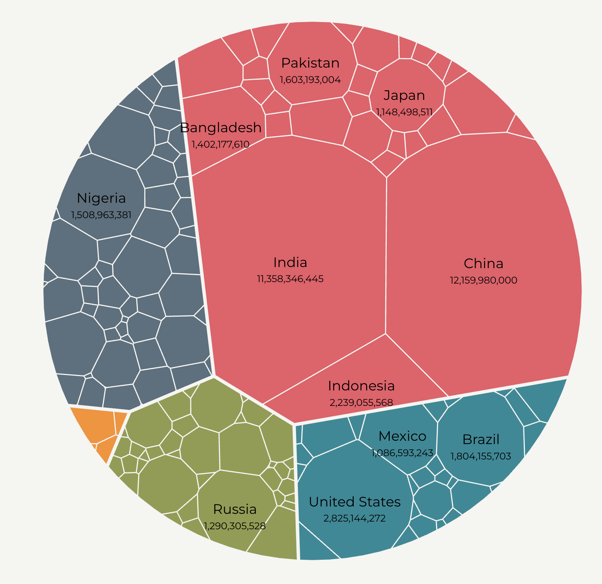

+++
author = "Yuichi Yazaki"
title = "ボロノイ・ツリーマップ（Voronoi Treemaps）"
slug = "voronoi-treemaps"
date = "2025-10-11"
categories = [
    "chart"
]
tags = [
    "",
]
image = "images/cover.png"
+++

ボロノイ・ツリーマップ（Voronoi Treemap）は、階層構造（ツリー構造）データを面積で表現する**領域分割型の可視化手法**の一つです。通常のツリーマップが長方形で空間を分割するのに対し、ボロノイ・ツリーマップは**ボロノイ図（Voronoi Diagram）**を応用して、不規則な多角形で空間を分割します。これにより、より**自然で有機的なレイアウト**が得られ、要素同士の関係や重心配置を視覚的にわかりやすく表現できます。

<!--more-->

## 歴史的経緯

ボロノイ・ツリーマップは、2000年代初頭にドイツの研究者によって提案された比較的新しい手法です。とくに **Michael Balzer と Oliver Deussen（2005）** による論文「Voronoi Treemaps for the Visualization of Hierarchical Data」が基礎となっています。この研究は、従来の長方形ツリーマップの欠点（縦横比の極端な矩形、視認性の低下など）を克服する目的で行われました。

その後、可視化ツールや研究コミュニティにより改良が重ねられ、D3.jsやProcessingなどでもボロノイ分割を用いた階層可視化が実装されています。

## データ構造

基本的な入力データはツリーマップと同様に **階層構造をもつツリーデータ（親子関係をもつノードと値）** です。各ノードは値（例：売上、人口、サイズなど）をもち、その値が面積に反映されます。

ただし、レイアウト計算にはボロノイ図を繰り返し適用するため、位置（重心）や距離のパラメータが考慮されます。アルゴリズム的には **重心ボロノイ分割（Centroidal Voronoi Tessellation, CVT）** を多層的に用いるのが一般的です。

## 目的

ボロノイ・ツリーマップの主な目的は、階層データを**より自然な形状で空間的に表現**し、構造全体のバランスや関係性を理解しやすくすることです。特に、ユーザーが空間的な関連を直感的に読み取れるようにする点が特徴です。

## ユースケース

- 企業の組織構造や部門別の構成比の可視化  
- 生態系や生物分類など、階層的分類データの表示  
- ファイルシステムの構造や使用容量の視覚化  
- 都市・地域構造データの階層的可視化（例：地域→区→町→建物）  

## 特徴

| 特徴 | 説明 |
|------|------|
| 不規則な形状 | 自然界や地理的構造を連想させる形状で表現可能 |
| 領域の連続性 | 境界がなめらかに接続し、区画間のつながりが視覚的に保たれる |
| 比例面積 | ノードの値に応じて面積を比例的に割り当て可能 |
| 高い美的価値 | 長方形に比べ、有機的で柔らかな印象を与える |

## チャートの見方

ボロノイ・ツリーマップの各セル（ポリゴン）は、ツリーのノードを表しています。  
- **面積**：ノードの値（サイズ、数量など）に比例  
- **色**：カテゴリや階層の属性を示す  
- **位置**：親ノード内での空間的関係を反映  

ユーザーは中心から外側に向かって階層をたどることで、全体構造を把握できます。

| 要素 | 説明 |
|------|------|
| セル（領域） | 各データ項目を示し、ボロノイ分割によって生成された多角形として表示されます。 |
| サイズ | 各領域の面積は、データの値（例：売上、人数、割合など）に比例して割り当てられます。 |
| 色 | 階層構造のレベルやカテゴリを区別するために用いられます。上位階層は明るい色、下位階層は濃い色で表現される場合があります。 |
| 境界線 | 隣接する領域との境界を示し、階層レベルに応じて線の太さやスタイルが異なることがあります。 |

ボロノイ・ツリーマップの大きな特徴は、領域が不規則な形状でありながらも、隣接関係や階層構造を視覚的に自然に伝える点にあります。例えば、関連するカテゴリーは物理的にも近い位置に配置され、分布全体の「まとまり感」を強調します。

## デザイン上の注意点

- 形状が不規則になるため、**ラベル配置が難しい**点に注意が必要です。  
- 色分けや階層境界を明示する工夫が求められます。  
- 階層レベルが深い場合、インタラクティブなズーム機能を組み合わせると効果的です。  
- 比例面積の誤差を最小化するため、反復計算を行うレイアウトアルゴリズムを採用します。

## 応用例

- **地図との融合**：地理的エリアにボロノイ分割を重ねる「ジオ・ボロノイツリーマップ」  
- **デザイン可視化**：製品構成やアートワークの構造分析  
- **情報建築**：ウェブサイト構造やナレッジマップの階層表示  

## 代替例

- 長方形ツリーマップ（Rectangular Treemap）  
- 円形パッキング（Circle Packing）  
- サンバーストチャート（Sunburst Chart）  
- アイシクルチャート（Icicle Chart）  

## まとめ

ボロノイ・ツリーマップは、階層データをより自然で直感的に可視化する手法として、近年注目されています。矩形ベースのツリーマップに比べて美的表現力が高く、情報デザインや生物学的データ、地理情報などにも応用可能です。ボロノイ分割の幾何学的性質を利用することで、階層構造を「自然の中の分布」に近い形で理解できる点が大きな利点です。

## 参考・出典

- [Voronoi Treemaps for the Visualization of Hierarchical Data (Balzer & Deussen, 2005)](https://graphics.uni-konstanz.de/publikationen/2005/balzer_voronoi_2005.pdf)
- [Wikipedia: Voronoi Treemap](https://en.wikipedia.org/wiki/Voronoi_treemap)
- [Voronoi Treemaps for the Visualization of Software Metrics – University of Konstanz](https://graphics.uni-konstanz.de/publikationen/Balzer2005VoronoiTreemaps/)
