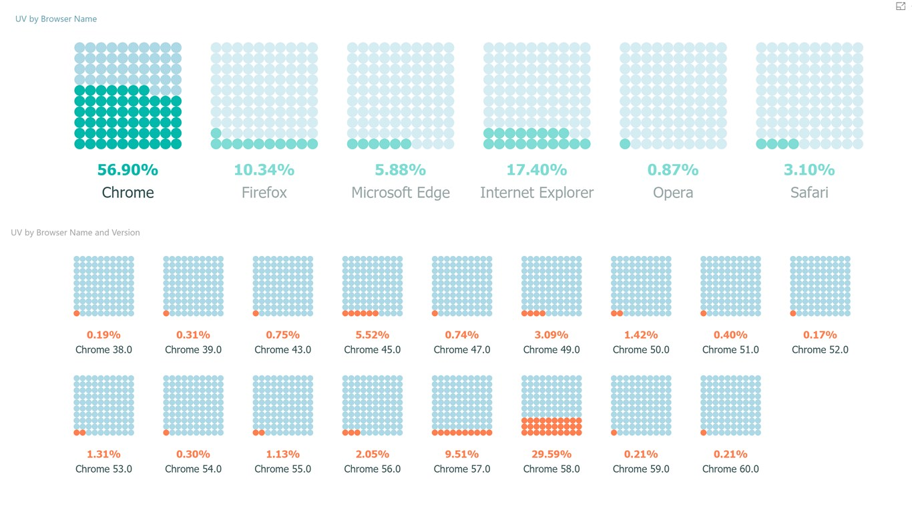

+++
author = "Yuichi Yazaki"
title = "Waffle Chart"
slug = "waffle-chart"
date = "2025-10-04"
description = ""
categories = [
    "chart"
]
tags = [
    ""
]
image = "images/cover.png"
+++

A **waffle chart** represents a whole as a grid of small cells, often 100 cells in a 10 by 10 layout. Each cell is colored by category, making proportions easy to understand as countable blocks.

Like pie charts and bar charts, waffle charts show part-to-whole relationships, but they have a more iconic and infographic-like appearance.

<!--more-->

## Background

The idea is related to **ISOTYPE**, the visual language promoted by Otto Neurath. ISOTYPE emphasized showing quantity through repeated symbols rather than changing the size of symbols.

Waffle charts became especially popular in data journalism and infographics after the 2010s as an alternative to pie charts. They are now supported or easily built in Python, R, Tableau, D3.js, and many presentation tools.

## Data Structure

| Category | Percentage |
|---|---|
| A | 40 |
| B | 35 |
| C | 25 |

These values are assigned to cells in a fixed grid. In a 100-cell chart, each cell usually represents 1%.

## Purpose

The goal is to show how a whole is divided into parts. Because the viewer can mentally count blocks, waffle charts often feel more concrete than angle-based pie charts.

## Use Cases

- workforce composition
- gender ratio or demographic shares
- budget and expense composition
- survey responses
- recycling rate or renewable-energy share

## How to Read It

1. The full grid represents 100%.
2. Filled cells represent a category's share.
3. Color connects cells to categories through a legend.
4. Small multiples allow fair comparison across groups.
5. Filling direction should remain consistent.

## Design Notes

- Use clear color contrast.
- Choose an appropriate grid size, such as 10x10 or 20x5.
- Avoid high-precision claims when rounding is involved.
- Keep legends and labels clear.

## Alternatives

| Chart | Comparison |
|---|---|
| Pie chart | Uses angle and area to show part-to-whole composition |
| Bar chart | Better for exact quantitative comparison |
| Treemap | Shows part-to-whole relationships and hierarchy by area |

## Summary

Waffle charts turn proportions into visible, countable units. They are useful for communicating approximate shares, progress, and composition, especially in educational and editorial contexts.

## References

- [Python Graph Gallery: Waffle chart](https://python-graph-gallery.com/waffle-chart/)
- [CDC: Waffle and Gauge Chart](https://www.cdc.gov/cove/data-visualization-types/waffle-and-gauge.html)
- [Esri: Mapping Coronavirus Waffles](https://www.esri.com/arcgis-blog/products/arcgis-pro/mapping/mapping-coronavirus-waffles)
- [Datawrapper: Visualization Types Poster](https://kirby.datawrapper.de/media/pages/blog/chart-types-guide/2dd7f89cdb-1750068284/visualization-types-poster.pdf)
