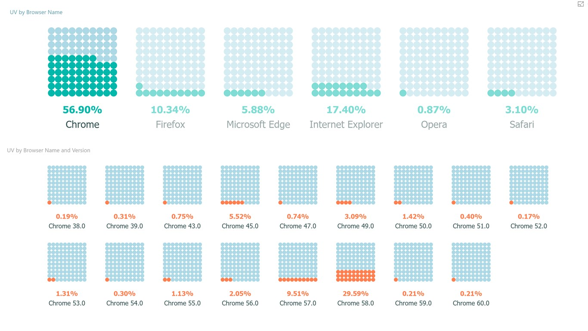

+++
author = "Yuichi Yazaki"
title = "ワッフル・チャート（Waffle Chart）"
slug = "waffle-chart"
date = "2025-10-04"
description = ""
categories = [
    "chart"
]
tags = [
    ""
]
image = "images/cover.png"
+++

ワッフル・チャート（Waffle Chart）は、データの構成比を視覚的に示すためのチャートで、小さな正方形を格子状（多くは10×10＝100マス）に配置し、塗りつぶしたマスの数で全体に対する割合を表します。  
円グラフや100%積み上げ棒グラフと同様に「全体に対する部分の大きさ」を示すのに用いられますが、「マスを数える」ことで割合を直感的に理解できるのが特徴です。 

<!--more-->

このチャートは、Flourish・Datawrapper・Tableauなど多くの可視化ツールで公式テンプレートとして採用されており、公的機関（例：CDCやEsriなど）のガイドラインにも登場するほど、汎用的な表現手法となっています。特に、単一指標の達成率・進捗率・構成比をわかりやすく表す用途に向いています。

### 図解の見方

1. **全体＝100%**  
   グリッド全体（通常は10×10の100マス）が全体量を表します。1マス＝1%が基本単位です。

2. **塗りつぶしマス＝割合の可視化**  
   例えば、68マスが塗られていれば「68%」を意味します。マスを数えることで、割合の大きさを直感的に把握できます。

3. **色と凡例の対応**  
   色やアイコンはカテゴリーを表し、凡例で対応関係を確認します。たとえば「青＝男性」「赤＝女性」など。

4. **複数比較（スモールマルチプル）**  
   同じスケールのワッフル・チャートを並べて比較することで、構成比や進捗を公平に比較できます。

5. **充填方向の一貫性**  
   左上から右下など、一定方向に塗りつぶすことで視覚的な統一感を保ちます（特に文化圏の読み方向に合わせることが推奨されます）。

### 背景と関連知識

ワッフル・チャートの発想は、オットー・ノイラートらが提唱した **アイソタイプ（ISOTYPE）** に源流があります。
これは「記号の大きさを変えず、数の多さで量を示す」という原則に基づく情報表現であり、ワッフル・チャートはその系譜上に位置づけられます。

近年では、データジャーナリズムや教育現場などでも、数値の理解を助ける「可算的（countable）」なチャートとして採用が進んでいます。

FlourishやDatawrapperの公式ビジュアルガイドでは、「構成比・シェア・進捗」のカテゴリに含まれており、視覚的明快さと親しみやすさが評価されています。

また、ワッフル・チャートは精密な数値比較には不向きであり、「おおまかな比率」や「全体の一部を直感的に伝える」ことを目的に用いるのが適しています。

### まとめ

ワッフル・チャートは、データの割合をわかりやすく「マスで数える」形で伝える、ビジュアル的で教育効果の高いチャートです。

全体に対する部分の構成比や達成度を一目で理解できることから、円グラフの代替として多くの可視化ツールに標準搭載されています。

データの意味を「数える」「埋める」という操作に変換し、視覚的な比喩として定着した代表的なチャートの一つといえるでしょう。

## 参考・出典

- [CDC — Waffle and Gauge Chart | COVE](https://www.cdc.gov/cove/data-visualization-types/waffle-and-gauge.html)
- [CDC — Waffle Chart (WCMS Template)](https://www.cdc.gov/wcms/4.0/cdc-wp/data-presentation/Waffle-Chart.html)
- [Esri — Mapping Coronavirus Waffles](https://www.esri.com/arcgis-blog/products/arcgis-pro/mapping/mapping-coronavirus-waffles)
- [Datawrapper — Visualization Types Poster (PDF)](https://kirby.datawrapper.de/media/pages/blog/chart-types-guide/2dd7f89cdb-1750068284/visualization-types-poster.pdf)
- [Datawrapper — Chart Types Guide](https://www.datawrapper.de/blog/chart-types-guide)
- [Flourish Help Center — Choosing the right visualization for your data](https://helpcenter.flourish.studio/hc/en-us/articles/8761551004815-Choosing-the-right-visualization-for-your-data)