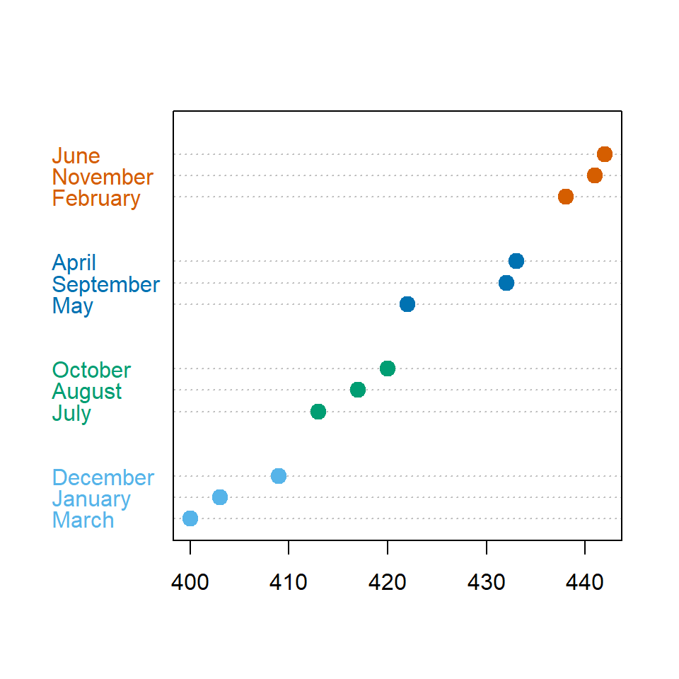
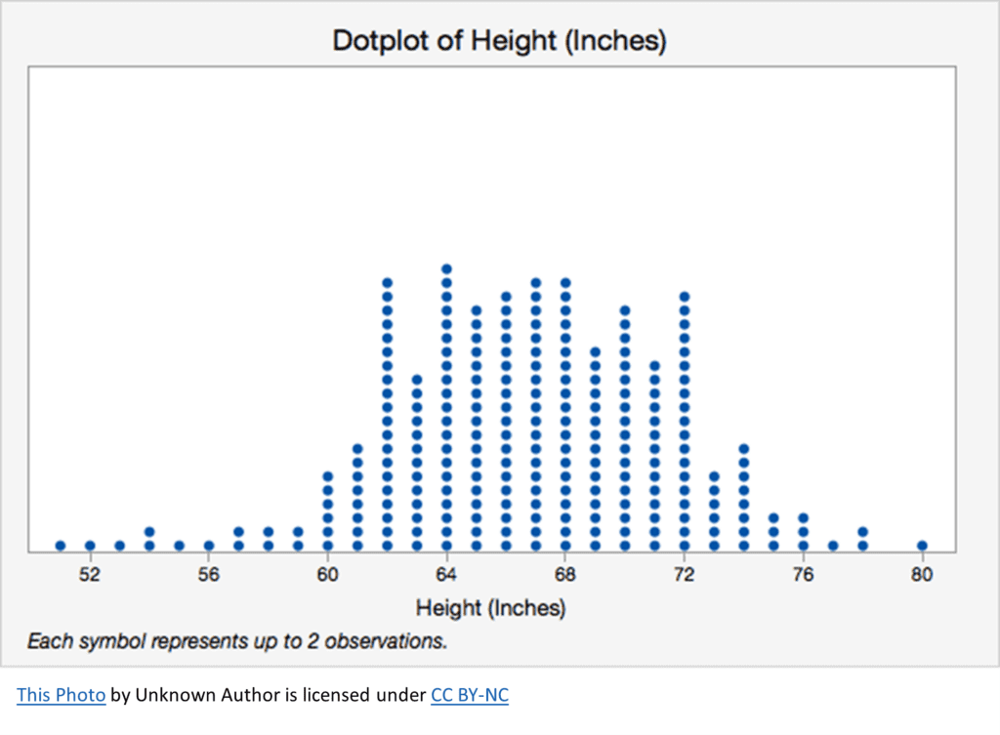
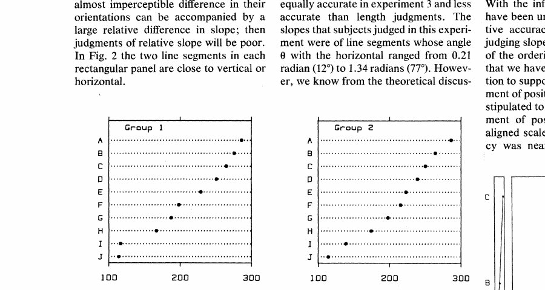
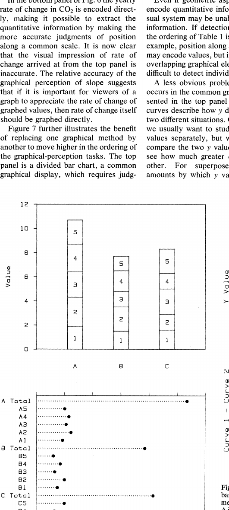
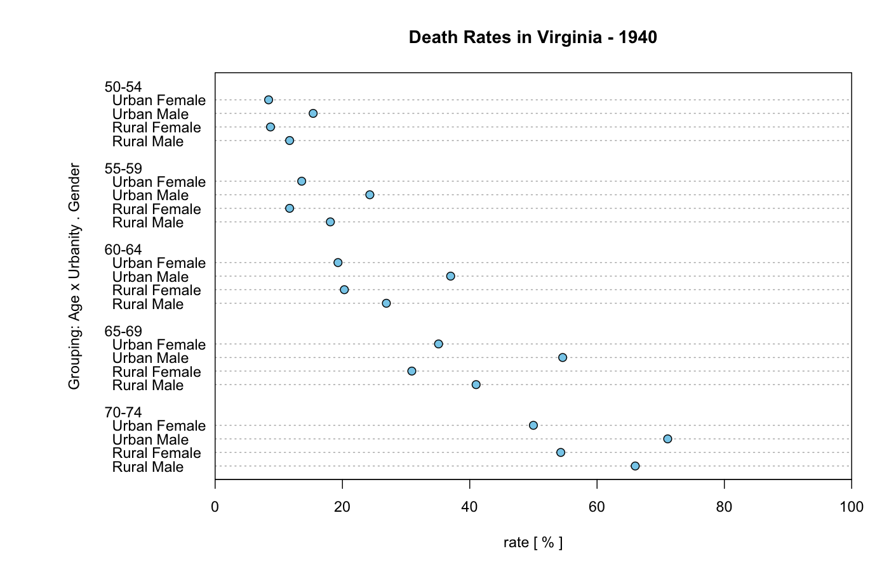
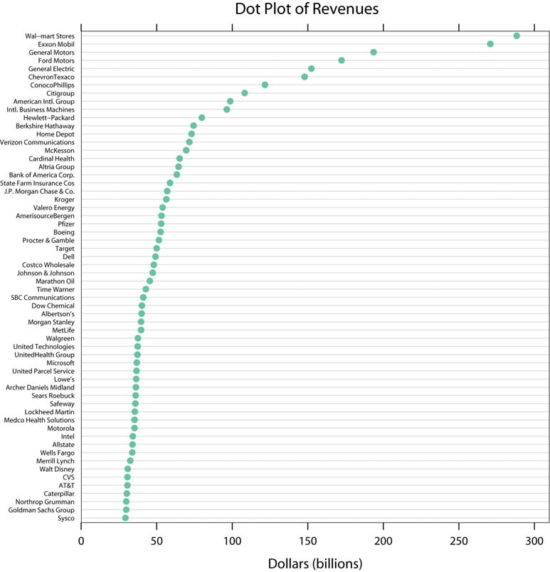
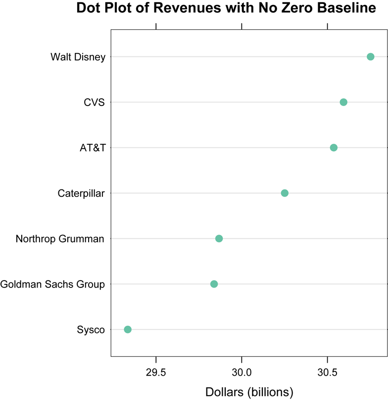
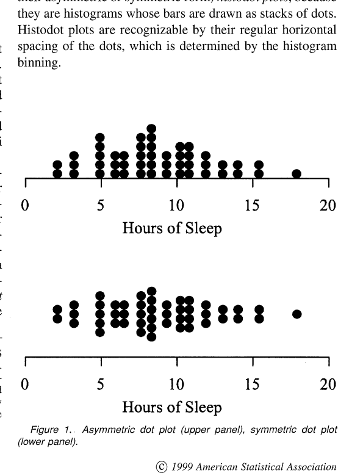
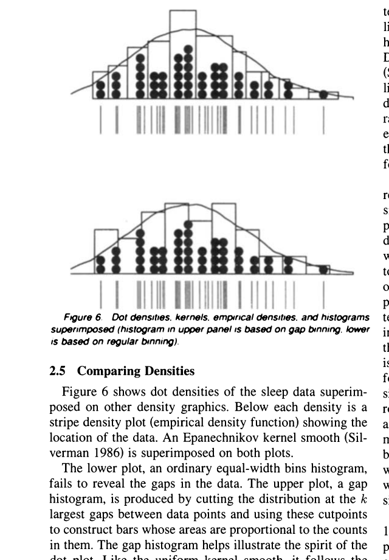
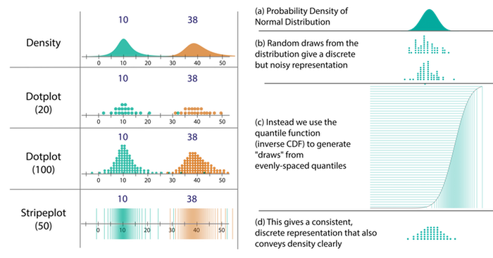

+++
author = "Yuichi Yazaki"
title = "ドットプロットが2つあるのは、Wilkinson と Cleveland が別の問題を解いたから"
slug = "wilkinson-cleveland-dot-plot"
date = "2026-08-18"
description = "同じ「ドットプロット」でも、Cleveland はラベル付き数値の棒グラフ代替、Wilkinson は1変数分布のヒストグラム代替。名前の衝突は、解いている問題が違う。"
categories = [
    "chart"
]
tags = [
    "",
]
image = "images/cover.png"
+++

「ドットプロット（dot plot）」と呼ばれる図は、少なくとも2つあります。見た目はどちらも丸い点ですが、データ構造も、読むべきものも、代替対象も違います。

**William S. Cleveland** の図は、カテゴリごとに1つの数値を点の位置で示す棒グラフの代替です。**Leland Wilkinson** の図は、個々の観測を点で積み、1変数の分布を示すヒストグラムの代替です。混乱の原因は、両者がほぼ同じ英語名を使い、後年のソフトウェアと教科書が「dot plot」を共有したことです。

本人たちの用語は、もう少し正確です。Cleveland は 1984年に **dot chart**、Wilkinson は 1999年に **dot plot** と書いています。「Cleveland dot plot」「Wilkinson dot plot」は、あとから付けた区別用の呼び方です。

<!--more-->

カテゴリ（月）が縦、数値が横。1カテゴリに点が1つ。棒グラフと同じ比較だが、量は点の位置で読む。グループごとに色を分け、値の大きい順に並べている。

数値軸が横、縦は度数。同じ付近の値を積む。ヒストグラムと同じ問い（分布の形）だが、棒ではなく点で数える。下の注記「Each symbol represents up to 2 observations」は、1点が必ずしも1観測ではないことを示している。

## 別名

| 呼び方 | 指しているもの |
|--------|----------------|
| Cleveland dot chart / Cleveland dot plot | ラベル付き数値の比較。棒グラフの代替 |
| Wilkinson dot plot / dot-density plot | 1変数分布。積み上げた点で度数を示す |
| histodot plot（Wilkinson の用語） | 固定幅ビンの積み上げ。見た目はドットプロット、中身はヒストグラム |
| R の `dotchart()` | Cleveland 型（公式ヘルプの見出しが *Cleveland's Dot Plots*） |
| ggplot2 の `geom_dotplot()` | Wilkinson 型（既定は `method = "dotdensity"`） |

バイオインフォマティクスのドットプロット（配列比較の対角図）と、工程管理のドットチャート（RACI 表の一種）は、どちらとも別物です。

## いちばん短い違い

| | Cleveland（1984） | Wilkinson（1999） |
|--|-------------------|-------------------|
| 本人の用語 | dot chart | dot plot |
| 解く問題 | 名前の付いた数値を、棒より正確に比較する | 手描きの分布図を、コンピュータで正しく再現する |
| 1つの点 | 名前の付いた1つの値（測定でも、率や平均でもよい） | バッチ内の1観測（またはその近似） |
| 軸 | カテゴリ × 数値 | 数値（分布）× 度数 |
| 代替対象 | 棒グラフ、分割棒グラフ | ヒストグラム（と、ビン化した偽ドットプロット） |
| 読むもの | 共通スケール上の**位置** | 点の**位置と個数**（密度） |
| ゼロ基準 | 必須ではない（棒より広い条件で使える） | 論点にならない（長さで量を符号化しない） |

同じ「点」でも、役割が違います。Cleveland では点は**名前に対応する1つの値**です。都市の人口や企業の売上のように測定そのものでも、死亡率や平均値のように集計でもよい。本人の条件は「値が名前を持つ」ことであって、要約であることではありません。Wilkinson では点は**バッチの中の1観測**（またはその近似）で、名前ではなく分布の一部として読みます。quantile dotplot のように、観測ではなく分位点の粒子である変種もあります。

## 歴史的経緯

### 1884：分布の点は、Wilkinson より100年以上前からある

Wilkinson は 1999年の論文 *Dot Plots*（*The American Statistician*）で、自分がこの図を発明したとは書いていません。冒頭はこうです。

> Dot plots represent individual observations in a batch of data with symbols, usually circular dots. They have been used for more than 100 years to depict distributions in detail.
>
> （ドットプロットは、データの各観測を記号、通例は円点で表す。分布を詳しく示す用法は100年以上ある）

彼が挙げる古い例は、W. S. Jevons が 1884年にイギリス・ソヴリン金貨の重量を年ごとに点で示した図です（文献は Stephen Stigler が教えた、と謝辞にあります。Jevons 原典はここでは未確認です）。その後、Tippett（1944）、Tukey（1977）、Box, Hunter, and Hunter（1978）など統計の教科書にも出ます。

手描きのルールは単純です。点を、本来の数値のなるべく近くに置き、重なって読めなくならない程度にずらす。Wilkinson の仕事は、このルールをコンピュータで再現するアルゴリズムを書いたことです。

### 1984–1985：Cleveland は棒グラフの代替として dot chart を出した

一方 Cleveland は、分布の積み上げ点ではなく、**名前の付いた数値**の話をしています。1984年の *Graphical Methods for Data Presentation: Full Scale Breaks, Dot Charts, and Multibased Logging*（*The American Statistician*）です。

> Dot charts show data that have labels and are replacements for bar charts; the new charts can be used in a wider variety of circumstances and allow more effective visual decoding of the quantitative information.
>
> （ドットチャートはラベル付きデータを示し、棒グラフの代替である。より広い条件で使え、量の視覚的復号も効果的である）

論文末近くでは、こうも書いています。

> Dot charts—with all of the variations and the construction details—are essentially a new graphical method.
>
> （変種と作図の細部を含めて、ドットチャートは実質的に新しい図法である）

「新しい」の中身は、点そのものではありません。棒をやめ、**共通スケール上の位置**だけを量の符号化に使うことです。根拠は、同年の Cleveland & McGill *Graphical Perception*（*JASA*）です。位置の判断は、長さや面積の判断より誤差が小さい。分割棒グラフでは、一部の比較が長さ・面積判断に落ちる。グループ付きドットチャートなら、どの値も共通スケール上の位置で比べられる。

実験データのひとつが、論文中の学術誌の「図が占める面積割合」です。分割棒だと「グラフ面積」同士の比較が難しい。グループ付きドットだと、最小・最大の3誌を探す作業が楽になる、と本人が書いています。別例は、William Playfair が使った 1800年頃のヨーロッパ都市人口です。スケールブレイクや対数軸（底2）では、棒の面積が意味を持たない。だから棒を使わない。

1985年、Cleveland と Robert McGill の *Science* 論文は、点線の使い分けを一段はっきり書きます。これは後年のロリポップとも直接つながります。

> When the baseline for the graph is zero [...], the dotted lines can end at the data dots; the data can be visually decoded by judging the positions of the data dots along the horizontal scale **or by judging the lengths of the dotted lines**. If there is no zero baseline [...], the dotted lines should go across the entire data region [...]; were the dotted lines to stop at the data dots, line length would be a visually significant aspect of the graph that would encode nothing meaningful.
>
> （基準がゼロなら、点線はデータ点で止めてよい。点の位置でも、点線の長さでも読める。意味のある基準がなければ、点線は領域全体に通す。点で止めると、線の長さが何も意味しない量を符号化してしまう）

1985年の著書 *The Elements of Graphing Data* が、この図法の普及版です。R の `graphics::dotchart()` が参照しているのも、1984年論文ではなくこの本です。

### 1999：Wilkinson が「それはヒストグラムである」と切り分けた

1990年代、統計ソフトは「ドットプロット」を出し始めます。Wilkinson の診断は厳しいです。それらは文献にあるドットプロットではなく、等間隔ビンのヒストグラムを点の山で描いただけだ、と。Sasieni and Royston（1996）のアルゴリズムを、その例として挙げています。

> Their results are histograms, not dot plots. [...] I will call these [...] **histodot plots**, because they are histograms whose bars are drawn as stacks of dots.
>
> （それはヒストグラムであってドットプロットではない。棒を点の山で描いたヒストグラムなので、histodot plot と呼ぶ）

見分け方は水平方向の間隔です。histodot はビン幅で点が等間隔に並ぶ。本物のドットプロットは、点を本来の値の近くに置くので、山の位置がデータに引っ張られ、間隔は一定とは限りません。外れ値の付近では、その差がよく出ます。

アルゴリズムの理論的な位置づけは、カーネル密度推定に近い、と本人が書いています。点の直径の選び方は、帯域幅の選択に相当する。ggplot2 の `geom_dotplot()` が Wilkinson（1999）を引用し、既定を `method = "dotdensity"`、固定ビンを `method = "histodot"` としているのは、この区別そのものです。

注意点が一つあります。Wilkinson 1999 が Cleveland 1985 に触れる箇所は、ラベル付きドットチャートではなく、重なった点を縦にずらす（変位させる）話です。つまり 1999年時点の Wilkinson は、「Cleveland 型 vs Wilkinson 型」という対立を主旨にしていません。2つの図を対にして呼ぶのは、Wikipedia や JMP、ggplot2 周辺が後から整理した結果です。

### その後：同じ関数名が、別の図を指す

名前が衝突すると、実装が分かれます。

- **R `dotchart()`** は Cleveland。公式の例は 1940年バージニア州の死亡率 `VADeaths`。カテゴリ（年齢×都市/農村×性別）に点が1つ。
- **ggplot2 `geom_dotplot()`** は Wilkinson。公式の例は `mtcars$mpg` の分布。
- **Minitab の Dotplot** は分布側。サンプルが約50を超えると、1点が複数観測を表し、脚注に *Each symbol represents up to N observations* と出ます。冒頭の身長図がそれです。等間隔に見えるなら、Wilkinson の用語では histodot に近い。
- **教育の「ドットプロット」** は、ほぼ Wilkinson 型です。米国 Common Core（Grade 6）は *dot plots, histograms, and box plots* を数直線上の分布表示として並べています。棒グラフの代替ではありません。

2006年、Naomi Robbins は *Dot Plots: A Useful Alternative to Bar Charts* で Cleveland 型をビジネス向けに解説します。Fortune 1000 上位60社の売上を棒と点で並べ、点の方がインクが少なく、利益を重ねても壊れにくい、と書いています。非ゼロ基準でも長さが嘘をつかない、というのが Cleveland 1984 の実務への翻訳です。

2016年、Matthew Kay らは CHI 論文 *When (ish) is My Bus?* で、Wilkinson の積み上げ点を予測分布の分位点に転用し、**quantile dotplot** と呼びます。生データの分布ではなく、「バスがあと何分で来るか」の不確実性を、点を数えて読む図です。Wilkinson 型の延長であって、Cleveland 型ではありません。

## データ構造

### Cleveland：カテゴリと、1つの数値

| 都市 | 人口（千人） |
|------|-------------|
| London | 1100 |
| Paris | 670 |
| Naples | 430 |

1行が1つの名前と、それに付いた1つの数値です。Playfair の都市人口のように実測でも、死亡率のように率でもよい。同じ名前に点が2つある（前年と今年、男性と女性など）なら、グループ付きドットチャートか、ダンベル／レンジプロットの領域です。Cleveland 自身は 1984年に、グループ内の項目を「塗りつぶしの違う円」で重ねる変種を示しています。

### Wilkinson：1変数の観測の列

| 身長（インチ） |
|----------------|
| 62 |
| 64 |
| 64 |
| 67 |
| 71 |

1点が1人（または少数）。カテゴリ軸はありません。グループ比較するなら、分布を並べる（男女別の積み上げ、クラス別の数直線）のであって、郡ごとの平均値を1点で置くのではありません。

## 目的

Cleveland の目的は、次の一点です。

**名前の付いた数値を、棒の長さ・面積ではなく、共通スケール上の位置で比較する。**

棒は、ゼロ（または意味のある基準）からの偏差を面積でも符号化します。基準に意味がない、対数軸、スケールブレイク、値が近くて解像度が要る、分割棒で一部が共通基線を失う。そういうときに棒をやめる。点なら、要素の面積をほぼ揃えられるので、小さい値も消えない。誤差範囲も、棒の中に埋もれない。

Wilkinson の目的は、別の一点です。

**個々の観測を失わずに、分布の形を点の密度として示す。コンピュータ実装がヒストグラムに退化しないようにする。**

ヒストグラムはビンの境界で形が変わります。ドットプロットは、点の位置がデータに追従する（dot-density の場合）。サンプルが小さいときは、箱ひげや密度曲線より、生の点が残る方が教育にも探索にも向く。ただし点が増えると山が読めなくなる。Minitab が n≈50 を目安にするのは、その制約です。

## ユースケース

Cleveland 型が向くのは、棒グラフを置きたくなるが、次のどれかがあるときです。

- カテゴリが多く、ラベルを横に置きたい（国名、企業名、設問）
- 値が近く、ゼロまで棒を伸ばすと差が潰れる
- 対数軸や、ゼロに意味がない指標（気温、指数、すでに基準化した値）
- 分割棒／グループ棒より、全項目を共通スケールで比べたい
- 誤差範囲を点の横に付けたい

Wilkinson 型が向くのは、ヒストグラムを置きたくなるが、次のどれかがあるときです。

- サンプルが小さく、ビンより個々の値が欲しい（テスト得点、実験の反復）
- クラスター、隙間、外れ値を点のまま見たい
- 教育で「度数＝点の数」と数えさせたい
- 予測分布を、点の個数で区間確率として読ませたい（quantile dotplot）

向かない入れ替えもあります。国別 GDP を Wilkinson 型で積むのは、カテゴリ比較の問題を分布の問題にすり替えています。逆に、クラス40人の得点を Cleveland 型で「生徒名 × 1点」にすると、分布の形より順位表になります。どちらが悪いかではなく、問いが違う。

## 特徴

| 視点 | Cleveland | Wilkinson |
|------|-----------|-----------|
| 強み | 位置判断。非ゼロ基準・対数・重ね描きに強い。小さい値も消えない | 個々の観測（またはその近似）が見える。形・隙間・外れ値、点を数える読みができる |
| 弱み | ゼロからの「何倍」は棒より弱い（Robbins も、比の読みは棒側、と整理している） | 大規模データで点が潰れる。1点が複数観測になると、数え上げがずれる |
| インク | 棒より少ない。点線は薄くする、と Cleveland が指定 | 点の直径が帯域幅を兼ねる。大きすぎると形が変わる |
| よくある誤用 | 点で止めた線を、ゼロ基準がないのに長さとして読ませる | 等間隔ビンの histodot を、Wilkinson のドットプロットだと思い込む |

## チャートの見方

### Cleveland

| 要素 | 内容 |
|------|------|
| 縦（よくある向き） | カテゴリ。長いラベル向き |
| 横 | 数値。ゼロから始めなくてもよい |
| 点 | そのカテゴリの値。読むべきは点の中心 |
| 点線 | ラベルと点をつなぐ。薄いほどよい |
| 点線を点で止めてよいか | ゼロ（または意味のある基準）があるときに限る |

並べ順は、Cleveland の図でも値順が基本です。値順にすると、点の並びが標本の累積分布にも見える、と 1984年論文は書いています。右側に累積の目盛りを足した図（Figure 8）もあります。

### Wilkinson

| 要素 | 内容 |
|------|------|
| 横（よくある向き） | 変数の値 |
| 縦 | その付近の度数。軸の目盛りはソフトウェアによって当てにならない（ggplot2 もそう注記している） |
| 1つの点 | 1観測、または注記された複数観測 |
| 山の高さ | その付近の頻度 |
| 山の位置 | データの集中。histodot ならビン中心、dot-density ならデータに寄った位置 |
| 孤立した点 | 外れ値の候補 |

冒頭の身長図は、64〜72インチ付近に山があり、左右に裾が伸びています。下の注記を読まないと、点の数が人数そのものだと思い込めます。

## デザイン上の注意点

Cleveland 側は、1984–85年の指定がそのまま使えます。

- **点線は薄く、点は大きく。** 要約するときは点が残り、線は背景になる。
- **ゼロがなければ線は通す。** 点で止めると、長さが偽の量になる。ゼロがあるときだけ、点までで止めてよい（ロリポップに近づく）。
- **グループ内の記号は、塗りで差をつける。** Cleveland は文字や形（円・四角・三角）より、円の塗り分けの方が識別しやすいと書いています。
- **並べ替える。** アルファベット順は、ルックアップが目的のときに限る。

Wilkinson 側は、1999年と実装の注記が使えます。

- **点の直径を先に決める。** 直径＝ビン幅（または最大幅）。見た目の問題ではなく、平滑化のパラメータです。
- **histodot と dot-density を混同しない。** 等間隔なら前者。山がデータに張り付くなら後者。
- **1点が何観測かを書く。** Minitab の脚注は、そのためのものです。
- **n が大きいときは、ヒストグラムか密度曲線に戻す。** 点が読めなくなった分布図は、Wilkinson の目的を満たしません。

両方に共通する失敗は、名前だけで選ぶことです。ツールのメニューが *Dot Plot* でも、中身がどちらかは軸を見れば分かります。カテゴリ名が並んでいれば Cleveland、数直線上の山なら Wilkinson。

## 実用例

### 1. Cleveland 1984–85：ラベル付き数値を、点の位置で読む

1984年の *The American Statistician* 論文が、Playfair のヨーロッパ都市人口と、学術誌の図面積割合を使った最初の作例です。都市人口はスケールブレイク付き（Figure 3）と底2の対数（Figure 4）。どちらも「棒にすると面積が嘘になる」例です。図面積は、分割棒（Figure 9）とグループ付きドット（Figures 6–7）の対比で、*Proceedings of the Royal Society* のグラフ面積とイラスト面積がいちばん近い、と点ならすぐ分かると書いています。

同じ手法の図を、翌1985年の Cleveland & McGill *Science* 論文が再掲しています。下がその Figure 1（カテゴリ A–J の値を点の位置で示す）と Figure 7（分割棒を、グループ付きドットに置き換える）です。

[Cleveland & McGill, *Science*（1985）](https://www.science.org/doi/10.1126/science.229.4716.828) Figure 1 より。点線でラベルと点をつなぎ、量は共通スケール上の位置で読む。

同論文 Figure 7 より。上は分割棒、下はグループ付きドットチャート。分割棒では共通基線を失う比較が、点ではすべて位置判断になる。

### 2. R 公式例：1940年バージニア州の死亡率（`VADeaths`）

`graphics::dotchart()` のヘルプは、Cleveland（1985）を引き、*two variants of dotplots* を描くと書いています。例が `VADeaths` です。年齢階級×都市/農村×性別の死亡率。カテゴリが多く、値が率で、棒にするとインクが多い。Cleveland が設定した問題そのものです。下は、ヘルプに載っている grouped の例を、同じ関数で描いたものです。

[R `graphics::dotchart`](https://stat.ethz.ch/R-manual/R-devel/library/graphics/html/dotchart.html) の公式例。`dotchart(t(VADeaths), xlim = c(0, 100), ...)`。グループ見出しと点線は、Cleveland 1984 の grouped dot chart そのもの。

### 3. Robbins 2006：Fortune 1000 の売上と利益

Naomi Robbins は、上位60社の売上を棒とドットで並べ、ドットの方が冗長でないと示します。続けて利益を同じ図に重ねる。棒で同じことをすると、幅を細くするか透明にするかになり、図が壊れる。非ゼロ基準の拡大図では、棒は「何倍にも見える」嘘になるが、点は位置だけなので壊れない。Cleveland の知覚実験を、企業財務に移した実例です。記事は [Perceptual Edge に PDF がある](http://perceptualedge.com/articles/b-eye/dot_plots.pdf) 2006年3月7日付です。

[Naomi B. Robbins, *Dot Plots: A Useful Alternative to Bar Charts*（2006）](http://perceptualedge.com/articles/b-eye/dot_plots.pdf) Figure 1 より。Wal-mart から Sysco まで、売上を点の位置で示す。

同記事 Figure 9 より。軸は約 29.3〜30.8。棒なら長さが嘘になるが、点は位置だけなので壊れない、という Cleveland の条件の実演。

### 4. Wilkinson 1999：手描き分布を、histodot にしない

Wilkinson の論文自体が、実装の失敗例に対する実例集です。商業ソフトと Sasieni & Royston（1996）を histodot と呼び、SYSTAT で描いた図を対置しています。ggplot2 が `dotdensity` / `histodot` の二系統を残しているのは、この論文を実装側が読んだ結果です。

[Leland Wilkinson, *Dot Plots*（*The American Statistician*, 1999）](https://doi.org/10.1080/00031305.1999.10474474) Figure 1 より。上は基線から積む非対称、下は軸を中心に左右へ広げる対称。1点が1観測の分布図。

同論文 Figure 6 より。点の山にヒストグラムとカーネル密度を重ね、下に rug（各観測の位置）を置く。上がギャップビン、下が等間隔ビン。等間隔だと隙間が見えにくい、というのが本人の指摘です。

### 5. 教育・品質管理：Minitab の身長・工程データ

冒頭の *Dotplot of Height (Inches)* は、導入統計と Minitab の定番形です。Penn State STAT 200 も、同じ注記（1点が最大2観測）付きのドットプロットを教材にしています。Common Core の Grade 6 がヒストグラム・箱ひげと並べて指定しているのも、この系統です。品質管理では、Minitab がシャンプー瓶のキャップトルクなど、n が小さい工程データに推奨しています。

Minitab 系の定番形。横軸が身長、縦が度数。脚注「Each symbol represents up to 2 observations」は、1点が必ずしも1人ではないことを示す。Wilkinson の用語では、等間隔に見えるなら histodot に近い。

ただしこれらは、Wilkinson の理想形（dot-density）より histodot に寄ることが多い。実用例として重要なのは、「現場の『ドットプロット』の大半は分布図であり、棒グラフの代替ではない」という事実です。

### 6. Kay et al. 2016：バス到着の不確実性（quantile dotplot）

[When (ish) is My Bus?](https://idl.cs.washington.edu/files/2016-WhenIsMyBus-CHI.pdf) は、Wilkinson の積み上げを予測分布の分位点に使います。50個の点なら、「3回に1回遅れてもよい」は左から3点を数える。密度曲線より区間の見積もりのばらつきが小さい、というのが実験結果です。ggdist の `geom_dots()` が、この系統の実装です。Cleveland の順位図とは、点が名前付きの値か、分布を構成する粒子かが違います。

[Kay, Kola, Hullman, Munson, *When (ish) is My Bus?*（CHI 2016）](https://idl.uw.edu/papers/when-ish-is-my-bus) 公式図より。左は到着予測の不確実性、右は quantile dotplot の生成。点を数えて区間確率を読む。

ロリポップとの関係は、[ロリポップチャートは、誰が何のために作ったのか](https://visualizing.jp/lollipop-chart/) に書きました。ゼロ基準があるときの Cleveland の「点まで線を止める」形が、2011年の Cotgreave の命名に先行します。軸がゼロから始まらない「ロリポップ」は、Cleveland の条件ではドットチャートに戻すべきものです。

## 代替例

| やりたいこと | 使う図 |
|--------------|--------|
| カテゴリの量比較、ゼロ基準あり、本数が多くない | 棒グラフ |
| 同上だが値が上限に寄り、インクが多い | ロリポップ |
| カテゴリの量比較、非ゼロ基準・対数・誤差範囲 | Cleveland ドットチャート |
| 同一カテゴリの2点の差 | ダンベル／レンジプロット |
| 中〜大サンプルの分布の形 | ヒストグラム、密度曲線 |
| 小サンプルの分布、個々の値が欲しい | Wilkinson ドットプロット（またはストリップ／スウォーム） |
| 予測分布を点の個数で読ませたい | quantile dotplot |
| 要約統計だけ欲しい | 箱ひげ図 |

## まとめ

「ドットプロット」で検索して出てくる図が食い違うのは、用語が雑だからではありません。**2つの論文が、別の失敗を直そうとした**からです。

- Cleveland（1984）は、棒の面積が嘘をつく条件で、ラベル付き数値を点の位置に移した。本人の名は **dot chart**。
- Wilkinson（1999）は、100年来の分布の点図が、ソフトの中でヒストグラムに退化しているのを、配置アルゴリズムで引き戻した。本人の名は **dot plot**。
- 後年のツールは、両方を *dot plot* と呼んだ。R だけ見ても、`dotchart()` と `geom_dotplot()` は別の図である。

実務上の判別は単純です。点にカテゴリ名が付いていて値を比較するなら Cleveland、数直線上の山として分布を見るなら Wilkinson。線を点で止めてよいかは、Cleveland 側だけの問題で、ゼロ基準があるときに限る。1点が何件かは、Wilkinson 側だけの問題で、注記を読む。

名前を先に選ぶ必要はありません。比較したいのか、分布を見たいのか。問いが分かれば、点の意味も決まります。

## 参考・出典

- [William S. Cleveland, “Graphical Methods for Data Presentation…” (*The American Statistician*, 1984)](https://doi.org/10.1080/00031305.1984.10483224)
- [Cleveland & McGill, “Graphical Perception…” (*JASA*, 1984)](https://doi.org/10.1080/01621459.1984.10478080)
- [Cleveland & McGill, “Graphical Perception and Graphical Methods…” (*Science*, 1985)](https://www.science.org/doi/10.1126/science.229.4716.828)
- William S. Cleveland, *The Elements of Graphing Data* (1985 / 改訂 1994)
- [Leland Wilkinson, “Dot Plots” (*The American Statistician*, 1999)](https://doi.org/10.1080/00031305.1999.10474474)（[PDF](https://moderngraphics11.pbworks.com/f/wilkinson_1999.DotPlots.pdf)）
- Peter Sasieni & Patrick Royston, “Dotplots” (*Applied Statistics*, 1996) ※ Wilkinson が histodot と呼んだ対象
- [R `graphics::dotchart`（Cleveland's Dot Plots）](https://stat.ethz.ch/R-manual/R-devel/library/graphics/html/dotchart.html)
- [ggplot2 `geom_dotplot`（Wilkinson 1999 を引用）](https://ggplot2.tidyverse.org/reference/geom_dotplot.html)
- [Naomi B. Robbins, “Dot Plots: A Useful Alternative to Bar Charts” (2006)](http://perceptualedge.com/articles/b-eye/dot_plots.pdf)
- [Matthew Kay et al., “When (ish) is My Bus?” (CHI 2016)](https://idl.cs.washington.edu/files/2016-WhenIsMyBus-CHI.pdf)
- [Minitab, Overview for Dotplot](https://support.minitab.com/minitab/19/help-and-how-to/graphs/dotplot/before-you-start/overview/)
- [Penn State STAT 200, Dotplots and Histograms](https://online.stat.psu.edu/stat200/lesson/2/2.2/2.2.1)
- [Wikipedia: Dot plot (statistics)](https://en.wikipedia.org/wiki/Dot_plot_(statistics)) ※ 2系統の整理。1884年の記述は Wilkinson 経由
