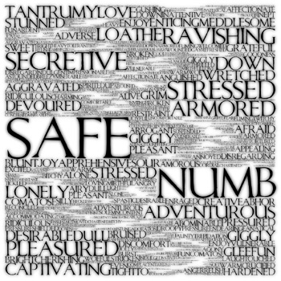
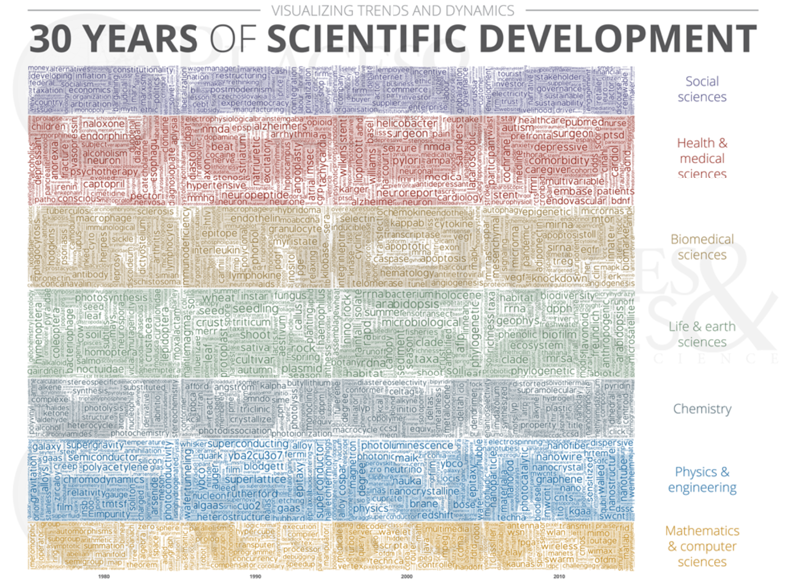
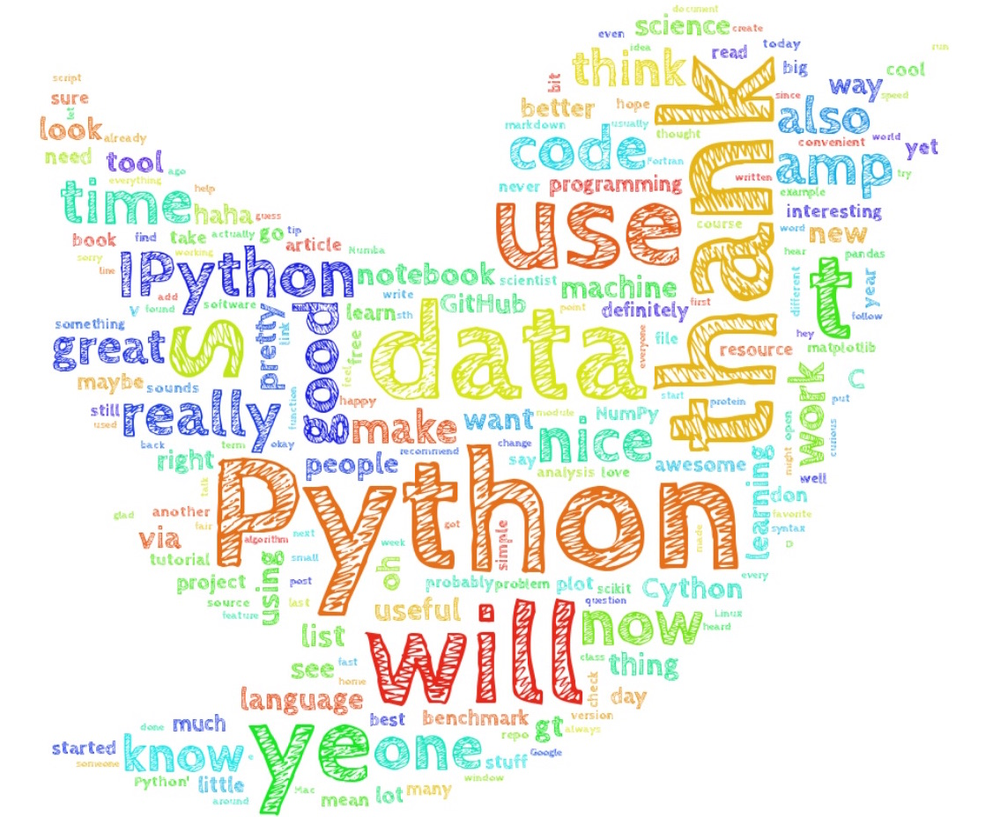
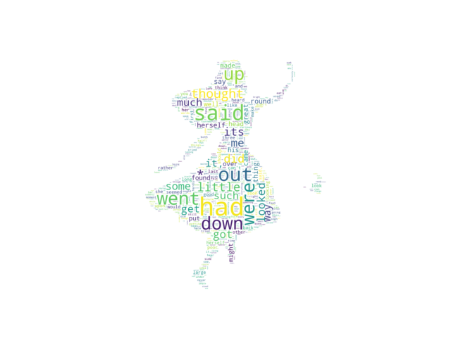
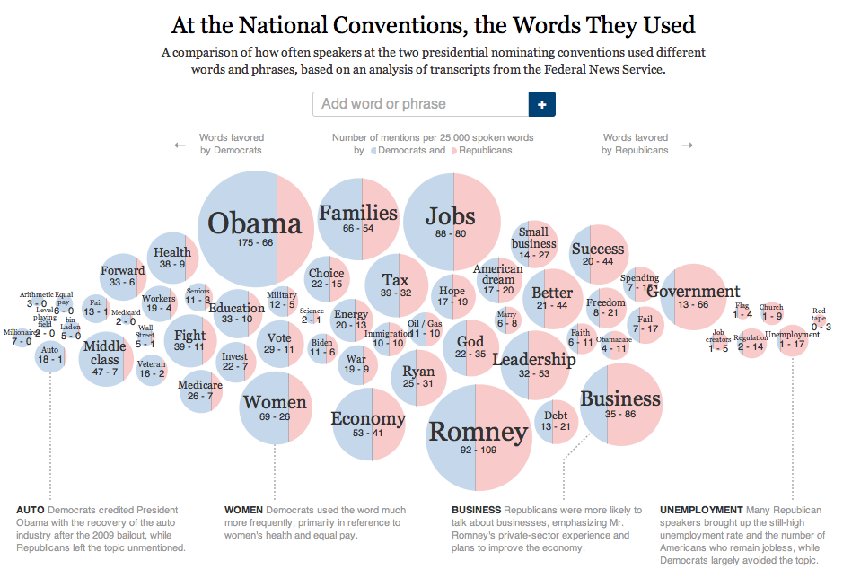
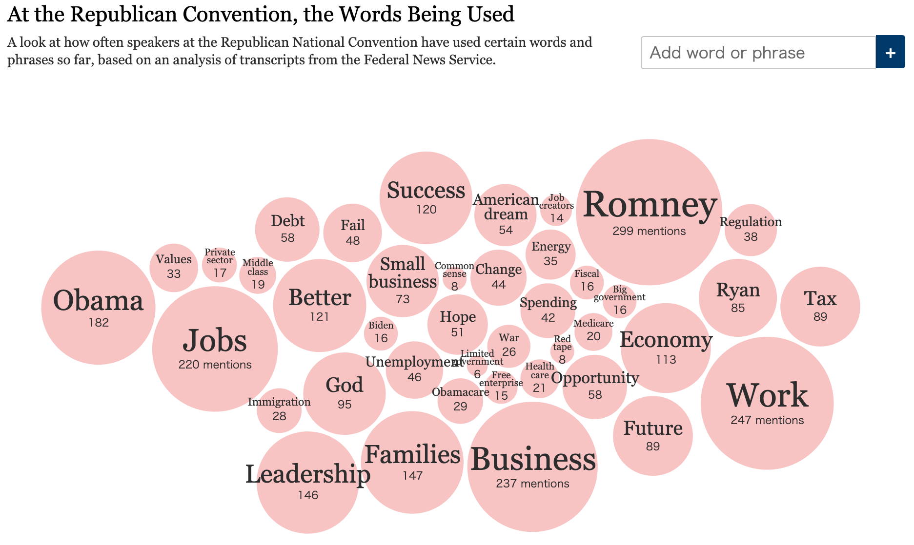
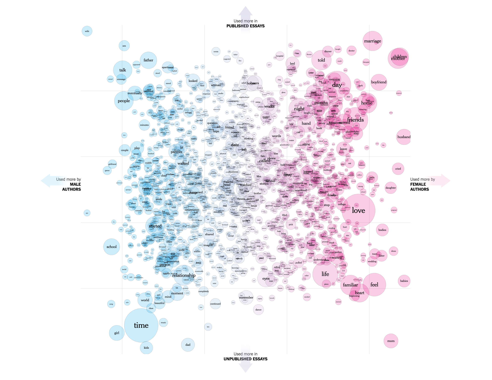
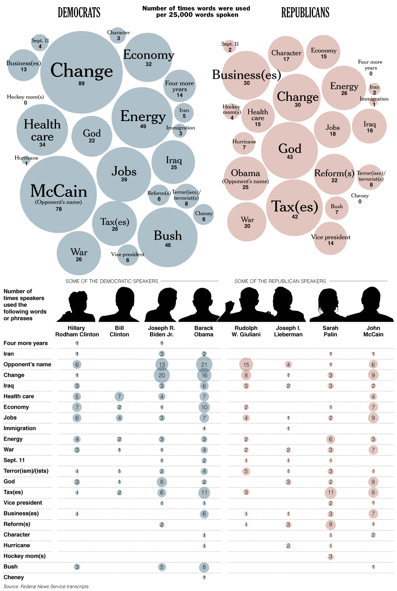

+++
author = "Yuichi Yazaki"
title = "ワード・クラウドとワード・バブル（Word Clouds & Word Bubbles）"
slug = "word-clouds-bubbles"
date = "2020-08-03"
description = ""
categories = [
    "chart"
]
tags = [
    "",
]
image = "images/State-of-the-Union-2.png"
+++

ある文章に含まれる単語の重み付け（たいていは頻出度合い）をフォントサイズで表現します。起源は、1990年代後半にウェブサイトで一般的に使用されていたタグクラウドにあります。

<!--more-->

### 問題

その単語の元々持っている文字数による長さによる視覚的な影響を、重み付けが影響を受けてしまうことです。たとえ同じ重み付けであっても、元々の単語の文字数によって視覚的なインパクトは異なってしまいます。

この問題は、単語を円の中に配置し、円の面積で重み付けを表現すれば解決することが可能です。これらはWord Bubblesと呼ばれます。

### ストップワード
通常、”です” や “しかし” などの非常に一般的でありながら、単語だけではあまり意味がない単語はあらかじめ取り除いておきます。こういった単語は総称して「ストップワード」と呼ばれます。

### 辞書
また英語のように分かち書きではない日本語は、一旦文章を単語ごとに分割しなければなりません。その際、辞書を利用しますが、辞書が古いと近年活用されるようになった単語が抽出されないので注意が必要です。「くまもん」や「Apple Watch」ががうまく抽出できないでしょう。

### 色
文字色として、定性的な情報（文字の属性値）を反映させることが可能です。

ツールによっては文字を見分けるためにランダムに色を割り振る例も散見されますが、色をランダムに割り振るべきではなく、何らかのデータ値に基づかせるべきでしょう。

### 全体の形
ワードクラウド化した単語群の全体のなにかの形に模す作例もあります。この場合は文章の内容を表しているものが良いでしょう。

### 単語へのインタラクション
単語に対してハイパーリンクを付与し、クリックをきっかけにデータセットをファセット分割するなどのインタラクションを付与してもよいでしょう。

## ワード・クラウドの作例

[Levitated | Emotion Fractal](http://www.levitated.net/daily/levEmotionFractal.html)

[http://scimaps.org/mapdetail/visualizing_trends_a_155](http://scimaps.org/mapdetail/visualizing_trends_a_155)

[https://sebastianraschka.com/Articles/2014_twitter_wordcloud.html](https://sebastianraschka.com/Articles/2014_twitter_wordcloud.html)

[https://amueller.github.io/word_cloud/auto_examples/frequency.html#sphx-glr-auto-examples-frequency-py](https://amueller.github.io/word_cloud/auto_examples/frequency.html#sphx-glr-auto-examples-frequency-py)

## ワード・バブルの作例

### 全国大会で使われた言葉

[At the National Conventions, the Words They Used](https://archive.nytimes.com/www.nytimes.com/interactive/2012/09/06/us/politics/convention-word-counts.html)

### 共和党大会で使われている言葉

[At the Republican Convention, the Words Being Used](https://archive.nytimes.com/www.nytimes.com/interactive/2012/08/28/us/politics/convention-word-counts.html)

### このグラフはどうなっているでしょうか？

[What’s Going On in This Graph? – New York Times](https://www.nytimes.com/interactive/2018/02/08/learning/13WGOITGraphLN.html)

### 使われた言葉

[The Words They Used – New York Times](https://archive.nytimes.com/www.nytimes.com/interactive/2008/09/04/us/politics/20080905_WORDS_GRAPHIC.html)

## 参考文献

- Beautiful Visualization 第3章
- Participatory Visualization with Wordle