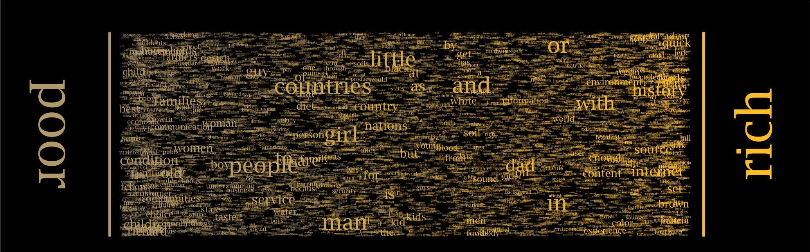

+++
author = "Yuichi Yazaki"
title = "Word Spectrum ― Google のビッグデータで語の関係を可視化する"
slug = "word-spectrum"
date = "2025-09-27"
categories = [
    "consume"
]
tags = [
    "",
]
image = "images/3cd57a4f-efeb-4bb8-b4f9-b640bbc9c916.png"
+++

ある言葉が、別の言葉とどれほど「結びついて」使われているのか。言語学や自然言語処理の分野では、こうした関係を数値化し、モデルに組み込む試みが数多くなされてきました。米国の研究者 Chris Harrison 氏は、Google が公開した大規模な n-gram データセットを素材にして、語と語のつながりを直観的に読み取れるビジュアライゼーションを制作しました。それが Word Spectrum です。

<!--more-->

## データの背景

2006 年、Google はおよそ **1 兆語（1,024,908,267,229 語）** に及ぶウェブコーパスから n-gram 頻度統計を算出し、研究用に公開しました。これには ユニグラム 1,358 万語、バイグラム（2-gram）3 億 1,484 万組などが含まれており、自然言語処理の基盤データとして広く活用されてきました。

Harrison 氏の Word Spectrum では、この中の **バイグラム（bigram）** を用います。具体的には「主要語 A」と「主要語 B」を決め、それぞれに続く語の出現頻度を比較するのです。

## 可視化の仕組み

Word Spectrum の特徴は、語を “スペクトル”状の線分上に配置する点にあります。

横位置（x 座標）
- 「A w」「B w」というバイグラムの出現頻度を比率化し、A と B のどちらにより強く結びついているかで位置を決めます。
- 例：「war memorial」531,205 回 vs 「peace memorial」25,699 回 → “memorial” は大きく war 側に寄って配置。

縦位置（y 座標）
- 意味はなく、ランダムに振り分けられます。これは重なりを避け、ビジュアルにテクスチャを加えるためです。

文字サイズ
- 出現頻度に応じて 逆べき乗関数でスケーリング。ただし図ごとにパラメータが異なるため、異なるスペクトル間のサイズ比較はできません。

正規化処理
- 例えば「war*」系バイグラムは「peace*」系より総数が多いため、war 側の頻度を縮小して均衡を取っています。

## 読み解き方

Word Spectrum の見方はシンプルです。

- 中央付近に置かれた語は、A と B の両方と似た程度に結びつく語。
- 端に寄る語は、どちらか一方との関係が圧倒的に強い語。
- 文字サイズが大きい語は、データ全体の中でも特に頻度が高く、文脈的な影響力が大きい語。

## 意義と魅力

Word Spectrum は、機械学習モデルのための数値的特徴量をそのまま「人が目で見る」形にしたビジュアライゼーションです。

- 抽象的な統計量を直感的な位置と大きさに翻訳することで、語彙間のニュアンスや文化的背景が立ち上がって見えてきます。
- “war” と “peace” のように対照的な語を並べると、その背後にある社会的・文化的な偏りが浮かび上がるのも特徴です。

## 制約と注意点

Harrison 氏自身が指摘しているように、Word Spectrum には次の制約があります。

- データの偏り：Web コーパス由来のため、出版物やウェブ上の表現に偏る。
- 語の除外なし：頻出する機能語や不穏当語もそのまま表示されうる。
- サイズ比較の非一貫性：図ごとにスケーリングが異なるため、複数図版をまたいで文字サイズを比較できない。

## まとめ

Word Spectrum は **「言葉のつながりをどのように“見える化”するか」** という問いに対する一つの回答です。大量のバイグラム統計を単純明快なルールに落とし込み、抽象的な言語モデルを視覚的な直感へと変換しました。

その後、Harrison 氏は改良版として Word Associations を制作し、スペクトルを放射状の「レイ」に区切ることで重なりの問題を軽減しました。両者を並べて見ると、データ可視化の設計思想の進化を追体験することもできます。

## 参考・出典

- [Chris Harrison | WordSpectrum](https://www.chrisharrison.net/index.php/Visualizations/WordSpectrum)